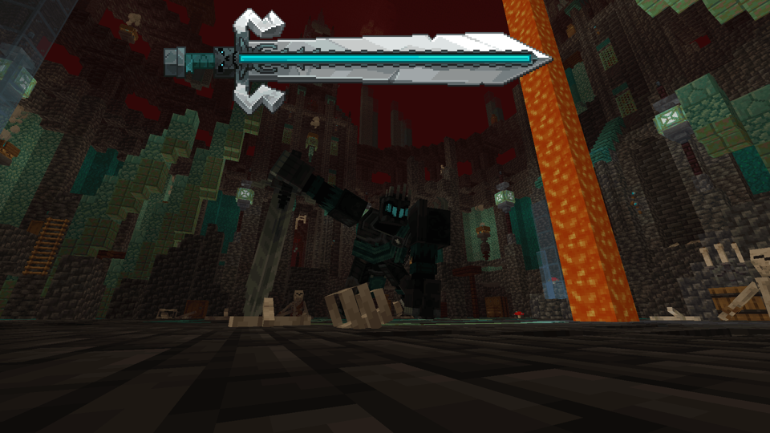
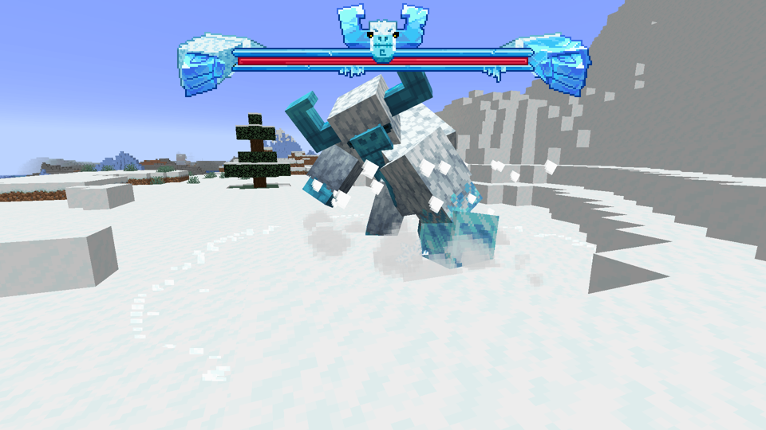
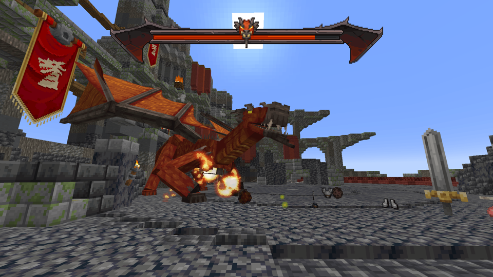
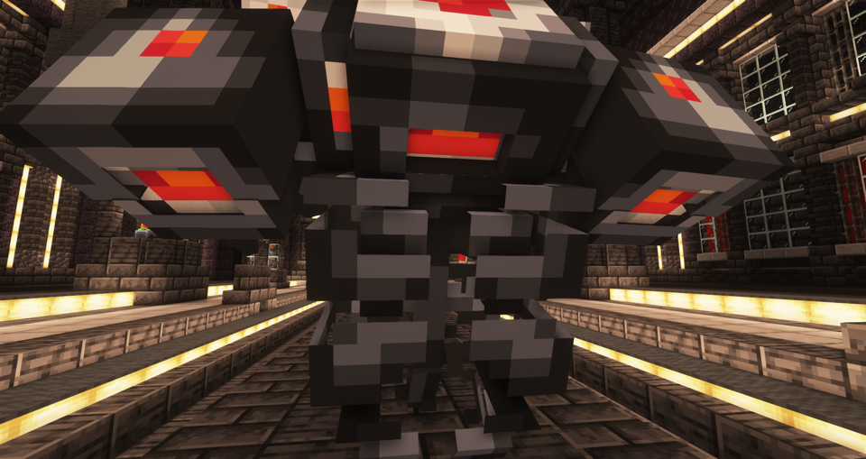
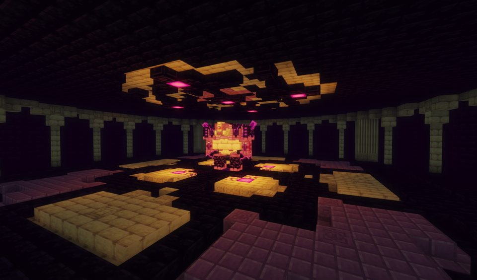
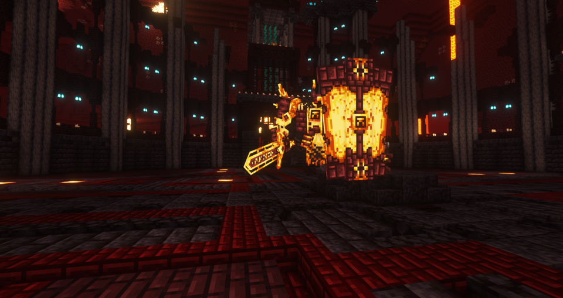

---
navigation:
  title: "Bosses"
  position: 2
  parent: quick-reference.md
  icon: minecraft:dragon_head
---

# Bosses

## Bosses'Rise

Underworld Knight.

Yeti.

Infernal Dragon.

| Boss | Location | Biomes | Access or summoning |
| --- | --- | --- | --- |
| Ashlord, The Infernal Dragon | Overworld, Dragon Tower | Bamboo Jungle, Jungle, Mangrove Swamp, Plains, Savanna and related eligible biomes | Explore the tower; its boss spawner controls the encounter. |
| Skor, The Yeti | Overworld, Yeti Hideout | Snowy Plains | Reach the arena inside the hideout. |
| Sirok, The Sandworm | Overworld, Sandworm Nest | Desert | Enter the nest. |
| Helvar, the Underworld Knight | Nether, Underworld Arena | Nether Wastes, Soul Sand Valley | Reach the underground arena. |
| Nerakyss, The Kraken | Overworld, Kraken Ship | Deep Cold Ocean, Deep Lukewarm Ocean, Deep Ocean | The ship uses a dedicated pirate encounter spawner. |

***

## L_Ender's Cataclysm

The Harbinger.

Ender Guardian.

Ignis.

| Boss | Location | Biomes | Access or summoning |
| --- | --- | --- | --- |
| Ignis | Nether, Burning Arena | Nether Wastes | Burning Ashes at the Altar of Fire. |
| Netherite Monstrosity | Nether, Soul Black Smith | Crimson Forest, Nether Wastes, Soul Sand Valley, Warped Forest | Find the Monstrosity within the forge. |
| Ender Guardian | End, Ruined Citadel | End Highlands, End Midlands | Reach the Altar of Void. |
| The Harbinger | Overworld, Ancient Factory | Andesite Caves (terralith), Deep Caves (terralith), Diorite Caves (terralith), Frostfire Caves (terralith), Fungal Caves (terralith) and related eligible biomes | Use a Nether Star on the dormant Harbinger. |
| The Leviathan | Overworld, Sunken City | Deep Cold Ocean, Deep Frozen Ocean, Deep Lukewarm Ocean, Deep Ocean | Abyssal Sacrifice at the Altar of Abyss; fight underwater. |
| Ancient Remnant | Overworld, Cursed Pyramid | Desert | Use the Necklace of the Desert on the dormant Remnant. |
| Maledictus | Overworld, Frosted Prison | Snowy Plains | Reach the Cursed Tombstone; exact interaction needs confirmation. |
| Scylla | Overworld, Acropolis | Warm Ocean | Find Scylla in the Acropolis. |

***

## Raid & Nether

Wildfire.

| Boss | Mod | Location | Access and reward |
| --- | --- | --- | --- |
| Invoker | Illager Invasion | Village raids; exact wave and difficulty depend on settings. | Defeat for the Hallowed Gem used by the Imbuing Table. |
| Wildfire | Friends&Foes | Nether Citadel | Enter the Citadel. |

***

## Vanilla & difficulty

| Entry | Location or role | Access |
| --- | --- | --- |
| Ender Dragon | End central island | Enter an activated End portal. |
| Wither | Summoned in a chosen dimension | Four soul sand or soul soil blocks and three wither skeleton skulls. |
| Dangerous | Changes existing enemies, not a separate named boss roster. | Health scaling and enemy equipment depend on its settings. |

***

## Related

[Creatures](adventure.creatures.md) and [Structures and dungeons](adventure.structures.md).
