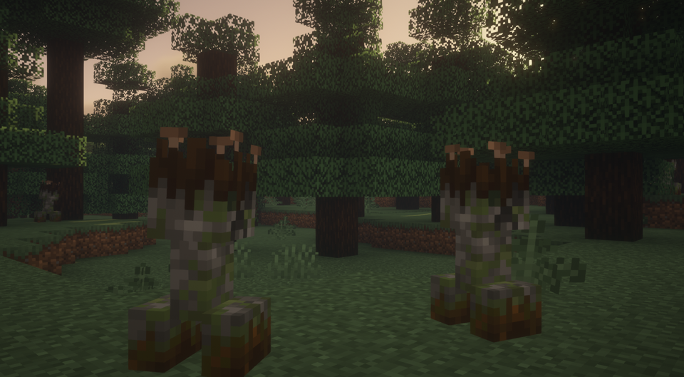
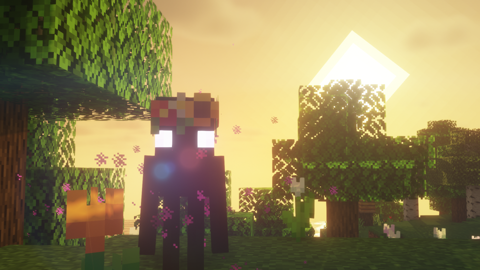
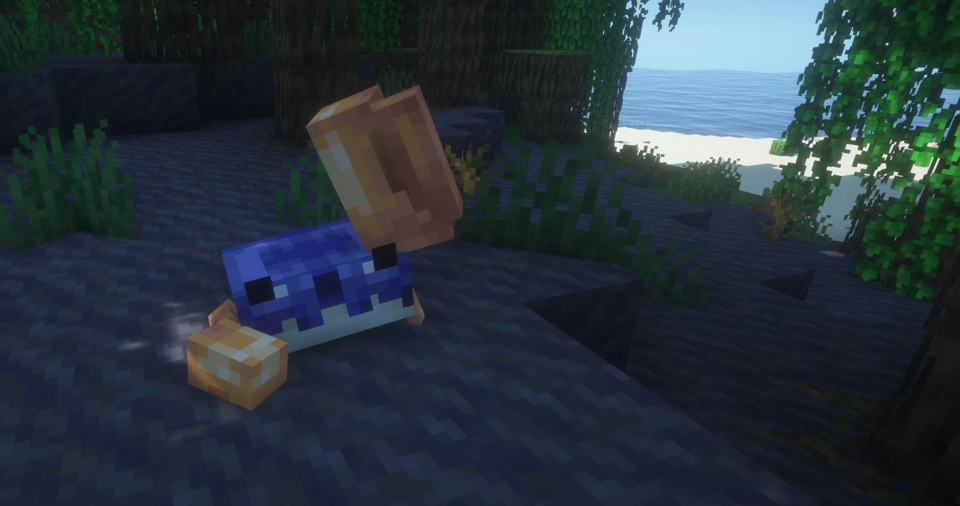
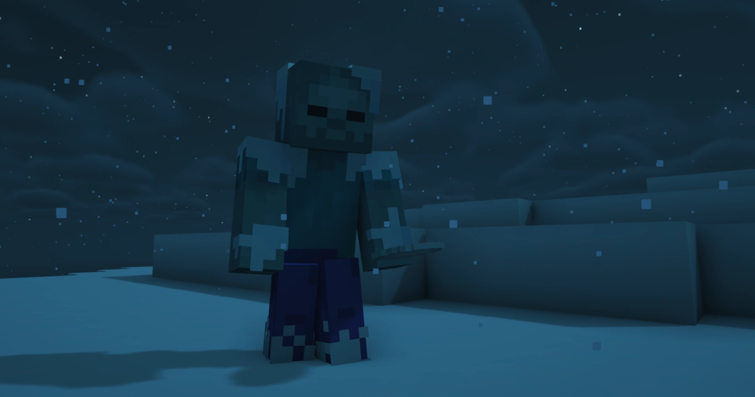
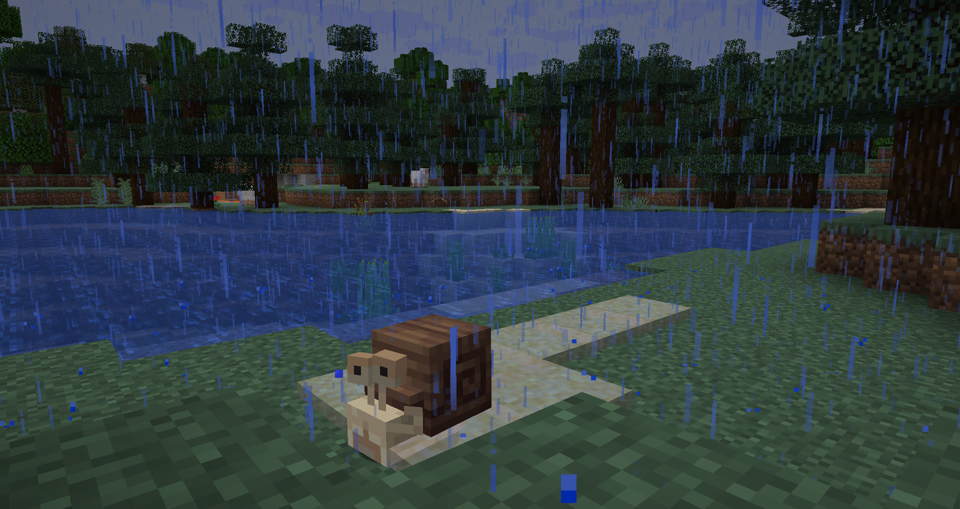
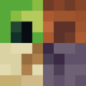
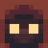
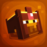
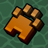
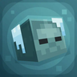

---
navigation:
  title: "Creatures"
  position: 3
  parent: quick-reference.md
  icon: minecraft:egg
---

# Creatures

## Creeper Overhaul

Spruce Creeper

The image shows one species. The other entries have their own appearance.

| Creature | Encounter |
| --- | --- |
| Badlands Creeper | Overworld: badlands biomes. |
| Bamboo Creeper | Overworld: jungle biomes. |
| Beach Creeper | Overworld: beach biomes. |
| Birch Creeper | Overworld: birch forest biomes. |
| Cave Creeper | Spawns in eligible Overworld biomes used by the mod’s creeper spawn rules. |
| Dark Oak Creeper | Overworld: dark forest biomes. |
| Desert Creeper | Overworld: desert biomes. |
| Dripstone Creeper | Overworld: cave biomes. |
| Hills Creeper | Overworld: hill biomes. |
| Jungle Creeper | Overworld: jungle biomes. |
| Mushroom Creeper | Overworld: mushroom biomes. |
| Ocean Creeper | Overworld: ocean biomes. |
| Savannah Creeper | Overworld: savanna biomes. |
| Snowy Creeper | Overworld: snowy biomes. |
| Spruce Creeper | Overworld: taiga biomes. |
| Swamp Creeper | Overworld: swamp biomes. |

***

## Enderman Overhaul

Flower Fields Enderman

The image shows one species. The other entries have their own appearance.

| Creature | Encounter |
| --- | --- |
| Axolotl Pet Enderman | Summoned with an Ancient Pearl rather than found as wild animals. |
| Badlands Enderman | Overworld: badlands biomes. |
| Cave Enderman | Uses broad Overworld spawn tags. Its name does not limit it to caves. |
| Coral Enderman | Overworld: Warm Ocean biomes. |
| Crimson Forest Enderman | Nether: crimson forest biomes. |
| Dark Oak Enderman | Overworld: dark forest biomes. |
| Desert Enderman | Overworld: desert biomes. |
| End Enderman | End: biomes. |
| End Islands Enderman | End: outer islands. |
| Flower Fields Enderman | Overworld: flower forest biomes. |
| Hammerhead Pet Enderman | Summoned with an Ancient Pearl rather than found as wild animals. |
| Ice Spikes Enderman | Overworld: ice spikes biomes. |
| Mushroom Fields Enderman | Overworld: mushroom fields biomes. |
| Nether Wastes Enderman | Nether: Nether Wastes. |
| Pet Enderman | Summoned with an Ancient Pearl rather than found as wild animals. |
| Savanna Enderman | Overworld: savanna biomes. |
| Snowy Enderman | Overworld: snowy biomes. |
| Soulsand Valley Enderman | Nether: soul sand valley biomes. |
| Swamp Enderman | Overworld: swamp biomes. |
| Warped Forest Enderman | Nether: warped forest biomes. |
| Windswept Hills Enderman | Overworld: windswept hills biomes. |
| Scarab | Registered secondary creature. Encounter conditions not confirmed. |
| Spirit | Registered secondary creature. Encounter conditions not confirmed. |

***

## Friends&Foes

Waving Crab

| Creature | Encounter |
| --- | --- |
| Copper Golem | Built from copper block, lightning rod and carved pumpkin. |
| Tuff Golem | Built from tuff, wool and carved pumpkin. Also in strongholds. |
| Crab | Overworld mangrove swamps and beaches. Breed with kelp. |
| Glare | Overworld lush caves. |
| Iceologer | Overworld snowy biomes and Iceologer Cabins. |
| Illusioner | Overworld taiga shacks and training grounds. |
| Moobloom | Overworld flower forests, cherry groves, meadows and sunflower plains. |
| Rascal | Overworld mineshafts. Play hide and seek for a reward. |
| Mauler | Overworld desert, badlands and savanna variants. |

- [Named bosses & access](adventure.bosses.md)

***

## Variants&Ventures

Gelid (Frozen Zombie)

| Creature | Encounter |
| --- | --- |
| Gelid | Overworld cold biomes. Freezing attacks. |
| Thicket | Overworld jungles. Poisonous attacks. |
| Verdant | Overworld jungles. Poison arrows. |
| Murk | Overworld warm oceans. Underwater skeleton. |

***

## Spawn

Snail

| Creature | Encounter |
| --- | --- |
| Angler Fish | Deep water fish that attracts prey with a lure. Overworld: deep cold and frozen oceans. It fits in a bucket. |
| Tuna | A breedable fish found in cold and deep Overworld oceans. Adults do not fit in a bucket. |
| Seahorse | Overworld: warm reefs and Seagrass Meadow. Its appearance varies with the habitat. |
| Snail | A forest snail that produces mucus when wet. |
| Hamster | Overworld: open grasslands. Tame it with sunflower seeds. |
| Ant | Anthills. Ants hatched from pupae follow their owner. Natural spawn conditions are not confirmed. |
| Clam | Overworld: beaches and oceans. Collect it by hand or with a Casting Net. |
| Sea Cow | Overworld: Seagrass Meadow. Milk it with a bucket. |
| Flukeshroom | Overworld: Mushroom Fields. Collect its soup with a bowl. |
| Octopus | A rare Overworld ocean creature. Catch it with a Casting Net. |
| Herring | A schooling fish found in Overworld oceans. |
| Pilot Fish | Swims around larger creatures. Its natural location is not confirmed. |
| Blenny | Tide pools. It is easily startled. Natural spawn conditions are not confirmed. |
| Bluefish | Overworld: cold oceans. It can enter a frenzy when nearby creatures are hurt. |
| Sunfish | Overworld: cold and lukewarm oceans. Adults do not fit in a bucket. |
| Stickbug | A mimic creature. Its encounter conditions are not confirmed. |
| Barracuda | Overworld: deep warm and lukewarm oceans. Catch it with a Casting Net. |
| Coastal Crab | Overworld: coasts. It shoots bubbles and fits in a bucket. |
| Spider Crab | A hostile crab in cold Overworld oceans. It climbs walls and shoots frozen bubbles. |
| Stranded | Attacks hostile creatures that bump into it. Waxing changes its state. Its natural location is not confirmed. |
| Barbed | Overworld: warmer oceans. It only attacks players who are in water. |
| Iguana | Tropical Islands. It uses sunlight to cook items. Natural spawn conditions are not confirmed. |
| Marine Iguana | Sea stacks. Help a young iguana shed to gain its trust. Natural spawn conditions are not confirmed. |
| Seal | Overworld: Cold Islands and frozen oceans. Offer live fish for a ride. |
| Booby | Sandy Islands. It performs mating dances. Natural spawn conditions are not confirmed. |
| Dodo | Dodo Islands. It is defenseless and shoots harmless seeds at hostile creatures. Natural spawn conditions are not confirmed. |
| Firekeeper | A hostile creature made from molten rock and sunstone. Its natural location is not confirmed. |

***

## Bosses'Rise

These enemies guard boss structures.

| Creature | Encounter |
| --- | --- |
| Ashlord Guard | Dragon Tower and arena decorations. Exact spawning varies. |
| Flaming Ashlord Shooter | Dragon Tower and arena decorations. Exact spawning varies. |
| Flaming Ashlord Guard | Dragon Tower and arena decorations. Exact spawning varies. |
| Frozen Skeleton | Yeti Hideout. |
| Soul Skeleton | Underworld Arena. |
| Wither Knight | Underworld Arena. |
| Pirate Captain | Kraken Ship. |
| Pirate Rook | Kraken Ship. |
| Crossbow Pirate | Kraken Ship. |
| Pile Of Bones | Dragon Tower and arena decorations. Exact spawning varies. |

- [Named bosses & access](adventure.bosses.md)

***

## L_Ender's Cataclysm

Find these creatures around the corresponding ruins and boss structures. Some companion encounters remain unconfirmed.

| Creature | Encounter |
| --- | --- |
| Ender Golem | End Ruined Citadel. |
| Endermaptera | End Ruined Citadel. |
| Ignited Revenant | Nether Burning Arena and fortress encounters. |
| Ignited Berserker | Nether Burning Arena and fortress encounters. |
| The Watcher | Overworld Ancient Factory. |
| The Prowler | Overworld Ancient Factory. |
| Deepling | Overworld deep oceans and Sunken City. |
| Deepling Brute | Overworld deep oceans and Sunken City. |
| Deepling Angler | Overworld deep oceans and Sunken City. |
| Deepling Priest | Overworld deep oceans and Sunken City. |
| Deepling Warlock | Overworld deep oceans and Sunken City. |
| Coralssus | Overworld deep oceans and Sunken City. |
| Amethyst Crab | Overworld lush caves and Amethyst Nest. |
| Koboleton | Overworld deserts and Cursed Pyramid. |
| Kobolediator | Overworld deserts and Cursed Pyramid. |
| Wadjet | Overworld deserts and Cursed Pyramid. |
| Draugr | Overworld Frosted Prison and snowy ruins. |
| Royal Draugr | Overworld Frosted Prison and snowy ruins. |
| Elite Draugr | Overworld Frosted Prison and snowy ruins. |
| Aptrgangr | Overworld Frosted Prison and snowy ruins. |
| Hippocamtus | Overworld Acropolis encounter family. Individual placement needs confirmation. |
| Cindaria | Overworld Acropolis encounter family. Individual placement needs confirmation. |
| Clawdian | Overworld Acropolis encounter family. Individual placement needs confirmation. |
| Urchinkin | Overworld Acropolis encounter family. Individual placement needs confirmation. |
| Drowned Host | Overworld Acropolis encounter family. Individual placement needs confirmation. |
| Symbiocto | Overworld Acropolis encounter family. Individual placement needs confirmation. |
| Coral Golem | Released living creatures. Exact natural or companion access not fully confirmed. |
| Lionfish | Released living creatures. Exact natural or companion access not fully confirmed. |
| Modern Remnant | Released living creatures. Exact natural or companion access not fully confirmed. |
| Netherite Ministrosity | Released living creatures. Exact natural or companion access not fully confirmed. |
| The Baby Leviathan | Released living creatures. Exact natural or companion access not fully confirmed. |

- [Named bosses & access](adventure.bosses.md)

***

## Illager Invasion

| Creature | Encounter |
| --- | --- |
| Alchemist | Overworld illager structures and raid reinforcements. Exact per-mob placement not fully resolved. |
| Archivist | Overworld illager structures and raid reinforcements. Exact per-mob placement not fully resolved. |
| Basher | Overworld illager structures and raid reinforcements. Exact per-mob placement not fully resolved. |
| Firecaller | Overworld illager structures and raid reinforcements. Exact per-mob placement not fully resolved. |
| Inquisitor | Overworld illager structures and raid reinforcements. Exact per-mob placement not fully resolved. |
| Marauder | Overworld illager structures and raid reinforcements. Exact per-mob placement not fully resolved. |
| Necromancer | Overworld illager structures and raid reinforcements. Exact per-mob placement not fully resolved. |
| Provoker | Overworld illager structures and raid reinforcements. Exact per-mob placement not fully resolved. |
| Sorcerer | Overworld illager structures and raid reinforcements. Exact per-mob placement not fully resolved. |
| Surrendered | Summoned by illager magic. Not a natural biome spawn. |

- [Named bosses & access](adventure.bosses.md)

***

## Summoned creatures

| Mod | Creatures & access |
| --- | --- |
| Archers | Summon a Spirit Wolf through its spell. |
| Archers Expansion | Polar Bear and Alter Ego are spell summons rather than naturally spawning wildlife. |
| Elemental Wizards | Summon an Earth Golem through its spell. |
| Wizards | Summon a Fire Hydra or Frost Elemental through its spell. |

***

## Other encounters

| Mod | Creatures & access |
| --- | --- |
| Supplementaries | Red Merchant and Plunderer have shipped entity definitions. Their encounter conditions are not confirmed. |
| Dangerous | Changes existing enemy equipment and health without adding a new wildlife roster. |
| Create: Deep Seas | Amphistium and Cookiecutter Shark are development creatures. They are not registered in ordinary gameplay. |

***

## Related

- [Bosses & summoning](adventure.bosses.md)
- [Creature habitats & structures](adventure.structures.md)

***

## Related mods

| Mod or content | Status | Publisher description |
| --- | --- | --- |
|  [Creeper Overhaul](adventure.creatures.md) | Baseline, installed | A mod which overhauls the vanilla creepers! |
|  [Enderman Overhaul](adventure.creatures.md) | Baseline, installed | Enderman Overhaul adds over 20 new enderman variants, each with their own sounds, models, and animations! |
|  [Friends&Foes (Forge/NeoForge)](adventure.creatures.md) | Baseline, installed | Adds outvoted and forgotten mobs from the mob vote, expanding on their original concepts and adding new vanilla-like features. The mod includes: Copper Golem, Crab, Glare, Moobloom, Iceologer, Rascal, Tuff Golem, Wildfire, Illusioner, Zombie Horse |
|  [Spawn](adventure.creatures.md) | Baseline, installed | An overworld wilderness overhaul that adds tons of animals, biomes, ambience and functionality |
|  [Variants&Ventures](adventure.creatures.md) | Baseline, installed | Adds multiple new mob variants seamlessly integrated into your Minecraft world. |
