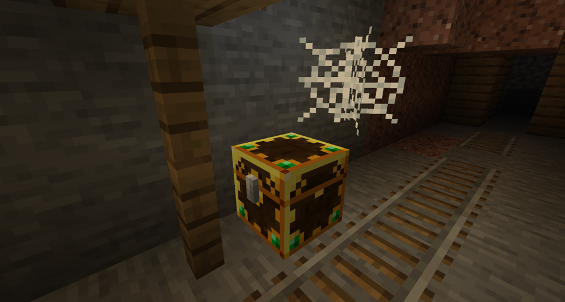

---
navigation:
  title: "Loot"
  position: 0
  parent: adventure.structures.md
  icon: minecraft:stone_bricks
---

# Loot

## Loot containers

- Browse items: <EmiSearch query="@lootr" />

Lootr chest in a mineshaft.

| Container | Behavior |
| --- | --- |
| Lootr chests, trapped chests, barrels, shulker boxes and minecarts | Each player receives a separate inventory in converted loot-table containers. |
| Gold and blue appearance | Gold indicates unopened for you. Blue indicates opened. A client setting can hide this appearance. |
| Ordinary storage | Containers without loot tables are not automatically personal loot. |

***

## Drop lookup

- Browse items: <EmiSearch query="@emi" />

| Mod | Coverage | Reading the display |
| --- | --- | --- |
| EMI Loot | Chest tables, block drops and creature drops | Read chance, average stack size and conditions separately. |
| Lootr | Per-player container access | Does not replace the underlying loot table or guarantee a particular item. |

***

## Getting started

Open a Lootr container for your own loot. Use the item browser’s loot displays to check sources and conditions. Refresh and decay depend on server settings. Reopening does not guarantee new loot.

## Related topics

- [Browse recipe](help.search.md)

***

## Related mods

| Mod or content | Purpose | Status | Item search |
| --- | --- | --- | --- |
|  [EMI Loot](adventure.loot.md) | Shows chest, block and creature loot sources in EMI. | Baseline, installed | No separate item search |
|  [Lootr](adventure.loot.md) | Gives each player separate loot in supported world-generated containers. | Baseline, installed | <EmiSearch query="@lootr" /> |
