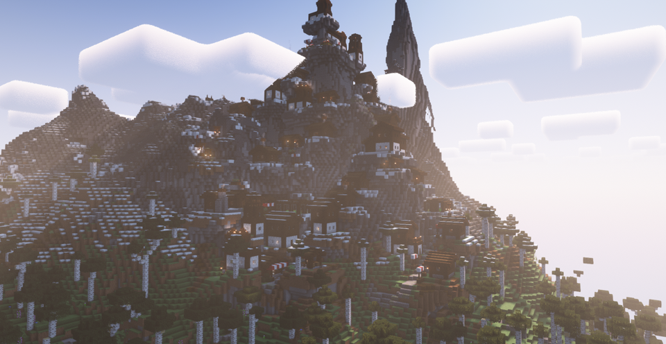
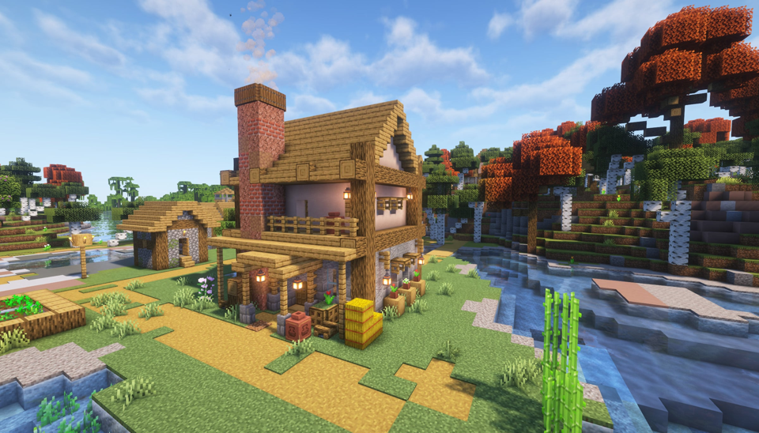
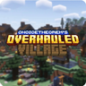

---
navigation:
  title: "Settlements"
  position: 0
  parent: adventure.structures.md
  icon: minecraft:bell
---

# Settlements

## Villages

Alpine-style mountain village.

ChoiceTheorem's Overhauled Village

All listed village styles have small, medium and large variants. The biome lists below name Terralith biomes except Mushroom Fields. Styles with the same listed placement are grouped together. Some rows describe eligible biome examples rather than the complete placement tag.

| Styles | Biomes |
| --- | --- |
| Beach | Gravel Beach |
| Christmas, Snowy Igloo | Alpine Grove, Cold Shrubland, Emerald Peaks, Rocky Shrubland, Scarlet Mountains and related eligible biomes |
| Desert, Desert Oasis | Desert Oasis, Desert Spires, Lush Desert, Sandstone Valley |
| Dark Forest | Sakura Grove, Sakura Valley |
| Jungle, Jungle Tree | Amethyst Canyon, Amethyst Rainforest, Jungle Mountains, Rocky Jungle, Tropical Jungle |
| Mesa, Mesa Fortified | Bryce Canyon, Painted Mountains, Red Oasis, Savanna Badlands, Snowy Badlands, White Mesa |
| Mountain, Mountain Alpine | Alpine Grove, Ashen Savanna, Caldera, Emerald Peaks, Painted Mountains and related eligible biomes |
| Mushroom | Mushroom Fields |
| Plains, Plains Fortified | Alpine Highlands, Arid Highlands, Blooming Plateau, Brushland, Highlands, Steppe, Temperate Highlands |
| Savanna, Savanna Na | Arid Highlands, Ashen Savanna, Fractured Savanna, Savanna Badlands, Savanna Slopes |
| Swamp, Swamp Fortified | Ice Marsh, Orchid Swamp |
| Taiga, Taiga Fortified | Alpine Grove, Birch Taiga, Forested Highlands, Shield, Siberian Grove and related eligible biomes |

Underground villages are absent from the enabled list. This mod’s pillager outposts are disabled.

***

## Gazebos

| Building style | Placement |
| --- | --- |
| Desert | Overworld village house pool |
| Plains | Overworld village house pool |
| Savanna | Overworld village house pool |
| Snowy | Overworld village house pool |
| Taiga | Overworld village house pool |

Compatibility templates also cover badlands, bamboo, birch, cherry, dark forest, giant taiga, jungle, mountains, mushroom, oak, ocean and swamp. These templates do not mean every compatible village provider is installed.

***

## Taverns

<EmiSearch query="@village_taverns" />

Village Taverns (RPG Series).

| Building style | Placement |
| --- | --- |
| Desert | Overworld village house pool |
| Plains | Overworld village house pool |
| Savanna | Overworld village house pool |
| Snowy | Overworld village house pool |
| Taiga | Overworld village house pool |

Bartender is a villager profession, not a separate creature species.

***

## Village buildings

<EmiSearch query="@archers" /> <EmiSearch query="@bards_rpg" /> <EmiSearch query="@paladins" /> <EmiSearch query="@rogues" /> <EmiSearch query="@wizards" />

| Mod | Profession and building | Template styles |
| --- | --- | --- |
| Archers (RPG Series) | Archery Artisan, small and large archery ranges | Desert, Plains, Savanna, Snowy, Taiga |
| Bard (RPG Series Plus) | Luthier, Pub | Desert, Plains, Savanna, Snowy, Taiga |
| Paladins & Priests (RPG Series) | Monk, Sanctuary | Desert, Plains, Savanna, Snowy, Taiga |
| Rogues & Warriors (RPG Series) | Arms Dealer, Barracks | Desert, Plains, Savanna, Snowy, Taiga |
| Wizards (RPG Series) | Wizard Merchant, Wizard Tower | Desert, Plains, Savanna, Snowy, Taiga |

These buildings extend village house pools, rather than creating standalone dungeons.

***

## Related

- [Structures and dungeons](adventure.structures.md)
- [Loot](adventure.loot.md)

***

## Related mods

| Mod or content | Purpose | Item search |
| --- | --- | --- |
|  [ChoiceTheorem's Overhauled Village](adventure.settlements.md) | Redesigns villages and pillager outposts to fit different biomes. | No separate item search |
|  [Gazebos (RPG Series)](adventure.settlements.md) | Adds village gazebos containing small spell libraries. | No separate item search |
|  [Village Taverns (RPG Series)](adventure.settlements.md) | Adds village taverns where travelers can find drinks and rest. | <EmiSearch query="@village_taverns" /> |
