---
navigation:
  title: "Structures"
  position: 4
  parent: quick-reference.md
  icon: minecraft:stone_bricks
---

# Structures

## When Dungeons Arise

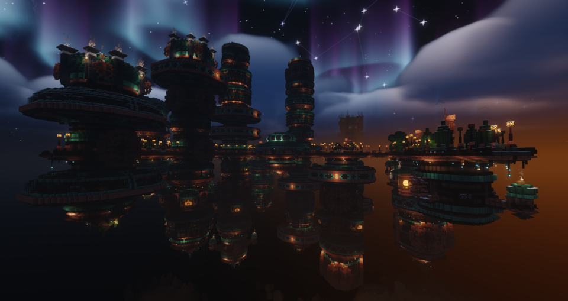

Mechanical Nest

Explore large dungeons and smaller landmarks. Aviary belongs to the End, while the other listed destinations belong to the Overworld.

| Structure | Where to look |
| --- | --- |
| Abandoned Temple | Overworld: Taiga, hill, mountain biomes. |
| Aviary | End: End Highlands, End Midlands. |
| Bandit Towers | Overworld: Bryce Canyon (Terralith), Painted Mountains (Terralith). |
| Bandit Village | Overworld: Bryce Canyon (Terralith), Painted Mountains (Terralith). |
| Bathhouse | Overworld: Plains, Meadow, Dark Forest. |
| Ceryneian Hind | Overworld: Desert biomes. |
| Coliseum | Overworld: Plains, Meadow, Sunflower Plains. |
| Fishing Hut | Overworld: Gravel Beach (Terralith). |
| Foundry | Overworld: Jungle, Forest, Taiga biomes. |
| Giant Mushroom | Overworld: Meadow, Plains, Sunflower Plains. |
| Greenwood Pub | Overworld: Forest biomes. |
| Heavenly Challenger | Overworld: Jungle, Forest biomes. |
| Heavenly Conqueror | Overworld: Jungle, Forest biomes. |
| Heavenly Rider | Overworld: Jungle, Forest biomes. |
| Illager Campsite | Overworld: hill biomes. |
| Illager Corsair | Overworld: Ocean biomes. |
| Illager Fort | Overworld: Taiga biomes. |
| Illager Galley | Overworld: Ocean biomes. |
| Illager Windmill | Overworld: Plains, Meadow, Sunflower Plains. |
| Infested Temple | Overworld: Taiga, hill biomes. |
| Jungle Tree House | Overworld: Amethyst Canyon (Terralith), Amethyst RainForest (Terralith). |
| Keep Kayra | Overworld: Swamp biomes. |
| Kisegi Sanctuary | Overworld: hill biomes. |
| Lighthouse | Overworld: Plains biomes. |
| Mechanical Nest | Overworld: Forest biomes. |
| Merchant Campsite | Overworld: Plains, Meadow, Sunflower Plains. |
| Mining Complex | Overworld: Jungle, Forest, Taiga biomes. |
| Mining System | Does not generate naturally. |
| Monastery | Overworld: Taiga, hill, mountain biomes. |
| Mushroom House | Overworld: Forest biomes. |
| Mushroom Mines | Overworld: Forest biomes. |
| Mushroom Village | Overworld: Forest biomes. |
| Plague Asylum | Overworld: Forest biomes. |
| Scorched Mines | Overworld: Desert biomes. |
| Shiraz Palace | Overworld: Desert biomes. |
| Small Blimp | Overworld: Jungle, Forest, Taiga biomes. |
| Thornborn Towers | Overworld: Forest biomes. |
| Typhon | Overworld: Ocean biomes. |
| Undead Pirate Ship | Overworld: Ocean biomes. |
| Wishing Well | Overworld: Plains, Meadow, Sunflower Plains. |

***

## Bosses'Rise

- Browse items: <EmiSearch query="@block_factorys_bosses" />

Provider project artwork, not a structure screenshot.

Each boss has a dedicated encounter structure.

| Structure | Where to look |
| --- | --- |
| Sandworm Nest | Overworld: Desert. |
| Dragon Tower | Overworld: Bamboo Jungle, Jungle, Mangrove Swamp. |
| Underworld Arena | Nether: Nether Wastes, Soul Sand Valley. |
| Yeti Hideout | Overworld: Snowy Plains. |
| Kraken Ship | Overworld: Deep Cold Ocean, Deep Lukewarm Ocean, Deep Ocean. |

- [Boss encounters](adventure.bosses.md)

***

## L_Ender's Cataclysm

- Browse items: <EmiSearch query="@cataclysm" />

Provider project artwork, not a structure screenshot.

Boss arenas sit alongside smaller ruins and creature nests.

| Structure | Where to look |
| --- | --- |
| Abandoned Spire | Overworld: Snowy Plains. |
| Abandoned Temple | Overworld: Snowy Plains. |
| Abandoned Village | Overworld: Snowy Plains. |
| Acropolis | Overworld: Warm Ocean. |
| Amethyst Nest | Overworld: Lush Caves. |
| Ancient Factory | Overworld: andesite caves (Terralith), deep caves (Terralith). |
| Burning Arena | Nether: Nether Wastes. |
| Cursed Pyramid | Overworld: Desert. |
| Desert Occupied Village | Overworld: Desert. |
| Desert Site | Overworld: Desert. |
| Desert Temple | Overworld: Desert. |
| Frosted Prison | Overworld: Snowy Plains. |
| Ruined Citadel | End: End Highlands, End Midlands. |
| Soul Black Smith | Nether: Crimson Forest, Nether Wastes, Soul Sand Valley. |
| Sunken City | Overworld: Deep Cold Ocean, Deep Frozen Ocean, Deep Lukewarm Ocean. |

- [Boss encounters](adventure.bosses.md)

***

## Illager Invasion

- Browse items: <EmiSearch query="@illagerinvasion" />

Provider project artwork, not a structure screenshot.

| Structure | Where to look |
| --- | --- |
| Firecaller Hut | Overworld: Bryce Canyon (Terralith), Painted Mountains (Terralith). |
| Illager Fort | Overworld: Snowy Plains. |
| Illusioner Tower | Overworld: Dark Forest, Old Growth Pine Taiga, Old Growth Spruce Taiga. |
| Labyrinth | Overworld: alpine grove (Terralith), Amethyst Canyon (Terralith). |
| Sorcerer Hut | Overworld: Dark Forest. |

***

## Friends&Foes

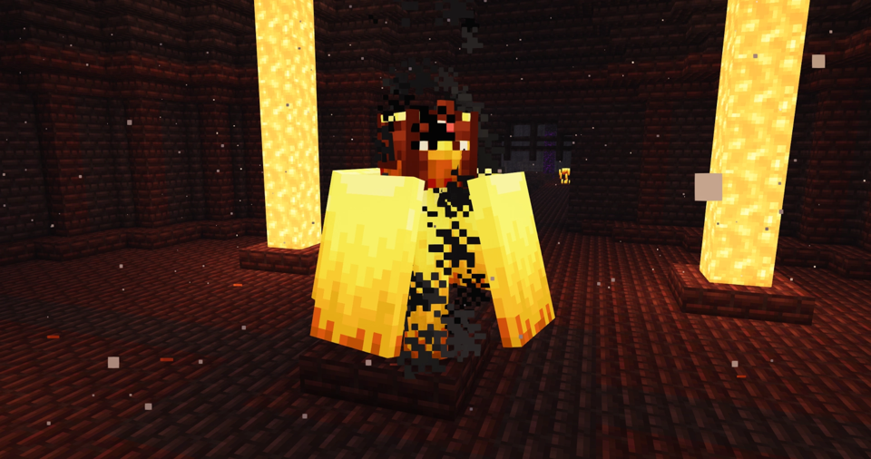

Wildfire inside a Citadel

| Structure | Where to look |
| --- | --- |
| Citadel | Nether: nether biomes. |
| Iceologer Cabin | Overworld: snowy, Snowy Plains biomes. |
| Illusioner Shack | Overworld: Taiga biomes. |
| Illusioner Training Grounds | Overworld: Taiga biomes. |

- [Boss encounters](adventure.bosses.md)

***

## Dungeons

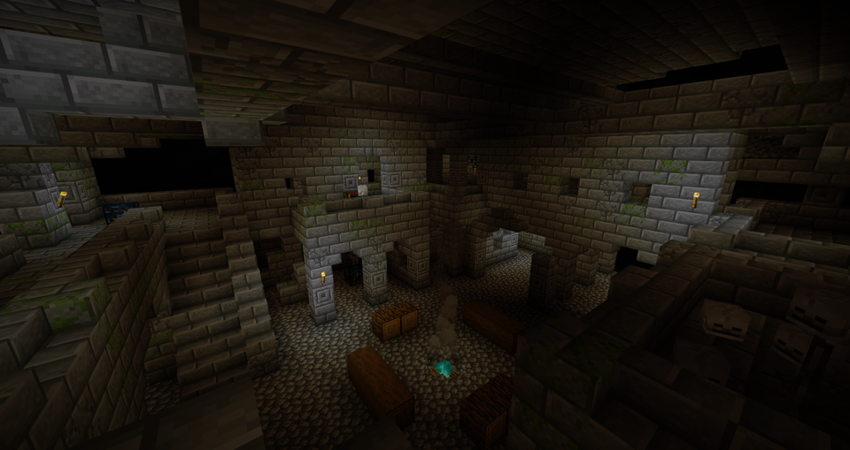

Fortress of the Undead

From YUNG's Better Dungeons.

These are dungeon families, not a count of rooms or building templates. Small Nether Dungeon is disabled.

| Structure | Where to look |
| --- | --- |
| Catacombs | Overworld: icy, badlands, Desert biomes. |
| Small Dungeon | Overworld: icy, badlands, Desert biomes. |
| Small Nether Dungeon | Disabled by the pack settings. |
| Spider Caves | Overworld: icy, badlands, Desert biomes. |
| Fortress of the Undead | Overworld: icy, badlands, Desert biomes. |

***

## Mineshafts

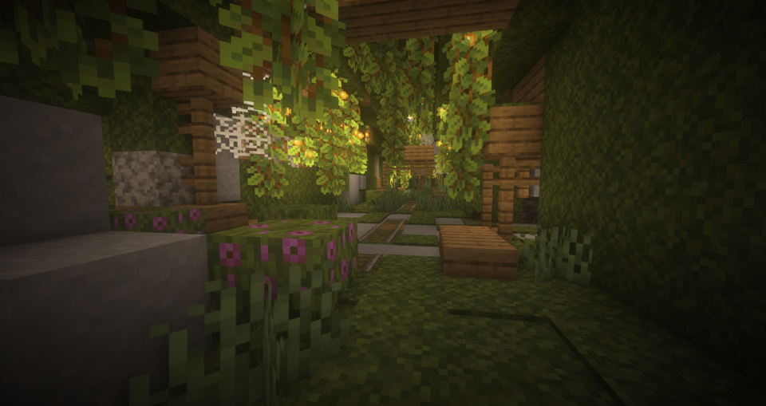

Witch hut

From YUNG's Better Mineshafts.

| Structure | Where to look |
| --- | --- |
| Mineshaft Acacia | Overworld: Savanna biomes. |
| Mineshaft Desert | Overworld: Desert biomes. |
| Mineshaft Dripstone | Overworld: Dripstone Caves. |
| Mineshaft Ice | Overworld: icy biomes. |
| Mineshaft Jungle | Overworld: Jungle biomes. |
| Mineshaft Lush | Overworld: Lush Caves. |
| Mineshaft Mesa | Overworld: badlands, mesa biomes. |
| Mineshaft Mushroom | Overworld: mushroom biomes. |
| Mineshaft Oak | Overworld: Plains biomes. |
| Mineshaft Overgrown | Overworld: Forest biomes. |
| Mineshaft Red Desert | Overworld: badlands biomes. |
| Mineshaft Spruce | Overworld: dead Forest (biomesoplenty), jade cliffs (biomesoplenty). |
| Mineshaft Spruce Snowy | Overworld: Jagged Peaks, Snowy Plains, Snowy Slopes. |

***

## Desert temples

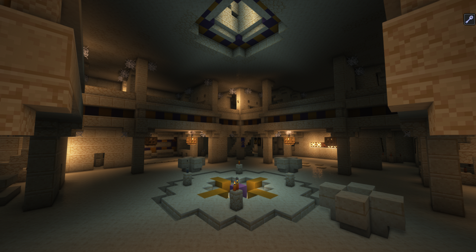

Witch hut

From YUNG's Better Desert Temples.

| Structure | Where to look |
| --- | --- |
| Desert Temple | Overworld: Desert biomes. |

***

## Jungle temples

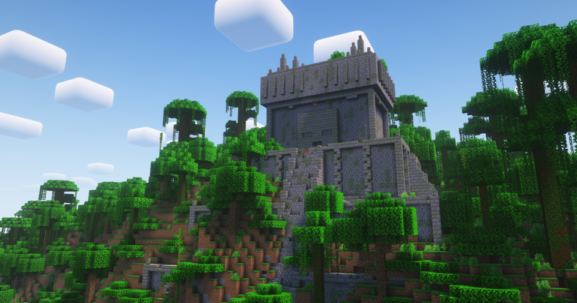

YUNG's Better Jungle Temples

From YUNG's Better Jungle Temples.

| Structure | Where to look |
| --- | --- |
| Jungle Temple | Overworld: Amethyst Canyon (Terralith), Amethyst RainForest (Terralith). |

***

## Nether fortresses

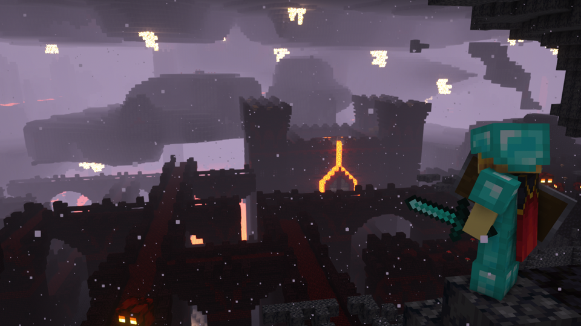

YUNG's Better Nether Fortresses

From YUNG's Better Nether Fortresses.

| Structure | Where to look |
| --- | --- |
| Fortress | Nether: nether biomes. |

***

## Ocean monuments

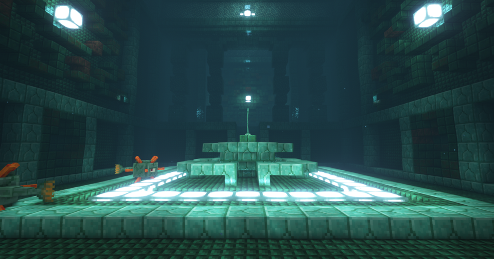

Witch hut

From YUNG's Better Ocean Monuments.

| Structure | Where to look |
| --- | --- |
| Ocean Monument | Overworld: Deep Ocean biomes. |

***

## Strongholds

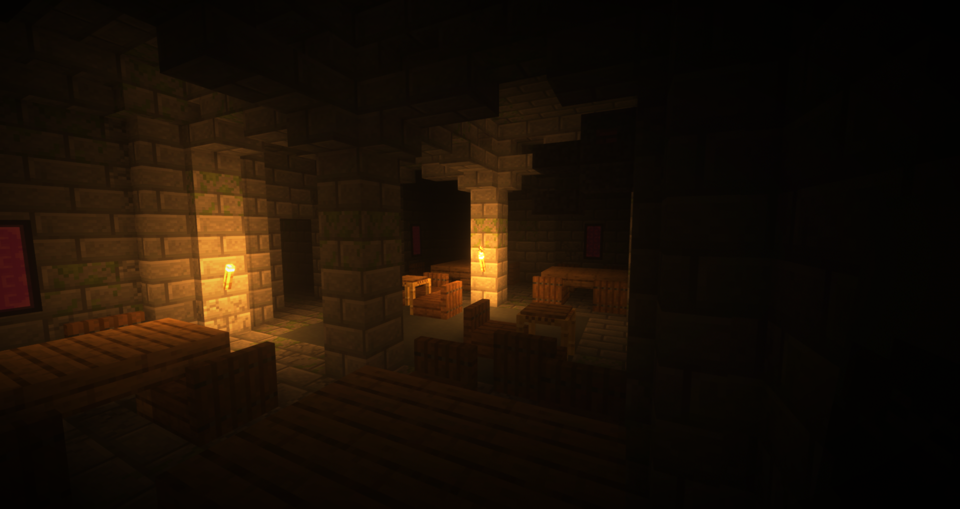

Witch hut

From YUNG's Better Strongholds.

| Structure | Where to look |
| --- | --- |
| Stronghold | Overworld: icy, Desert, Forest biomes. |

***

## Witch huts

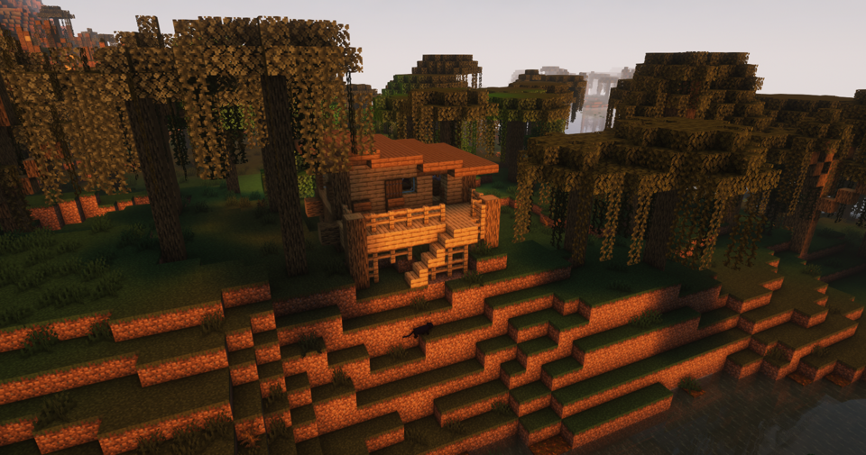

Witch hut

From YUNG's Better Witch Huts.

| Structure | Where to look |
| --- | --- |
| Witch Circle | Overworld: Swamp biomes. |
| Witch Hut | Overworld: Swamp biomes. |

Huts have large, small and duplex layouts. Witch Circle is a separate structure.

***

## Spawn

- Browse items: <EmiSearch query="@spawn" />

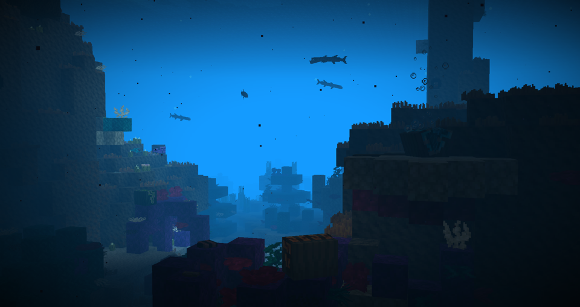

Deep coral reef, giant clams and barracuda. Habitat image, not an island structure.

| Structure | Where to look |
| --- | --- |
| Ant Mount | Overworld: ant gardens (Spawn). |
| Cold Island | Overworld: Deep Cold Ocean. |
| Dodo Island | Overworld: Deep Cold Ocean, Deep Lukewarm Ocean, Deep Ocean. |
| Octopolis | Overworld: Deep Ocean, Lukewarm Ocean, Ocean. |
| Sandy Island | Overworld: Deep Lukewarm Ocean. |
| Tide Pool | Overworld: Deep Cold Ocean. |
| Tropical Island | Overworld: Warm Ocean. |
| Volcanic Island | Overworld: Warm Ocean. |

***

## Terralith

Provider project artwork, not a structure screenshot.

Look for surface landmarks and underground structures in their matching terrain.

| Structure | Where to look |
| --- | --- |
| Desert Outpost | Overworld: Desert. |
| Fortified Desert Village | Overworld: Desert. |
| Fortified Village | Overworld: Meadow, Plains, Sunflower Plains. |
| Glacial Hut | Overworld: glacial chasm (Terralith). |
| Igloo | Overworld: snowy cherry grove (Terralith). |
| Mage Complex | Overworld: Amethyst RainForest (Terralith), lavender Forest (Terralith). |
| Mage Tower | Overworld: Amethyst Canyon (Terralith), lavender valley (Terralith). |
| Mage Tower Autumn | Overworld: skylands autumn (Terralith). |
| Mage Tower Spring | Overworld: skylands spring (Terralith). |
| Mage Tower Summer | Overworld: skylands summer (Terralith). |
| Mage Tower Winter | Overworld: skylands winter (Terralith). |
| Rubble Desert | Overworld: Desert. |
| Rubble Forest | Overworld: birch Forest, Dark Forest, flower Forest. |
| Rubble Jungle | Overworld: Bamboo Jungle, Jungle, sparse Jungle. |
| Rubble Mesa | Overworld: badlands, eroded badlands, wooded badlands. |
| Rubble Mountain | Overworld: Frozen Peaks, Jagged Peaks, stony peaks. |
| Rubble Taiga | Overworld: grove, Old Growth Pine Taiga, Old Growth Spruce Taiga. |
| Spire | Overworld: Frozen River. |
| Frosted Dungeon | Overworld: frostfire caves (Terralith). |
| Giant Bee Hive | Overworld: Lush Caves. |
| Mining Outpost | Overworld: deep caves (Terralith). |
| Oak Cabin | Overworld: Lush Caves. |
| Old Refinery | Overworld: deep caves (Terralith), fungal caves (Terralith). |
| Sunken Tower | Overworld: Lush Caves. |
| Witch Hut | Does not generate naturally. |
| Underground Cabin | Overworld: Lush Caves. |
| Valley Lodge | Overworld: shield clearing (Terralith), valley clearing (Terralith). |
| Witch Hut | Overworld: Swamp. |

***

## Nullscape

Provider project artwork, not a structure screenshot.

Both landmarks belong to the End Shadowlands biome.

| Structure | Where to look |
| --- | --- |
| Dragon Skeleton | End: Shadowlands (Nullscape). |
| Rift | End: Shadowlands (Nullscape). |

***

## Witcher

- Browse items: <EmiSearch query="@witcher_rpg" />

Provider project artwork, not a structure screenshot.

From Witcher (RPG Series Plus).

| Structure | Where to look |
| --- | --- |
| Dark Oak Ruins | Overworld: Dark Forest. |
| Feline Witcher Hideout | Overworld: caves biomes. |
| Griffin Witcher Hideout | Overworld: caves biomes. |
| Oak Ruins | Overworld: Forest, Plains. |
| Ursine Witcher Hideout | Overworld: caves biomes. |
| Witcher Grave Cave | Overworld: caves biomes. |
| Witcher Grave Dark Oak | Overworld: Dark Forest. |
| Wolven Witcher Hideout | Overworld: caves biomes. |

***

## Supplementaries

- Browse items: <EmiSearch query="@supplementaries" />

Provider project artwork, not a structure screenshot.

| Structure | Where to look |
| --- | --- |
| Galleon | Uses a custom Overworld placement tag. Its effective biome list is not confirmed. |
| Road Sign | Uses a custom Overworld placement tag. Its effective biome list is not confirmed. |

***

## Settlements

- [Village styles, gazebos & taverns](adventure.settlements.md)

***

## Unavailable structures

Incendium Biomes Only removes Incendium structures, special mobs, bosses and loot. Its terrain remains, but its structures are not pack destinations.

***

## Related mods

| Mod or content | Purpose | Status | Item search |
| --- | --- | --- | --- |
|  [ChoiceTheorem's Overhauled Village](adventure.settlements.md) | Redesigns villages and pillager outposts to fit different biomes. | Baseline, installed | No separate item search |
|  [EMI Loot](adventure.loot.md) | Shows chest, block and creature loot sources in EMI. | Baseline, installed | No separate item search |
|  [Gazebos (RPG Series)](adventure.settlements.md) | Adds village gazebos containing small spell libraries. | Baseline, installed | No separate item search |
|  [Lootr](adventure.loot.md) | Gives each player separate loot in supported world-generated containers. | Baseline, installed | <EmiSearch query="@lootr" /> |
| 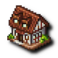 [Village Taverns (RPG Series)](adventure.settlements.md) | Adds village taverns where travelers can find drinks and rest. | Baseline, installed | <EmiSearch query="@village_taverns" /> |
|  [When Dungeons Arise](adventure.structures.md) | Adds large hostile dungeons and exploration structures. | Baseline, installed | No separate item search |
|  [YUNG's Better Desert Temples](adventure.structures.md) | Rebuilds desert temples with expanded rooms and exploration layouts. | Baseline, installed | No separate item search |
|  [YUNG's Better Dungeons](adventure.structures.md) | Replaces small vanilla dungeons with larger dungeon layouts. | Baseline, installed | No separate item search |
|  [YUNG's Better Jungle Temples](adventure.structures.md) | Redesigns jungle temples into more elaborate exploration structures. | Baseline, installed | No separate item search |
|  [YUNG's Better Mineshafts](adventure.structures.md) | Overhauls abandoned mineshafts with expanded underground layouts. | Baseline, installed | No separate item search |
|  [YUNG's Better Nether Fortresses](adventure.structures.md) | Redesigns Nether fortresses with expanded fortress layouts. | Baseline, installed | No separate item search |
|  [YUNG's Better Ocean Monuments](adventure.structures.md) | Redesigns ocean monuments with more elaborate underwater interiors. | Baseline, installed | No separate item search |
|  [YUNG's Better Strongholds](adventure.structures.md) | Rebuilds strongholds with larger and more varied room layouts. | Baseline, installed | No separate item search |
|  [YUNG's Better Witch Huts](adventure.structures.md) | Replaces swamp witch huts with redesigned hut structures. | Baseline, installed | No separate item search |
