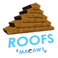
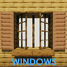

---
navigation:
  title: "Architecture"
  position: 0
  parent: reference.building.md
  icon: minecraft:bricks
---

# Architecture

## Bridges

<EmiSearch query="@mcwbridges" />

<ItemGrid>
  <ItemIcon id="mcwbridges:oak_log_bridge_middle" />
  <ItemIcon id="mcwbridges:oak_rail_bridge" />
  <ItemIcon id="mcwbridges:oak_bridge_pier" />
  <ItemIcon id="mcwbridges:stone_brick_bridge" />
</ItemGrid>

| Shown items |
| --- |
| <ItemLink id="mcwbridges:oak_log_bridge_middle" /> |
| <ItemLink id="mcwbridges:oak_rail_bridge" /> |
| <ItemLink id="mcwbridges:oak_bridge_pier" /> |
| <ItemLink id="mcwbridges:stone_brick_bridge" /> |

Macaw's Bridges supplies spans, stairs and supports in wood and stone families. Select both the bridge shape and material through its recipe.

***

## Roofs

<EmiSearch query="@mcwroofs" />

<ItemGrid>
  <ItemIcon id="mcwroofs:oak_roof" />
  <ItemIcon id="mcwroofs:oak_top_roof" />
  <ItemIcon id="mcwroofs:oak_attic_roof" />
  <ItemIcon id="mcwroofs:oak_steep_roof" />
</ItemGrid>

| Shown items |
| --- |
| <ItemLink id="mcwroofs:oak_roof" /> |
| <ItemLink id="mcwroofs:oak_top_roof" /> |
| <ItemLink id="mcwroofs:oak_attic_roof" /> |
| <ItemLink id="mcwroofs:oak_steep_roof" /> |

Macaw's Roofs uses separate pieces for the base, ridge and attic, including steeper profiles. Log, plank, stone and colored families have different recipes.

***

## Stairs & balconies

<EmiSearch query="@mcwstairs" />

<ItemGrid>
  <ItemIcon id="mcwstairs:oak_bulk_stairs" />
  <ItemIcon id="mcwstairs:oak_compact_stairs" />
  <ItemIcon id="mcwstairs:oak_loft_stairs" />
  <ItemIcon id="mcwstairs:oak_skyline_stairs" />
  <ItemIcon id="mcwstairs:oak_balcony" />
  <ItemIcon id="mcwstairs:oak_railing" />
</ItemGrid>

| Shown items |
| --- |
| <ItemLink id="mcwstairs:oak_bulk_stairs" /> |
| <ItemLink id="mcwstairs:oak_compact_stairs" /> |
| <ItemLink id="mcwstairs:oak_loft_stairs" /> |
| <ItemLink id="mcwstairs:oak_skyline_stairs" /> |
| <ItemLink id="mcwstairs:oak_balcony" /> |
| <ItemLink id="mcwstairs:oak_railing" /> |

Macaw's Stairs provides different stair profiles with platforms, balconies and matching railings. Choose the profile before collecting its materials.

***

## Doors

<EmiSearch query="@mcwdoors" />

<ItemGrid>
  <ItemIcon id="mcwdoors:oak_barn_door" />
  <ItemIcon id="mcwdoors:oak_japanese_door" />
  <ItemIcon id="mcwdoors:oak_modern_door" />
</ItemGrid>

| Shown items |
| --- |
| <ItemLink id="mcwdoors:oak_barn_door" /> |
| <ItemLink id="mcwdoors:oak_japanese_door" /> |
| <ItemLink id="mcwdoors:oak_modern_door" /> |

Macaw's Doors changes the visual style of building entrances. The shown doors are examples, not a complete style list.

***

## Windows

<EmiSearch query="@mcwwindows" />

<ItemGrid>
  <ItemIcon id="mcwwindows:oak_window" />
  <ItemIcon id="mcwwindows:oak_pane_window" />
  <ItemIcon id="mcwwindows:oak_shutter" />
  <ItemIcon id="mcwwindows:black_curtain" />
</ItemGrid>

| Shown items |
| --- |
| <ItemLink id="mcwwindows:oak_window" /> |
| <ItemLink id="mcwwindows:oak_pane_window" /> |
| <ItemLink id="mcwwindows:oak_shutter" /> |
| <ItemLink id="mcwwindows:black_curtain" /> |

Macaw's Windows combines window shapes with shutters and curtains. Choose the opening and its fittings separately through their recipes.

***

## Fences & walls

<EmiSearch query="@mcwfences" />

<ItemGrid>
  <ItemIcon id="mcwfences:oak_picket_fence" />
  <ItemIcon id="mcwfences:oak_stockade_fence" />
  <ItemIcon id="mcwfences:oak_hedge" />
  <ItemIcon id="mcwfences:bastion_metal_fence" />
</ItemGrid>

| Shown items |
| --- |
| <ItemLink id="mcwfences:oak_picket_fence" /> |
| <ItemLink id="mcwfences:oak_stockade_fence" /> |
| <ItemLink id="mcwfences:oak_hedge" /> |
| <ItemLink id="mcwfences:bastion_metal_fence" /> |

Macaw's Fences and Walls provides wood, hedge, metal and masonry boundary families with matching gates. Diagonal Fences changes compatible fence connections.

***

## Chains

<ItemGrid>
  <ItemIcon id="minecraft:chain" />
</ItemGrid>

| Shown items |
| --- |
| <ItemLink id="minecraft:chain" /> |

Reconnectible Chains uses vanilla chains for connected hanging spans. Choose your structural pieces through Browse recipe.

- [Browse recipe](help.search.md)

***

## Crafting

<Recipe id="mcwbridges:oak_bridge_pier" />

***

## Related mods

| Mod or content | Purpose | Status | Item search |
| --- | --- | --- | --- |
|  [Diagonal Fences](building.architecture.md) | Lets fences connect diagonally for more flexible boundaries. | Baseline, installed | No separate item search |
|  [Macaw's Bridges](building.architecture.md) | Adds bridge building pieces for paths across gaps and water. | Baseline, installed | <EmiSearch query="@mcwbridges" /> |
|  [Macaw's Doors](building.architecture.md) | Adds door designs and expands available wood variants. | Baseline, installed | <EmiSearch query="@mcwdoors" /> |
|  [Macaw's Fences and Walls](building.architecture.md) | Adds decorative fences, walls and gates for building boundaries. | Baseline, installed | <EmiSearch query="@mcwfences" /> |
|  [Macaw's Roofs](building.architecture.md) | Adds dedicated roof blocks instead of relying on stair-shaped roofs. | Baseline, installed | <EmiSearch query="@mcwroofs" /> |
|  [Macaw's Stairs](building.architecture.md) | Adds building stairs and matching handrails and balcony pieces. | Baseline, installed | <EmiSearch query="@mcwstairs" /> |
|  [Macaw's Windows](building.architecture.md) | Adds window designs and matching shutters, blinds and curtains. | Baseline, installed | <EmiSearch query="@mcwwindows" /> |
|  [Reconnectible Chains](building.architecture.md) | Connects fences and walls with decorative hanging chains. | Baseline, installed | No separate item search |
