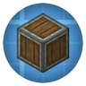
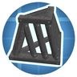
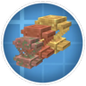
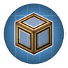

---
navigation:
  title: "Factory decor"
  position: 0
  parent: reference.building.md
  icon: create:industrial_iron_block
---

# Factory decor

## Train fittings

<EmiSearch query="@bellsandwhistles" /> <EmiSearch query="@create" />

<ItemGrid>
  <ItemIcon id="bellsandwhistles:brass_pilot" />
  <ItemIcon id="bellsandwhistles:brass_grab_rails" />
  <ItemIcon id="bellsandwhistles:headlight" />
  <ItemIcon id="bellsandwhistles:metro_window" />
  <ItemIcon id="bellsandwhistles:brass_bogie_steps" />
</ItemGrid>

| Shown items |
| --- |
| <ItemLink id="bellsandwhistles:brass_pilot" /> |
| <ItemLink id="bellsandwhistles:brass_grab_rails" /> |
| <ItemLink id="bellsandwhistles:headlight" /> |
| <ItemLink id="bellsandwhistles:metro_window" /> |
| <ItemLink id="bellsandwhistles:brass_bogie_steps" /> |

Create: Bells & Whistles adds exterior train fittings and body panels. Choose the fitting and its material through the recipe browser.

***

## Tiles & fittings

<EmiSearch query="@bits_n_bobs" />

<ItemGrid>
  <ItemIcon id="bits_n_bobs:tuff_tiles" />
  <ItemIcon id="bits_n_bobs:headlamp" />
  <ItemIcon id="bits_n_bobs:red_chair" />
</ItemGrid>

| Shown items |
| --- |
| <ItemLink id="bits_n_bobs:tuff_tiles" /> |
| <ItemLink id="bits_n_bobs:headlamp" /> |
| <ItemLink id="bits_n_bobs:red_chair" /> |

Create: Bits 'n' Bobs combines stone tile families with seating and lighting. The shown items identify some of its building choices, not its entire palette.

***

## Bricks & catwalks

<EmiSearch query="@createdeco" />

<ItemGrid>
  <ItemIcon id="createdeco:iron_catwalk" />
  <ItemIcon id="createdeco:scarlet_bricks" />
  <ItemIcon id="createdeco:pearl_bricks" />
  <ItemIcon id="createdeco:red_placard" />
</ItemGrid>

| Shown items |
| --- |
| <ItemLink id="createdeco:iron_catwalk" /> |
| <ItemLink id="createdeco:scarlet_bricks" /> |
| <ItemLink id="createdeco:pearl_bricks" /> |
| <ItemLink id="createdeco:red_placard" /> |

Create Deco combines colored brick patterns with matching slabs, stairs and walls. Metal walkways and fittings provide a separate factory finish.

***

## Industrial palette

<EmiSearch query="@dndecor" />

<ItemGrid>
  <ItemIcon id="dndecor:gold_catwalk" />
  <ItemIcon id="dndecor:gold_boiler" />
  <ItemIcon id="dndecor:container" />
  <ItemIcon id="dndecor:diagonal_girder" />
</ItemGrid>

| Shown items |
| --- |
| <ItemLink id="dndecor:gold_catwalk" /> |
| <ItemLink id="dndecor:gold_boiler" /> |
| <ItemLink id="dndecor:container" /> |
| <ItemLink id="dndecor:diagonal_girder" /> |

Create: Design n' Decor supplies industrial cladding and large decorative machine shapes. Check a part's recipe rather than assuming that its appearance makes it functional machinery.

***

## Encased machinery

<EmiSearch query="@createcasing" />

<ItemGrid>
  <ItemIcon id="createcasing:railway_clutch" />
  <ItemIcon id="createcasing:industrial_iron_depot" />
  <ItemIcon id="createcasing:spruce_shaft" />
  <ItemIcon id="createcasing:copper_chain_conveyor" />
</ItemGrid>

| Shown items |
| --- |
| <ItemLink id="createcasing:railway_clutch" /> |
| <ItemLink id="createcasing:industrial_iron_depot" /> |
| <ItemLink id="createcasing:spruce_shaft" /> |
| <ItemLink id="createcasing:copper_chain_conveyor" /> |

Create Encased adds wood transmission parts and material-specific encased machines. Each part has its own recipe, rather than accepting a universal casing swap.

***

## Frames & glass

<EmiSearch query="@createframed" />

<ItemGrid>
  <ItemIcon id="createframed:tinted_framed_glass" />
  <ItemIcon id="createframed:tinted_tiled_glass" />
  <ItemIcon id="createframed:zinc_window" />
  <ItemIcon id="createframed:cardboard_window" />
</ItemGrid>

| Shown items |
| --- |
| <ItemLink id="createframed:tinted_framed_glass" /> |
| <ItemLink id="createframed:tinted_tiled_glass" /> |
| <ItemLink id="createframed:zinc_window" /> |
| <ItemLink id="createframed:cardboard_window" /> |

Create: Framed supplies framed and tiled glazing for openings. Stained variants provide colored glazing.

***

## Beams & trusses

<EmiSearch query="@createmoregirder" />

<ItemGrid>
  <ItemIcon id="createmoregirder:andesite_beam" />
  <ItemIcon id="createmoregirder:brass_truss" />
  <ItemIcon id="createmoregirder:copycat_bracket" />
  <ItemIcon id="createmoregirder:copper_beam" />
</ItemGrid>

| Shown items |
| --- |
| <ItemLink id="createmoregirder:andesite_beam" /> |
| <ItemLink id="createmoregirder:brass_truss" /> |
| <ItemLink id="createmoregirder:copycat_bracket" /> |
| <ItemLink id="createmoregirder:copper_beam" /> |

Create: More Girder supplies structural beam and truss forms with matching connectors. Copper has oxidation and waxed variants, while copycat forms use a separate texture approach.

***

## Glass casings

<EmiSearch query="@createprism" />

<ItemGrid>
  <ItemIcon id="createprism:andesite_glass_casing" />
  <ItemIcon id="createprism:brass_clear_glass_casing" />
  <ItemIcon id="createprism:copper_illumination_casing" />
</ItemGrid>

| Shown items |
| --- |
| <ItemLink id="createprism:andesite_glass_casing" /> |
| <ItemLink id="createprism:brass_clear_glass_casing" /> |
| <ItemLink id="createprism:copper_illumination_casing" /> |

Create: Prismatic Shine combines glass casings with encased transmission parts. Clear and illuminated casing families are distinct choices. Glass scaffolding is a separate family.

***

## Copper aging

Create Oxidized supplies water filling recipes for exposed, weathered and oxidized copper, including Create shingles and tiles with slabs and stairs. Each inspected step uses 250 millibuckets of water. Waxing remains a separate item recipe. Copycat shapes provide a separate texture system.

- [Copycat shapes](building.copycats.md)

***

## Crafting

<Recipe id="bellsandwhistles:bogie_steps/brass_bogie_steps" />

***

## Related mods

| Mod or content | Purpose | Status | Item search |
| --- | --- | --- | --- |
|  [Create Deco](building.factory.md) | Adds Create-styled industrial decoration for factories and infrastructure. | Baseline, installed | <EmiSearch query="@createdeco" /> |
|  [Create Encased](building.factory.md) | Expands casing choices for Create shafts, cogwheels and pipes. | Baseline, installed | <EmiSearch query="@createcasing" /> |
|  [Create: Bells & Whistles](building.factory.md) | Adds decorative details for Create trains and railway builds. | Baseline, installed | <EmiSearch query="@bellsandwhistles" /> |
|  [Create: Bits 'n' Bobs](building.factory.md) | Adds cogwheel chain drives and customizable industrial decoration to Create. | Baseline, installed | <EmiSearch query="@bits_n_bobs" /> |
|  [Create: Design n' Decor](building.factory.md) | Adds factory decoration blocks styled to match Create machinery. | Baseline, installed | <EmiSearch query="@dndecor" /> |
|  [Create: Framed](building.factory.md) | Adds more framed glass variants for Create-style construction. | Baseline, installed | <EmiSearch query="@createframed" /> |
|  [Create: More Girder](building.factory.md) | Adds structural girder variants for Create builds. | Baseline, installed | <EmiSearch query="@createmoregirder" /> |
|  [Create: Oxidized](building.factory.md) | Adds Create processing recipes for oxidizing copper blocks. | Baseline, installed | No separate item search |
|  [Create: Prismatic Shine](building.factory.md) | Adds glass and illuminated casings for Create machinery. | Baseline, installed | <EmiSearch query="@createprism" /> |
