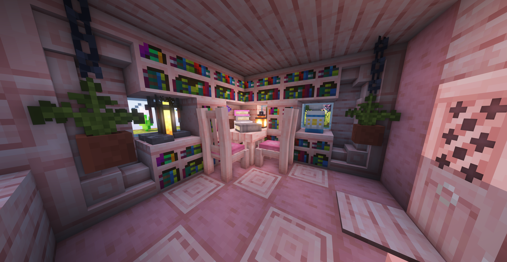

---
navigation:
  title: "Furniture"
  position: 0
  parent: reference.building.md
  icon: minecraft:bricks
---

# Furniture

## Rooms

<EmiSearch query="@handcrafted" />

Handcrafted cherry bedroom, moony.

***

## Wood furniture

<ItemGrid>
  <ItemIcon id="handcrafted:oak_chair" />
  <ItemIcon id="handcrafted:oak_table" />
  <ItemIcon id="handcrafted:oak_cupboard" />
  <ItemIcon id="handcrafted:oak_couch" />
  <ItemIcon id="handcrafted:oak_fancy_bed" />
</ItemGrid>

| Shown items |
| --- |
| <ItemLink id="handcrafted:oak_chair" /> |
| <ItemLink id="handcrafted:oak_table" /> |
| <ItemLink id="handcrafted:oak_cupboard" /> |
| <ItemLink id="handcrafted:oak_couch" /> |
| <ItemLink id="handcrafted:oak_fancy_bed" /> |

Handcrafted supplies coordinated seating, surfaces, storage-shaped furniture and beds across wood families. The shown oak items are examples, not the complete furniture or wood catalog.

***

## Seating & textiles

<EmiSearch query="@create" /> <EmiSearch query="@interiors" />

<ItemGrid>
  <ItemIcon id="interiors:white_chair" />
  <ItemIcon id="interiors:white_floor_chair" />
  <ItemIcon id="interiors:white_cushion" />
  <ItemIcon id="interiors:kelp_seat" />
</ItemGrid>

| Shown items |
| --- |
| <ItemLink id="interiors:white_chair" /> |
| <ItemLink id="interiors:white_floor_chair" /> |
| <ItemLink id="interiors:white_cushion" /> |
| <ItemLink id="interiors:kelp_seat" /> |

Create Interiors supplies chairs, floor chairs and cushions in sixteen dye colors, plus kelp seating. Handcrafted adds colored cushions, sheets and crockery.

***

## Plants & lamps

<EmiSearch query="@beautify" />

<ItemGrid>
  <ItemIcon id="beautify:hanging_pot" />
  <ItemIcon id="beautify:bookstack" />
  <ItemIcon id="beautify:botanist_workbench" />
  <ItemIcon id="beautify:lamp_bamboo" />
  <ItemIcon id="beautify:lamp_candelabra" />
  <ItemIcon id="beautify:oak_trellis" />
</ItemGrid>

| Shown items |
| --- |
| <ItemLink id="beautify:hanging_pot" /> |
| <ItemLink id="beautify:bookstack" /> |
| <ItemLink id="beautify:botanist_workbench" /> |
| <ItemLink id="beautify:lamp_bamboo" /> |
| <ItemLink id="beautify:lamp_candelabra" /> |
| <ItemLink id="beautify:oak_trellis" /> |

Beautify supplies plant displays, wall furnishings and decorative lamps. Choose each furnishing through its own recipe.

***

## Small furnishings

<EmiSearch query="@amendments" /> <EmiSearch query="@supplementaries" />

<ItemGrid>
  <ItemIcon id="supplementaries:awning" />
  <ItemIcon id="supplementaries:blackboard" />
  <ItemIcon id="supplementaries:clock_block" />
  <ItemIcon id="supplementaries:pedestal" />
  <ItemIcon id="supplementaries:jar" />
</ItemGrid>

| Shown items |
| --- |
| <ItemLink id="supplementaries:awning" /> |
| <ItemLink id="supplementaries:blackboard" /> |
| <ItemLink id="supplementaries:clock_block" /> |
| <ItemLink id="supplementaries:pedestal" /> |
| <ItemLink id="supplementaries:jar" /> |

Supplementaries supplies awnings, jars, pedestals, blackboards and small furnishings. Amendments changes interactions with existing vanilla blocks. Decorative Food supplies food presentation interactions rather than a separate set of cooking machines. Check the item tooltip before using furniture as storage or machinery.

***

## Crafting

<Recipe id="beautify:bookstack" />

## Related topics

- [Browse recipe](help.search.md)

***

## Related mods

| Mod or content | Purpose | Status | Item search |
| --- | --- | --- | --- |
|  [Amendments](building.furniture.md) | Expands existing blocks with features such as potion-mixing cauldrons and wall-mounted lanterns. | Baseline, installed | <EmiSearch query="@amendments" /> |
|  [Beautify: ReFoxed](building.furniture.md) | Adds vanilla-styled decorative furnishings for homes and gardens. | Baseline, installed | <EmiSearch query="@beautify" /> |
|  [Create: Interiors](building.furniture.md) | Adds Create-styled furniture for train interiors and other builds. | Baseline, installed | <EmiSearch query="@interiors" /> |
|  [Handcrafted](building.furniture.md) | Adds detailed furniture and household decorations. | Baseline, installed | <EmiSearch query="@handcrafted" /> |
|  [Supplementaries](building.furniture.md) | Adds practical decorations and utility blocks for building, storage and automation. | Baseline, installed | <EmiSearch query="@supplementaries" /> |
|  [TW‘s  Decorative Food](building.furniture.md) | Lets food items be placed in the world as decorations. | Baseline, installed | No separate item search |
