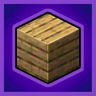

---
navigation:
  title: "Materials"
  position: 0
  parent: reference.building.md
  icon: chipped:mason_table
---

# Materials

## Wood & joinery

<EmiSearch query="@chipped" />

<ItemGrid>
  <ItemIcon id="chipped:carpenters_table" />
  <ItemIcon id="chipped:basket_woven_oak_planks" />
  <ItemIcon id="chipped:boxed_oak_planks" />
</ItemGrid>

| Shown items |
| --- |
| <ItemLink id="chipped:basket_woven_oak_planks" /> |
| <ItemLink id="chipped:boxed_oak_planks" /> |

<ItemLink id="chipped:carpenters_table" /> changes wood and wooden joinery textures. Insert the base material and select a variant. The shown oak planks are examples, not the full family.

***

## Stone & masonry

<ItemGrid>
  <ItemIcon id="chipped:mason_table" />
  <ItemIcon id="chipped:angry_mossy_stone_bricks" />
  <ItemIcon id="chipped:bordered_mossy_stone_bricks" />
</ItemGrid>

| Shown items |
| --- |
| <ItemLink id="chipped:angry_mossy_stone_bricks" /> |
| <ItemLink id="chipped:bordered_mossy_stone_bricks" /> |

<ItemLink id="chipped:mason_table" /> changes stone and masonry textures. Its families include natural stone and manufactured building materials. The shown mossy stone bricks are examples.

***

## Glass

<ItemGrid>
  <ItemIcon id="chipped:glassblower" />
  <ItemIcon id="chipped:arched_black_stained_glass_pillar" />
  <ItemIcon id="chipped:arched_blue_stained_glass_pillar" />
</ItemGrid>

| Shown items |
| --- |
| <ItemLink id="chipped:arched_black_stained_glass_pillar" /> |
| <ItemLink id="chipped:arched_blue_stained_glass_pillar" /> |

<ItemLink id="chipped:glassblower" /> handles these Chipped families: Clear glass and panes, plus stained glass and panes in all sixteen dye colors.

***

## Wool & carpet

<ItemGrid>
  <ItemIcon id="chipped:loom_table" />
  <ItemIcon id="chipped:barky_white_wool" />
  <ItemIcon id="chipped:blocky_white_wool" />
</ItemGrid>

| Shown items |
| --- |
| <ItemLink id="chipped:barky_white_wool" /> |
| <ItemLink id="chipped:blocky_white_wool" /> |

<ItemLink id="chipped:loom_table" /> handles these Chipped families: Wool and carpet in all sixteen dye colors.

***

## Plants & terrain

<ItemGrid>
  <ItemIcon id="chipped:botanist_workbench" />
  <ItemIcon id="chipped:blobby_moss_block" />
  <ItemIcon id="chipped:blue_moss_block" />
</ItemGrid>

| Shown items |
| --- |
| <ItemLink id="chipped:blobby_moss_block" /> |
| <ItemLink id="chipped:blue_moss_block" /> |

<ItemLink id="chipped:botanist_workbench" /> changes plant and terrain block textures. The shown moss variants illustrate part of this family.

***

## Minerals & metals

<ItemGrid>
  <ItemIcon id="chipped:alchemy_bench" />
  <ItemIcon id="chipped:ancient_gold_block" />
  <ItemIcon id="chipped:angry_raw_gold_block" />
</ItemGrid>

| Shown items |
| --- |
| <ItemLink id="chipped:ancient_gold_block" /> |
| <ItemLink id="chipped:angry_raw_gold_block" /> |

<ItemLink id="chipped:alchemy_bench" /> changes mineral and metal block textures. Copper choices include waxed oxidation stages. The shown gold blocks are examples.

***

## Bars & lighting

<ItemGrid>
  <ItemIcon id="chipped:tinkering_table" />
  <ItemIcon id="chipped:barbed_iron_bars" />
  <ItemIcon id="chipped:bolted_iron_bars" />
</ItemGrid>

| Shown items |
| --- |
| <ItemLink id="chipped:barbed_iron_bars" /> |
| <ItemLink id="chipped:bolted_iron_bars" /> |

<ItemLink id="chipped:tinkering_table" /> changes metal-bar, lighting and redstone block textures. The shown iron bars are examples, not the complete workstation catalog.

***

## Getting started

Craft the matching Chipped workstation, insert its base material and choose a texture. Chipped Express adds stonecutting conversions between Chipped variants and base materials. Every Compat and Stone Zone supply compatibility families for installed wood and stone providers. Their available variants depend on those providers. Use Browse recipe for exact conversions.

- [Browse recipe](help.search.md)

***

## Crafting

<Recipe id="minecraft:workbench/alchemy_bench" />

***

## Related mods

| Mod or content | Purpose | Item search |
| --- | --- | --- |
|  [Chipped](building.palette.md) | Adds decorative block variants crafted at material-specific workbenches. | <EmiSearch query="@chipped" /> |
|  [Chipped Express](building.palette.md) | Makes Chipped decorative block recipes available through the stonecutter. | No separate item search |
|  [Every Compat (Stone Zone)](building.palette.md) | Creates supported decorative block variants from other mods' stone types. | <EmiSearch query="@stonezone" /> |
|  [Every Compat (Wood Good)](building.palette.md) | Creates supported building and furniture variants using other mods' wood types. | <EmiSearch query="@everycomp" /> |
