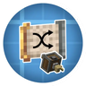
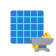

---
navigation:
  title: "Placement tools"
  position: 0
  parent: reference.building.md
  icon: minecraft:bricks
---

# Placement tools

## Random palettes

<ItemGrid>
  <ItemIcon id="mechtrowel:mech_trowel" />
  <ItemIcon id="createshufflefilter:shuffle_filter" />
  <ItemIcon id="createshufflefilter:weighted_shuffle_filter" />
</ItemGrid>

| Shown items |
| --- |
| <ItemLink id="mechtrowel:mech_trowel" /> |
| <ItemLink id="createshufflefilter:shuffle_filter" /> |
| <ItemLink id="createshufflefilter:weighted_shuffle_filter" /> |

Mech Trowel supplies a placement tool, with reach, capacity and variant conversion upgrade templates. Shuffle Filter and Weighted Shuffle Filter supply random and weighted palette selection. Their settings choose the palette. Available materials still matter.

***

## Schematics

<ItemGrid>
  <ItemIcon id="create_pattern_schematics:empty_pattern_schematic" />
  <ItemIcon id="create_pattern_schematics:pattern_schematic_and_quill" />
  <ItemIcon id="create_pattern_schematics:pattern_schematic" />
</ItemGrid>

| Shown items |
| --- |
| <ItemLink id="create_pattern_schematics:empty_pattern_schematic" /> |
| <ItemLink id="create_pattern_schematics:pattern_schematic_and_quill" /> |
| <ItemLink id="create_pattern_schematics:pattern_schematic" /> |

Pattern Schematics supplies empty patterns, captured patterns and the quill capture item. Forgematica supplies a client schematic overlay and material planning. A displayed schematic does not place a finished vehicle or bypass survival ingredients.

***

## Crafting

<Recipe id="create_pattern_schematics:pattern_schematic" />

## Related topics

- [Browse recipe](help.search.md)

***

## Related mods

| Mod or content | Status | Publisher description |
| --- | --- | --- |
|  [Create: Pattern Schematics](building.placement.md) | Baseline, installed | Build with repeating schematics! |
|  [Create: Shuffle Filter](building.placement.md) | Baseline, installed | This mod provides a new "Shuffle Filter" item which, when used in Create deployers on contrabtions, enables a randomnes when placing blocks. (Like the shuffle mod for players). |
|  [Forgematica](building.placement.md) | Baseline, installed | Litematica unofficial (Neo)Forge port. A modern client-side schematic mod for Minecraft. |
|  [Mech Trowel](building.placement.md) | Baseline, installed | A Trowel+ that randomizes / shuffle blocks with multiple customizable palettes. Includes building wand functionality. Works with Create /Copycats+ & FramedBlocks |
