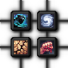
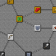

---
navigation:
  title: "Character skills"
  position: 0
  parent: reference.skills.md
  icon: minecraft:experience_bottle
---

# Character skills

## Skill development

<EmiSearch query="@rogues" /> <EmiSearch query="@skill_tree_rpgs" /> <EmiSearch query="@wizards" />

<ItemGrid>
  <ItemIcon id="skill_tree_rpgs:orb_of_oblivion" />
  <ItemIcon id="rogues:iron_dagger" />
  <ItemIcon id="wizards:wand_arcane" />
</ItemGrid>

Open skills with <KeyBind id="key.puffish_skills.open" />. Pufferfish’s Skills supplies the screen and progression engine. Skill Tree and More RPG Classes Skill Tree supply the class and weapon branches.

Kills contribute tree experience through the supplied definitions, with anti-farming limits and nearby team sharing. Spend earned points on available connected nodes and read their requirements. Class points and weapon points are separate budgets. Learning spells at the binding table uses ordinary experience levels, not these skill points.

***

## Class paths

<EmiSearch query="@archers_expansion" /> <EmiSearch query="@archers" /> <EmiSearch query="@bards_rpg" /> <EmiSearch query="@berserker_rpg" /> <EmiSearch query="@elemental_wizards_rpg" /> <EmiSearch query="@forcemaster_rpg" /> <EmiSearch query="@paladins" /> <EmiSearch query="@witcher_rpg" />

| Path | Native item |
| --- | --- |
| Path of Arcane | <ItemGrid><ItemIcon id="wizards:wand_arcane" /></ItemGrid>  <ItemLink id="wizards:wand_arcane" /> |
| Path of the Archer | <ItemGrid><ItemIcon id="archers:composite_longbow" /></ItemGrid>  <ItemLink id="archers:composite_longbow" /> |
| Path of Fire | <ItemGrid><ItemIcon id="wizards:wand_fire" /></ItemGrid>  <ItemLink id="wizards:wand_fire" /> |
| Path of Frost | <ItemGrid><ItemIcon id="wizards:wand_frost" /></ItemGrid>  <ItemLink id="wizards:wand_frost" /> |
| Path of the Paladin | <ItemGrid><ItemIcon id="paladins:iron_mace" /></ItemGrid>  <ItemLink id="paladins:iron_mace" /> |
| Path of the Light | <ItemGrid><ItemIcon id="paladins:holy_wand" /></ItemGrid>  <ItemLink id="paladins:holy_wand" /> |
| Path of the Rogue | <ItemGrid><ItemIcon id="rogues:iron_dagger" /></ItemGrid>  <ItemLink id="rogues:iron_dagger" /> |
| Path of the Warrior | <ItemGrid><ItemIcon id="rogues:iron_double_axe" /></ItemGrid>  <ItemLink id="rogues:iron_double_axe" /> |
| Path of Air | <ItemGrid><ItemIcon id="elemental_wizards_rpg:wand_wind" /></ItemGrid>  <ItemLink id="elemental_wizards_rpg:wand_wind" /> |
| Path of the Bard | <ItemGrid><ItemIcon id="bards_rpg:wooden_lute" /></ItemGrid>  <ItemLink id="bards_rpg:wooden_lute" /> |
| Path of the Berserker | <ItemGrid><ItemIcon id="berserker_rpg:iron_berserker_axe" /></ItemGrid>  <ItemLink id="berserker_rpg:iron_berserker_axe" /> |
| Path of the Deadeye | <ItemGrid><ItemIcon id="archers:rapid_crossbow" /></ItemGrid>  <ItemLink id="archers:rapid_crossbow" /> |
| Path of Earth | <ItemGrid><ItemIcon id="elemental_wizards_rpg:wand_terra" /></ItemGrid>  <ItemLink id="elemental_wizards_rpg:wand_terra" /> |
| Witcher fencing | <ItemGrid><ItemIcon id="witcher_rpg:iron_witcher_sword" /></ItemGrid>  <ItemLink id="witcher_rpg:iron_witcher_sword" /> |
| Path of the Forcemaster | <ItemGrid><ItemIcon id="forcemaster_rpg:iron_knuckle" /></ItemGrid>  <ItemLink id="forcemaster_rpg:iron_knuckle" /> |
| Witcher signs | <ItemGrid><ItemIcon id="witcher_rpg:wolf_school_medallion" /></ItemGrid>  <ItemLink id="witcher_rpg:wolf_school_medallion" /> |
| Path of the Tundra Hunter | <ItemGrid><ItemIcon id="archers_expansion:tundra_hunter_chest" /></ItemGrid>  <ItemLink id="archers_expansion:tundra_hunter_chest" /> |
| Path of the War Archer | <ItemGrid><ItemIcon id="archers_expansion:war_archer_chest" /></ItemGrid>  <ItemLink id="archers_expansion:war_archer_chest" /> |
| Path of Water | <ItemGrid><ItemIcon id="elemental_wizards_rpg:wand_aqua" /></ItemGrid>  <ItemLink id="elemental_wizards_rpg:wand_aqua" /> |

***

## Weapon development

| Path | Native item |
| --- | --- |
| Arcane Staff Specialisation | <ItemGrid><ItemIcon id="wizards:staff_arcane" /></ItemGrid>  <ItemLink id="wizards:staff_arcane" /> |
| Axe Specialisation | <ItemGrid><ItemIcon id="minecraft:iron_axe" /></ItemGrid>  <ItemLink id="minecraft:iron_axe" /> |
| Bow Specialisation | <ItemGrid><ItemIcon id="minecraft:bow" /></ItemGrid>  <ItemLink id="minecraft:bow" /> |
| Claymore Specialisation | <ItemGrid><ItemIcon id="paladins:iron_claymore" /></ItemGrid>  <ItemLink id="paladins:iron_claymore" /> |
| Crossbow Specialisation | <ItemGrid><ItemIcon id="minecraft:crossbow" /></ItemGrid>  <ItemLink id="minecraft:crossbow" /> |
| Dagger Specialisation | <ItemGrid><ItemIcon id="rogues:iron_dagger" /></ItemGrid>  <ItemLink id="rogues:iron_dagger" /> |
| Double Axe Specialisation | <ItemGrid><ItemIcon id="rogues:iron_double_axe" /></ItemGrid>  <ItemLink id="rogues:iron_double_axe" /> |
| Fire Staff Specialisation | <ItemGrid><ItemIcon id="wizards:staff_fire" /></ItemGrid>  <ItemLink id="wizards:staff_fire" /> |
| Frost Staff Specialisation | <ItemGrid><ItemIcon id="wizards:staff_frost" /></ItemGrid>  <ItemLink id="wizards:staff_frost" /> |
| Glaive Specialisation | <ItemGrid><ItemIcon id="rogues:iron_glaive" /></ItemGrid>  <ItemLink id="rogues:iron_glaive" /> |
| Hammer Specialisation | <ItemGrid><ItemIcon id="paladins:iron_great_hammer" /></ItemGrid>  <ItemLink id="paladins:iron_great_hammer" /> |
| Holy Staff Specialisation | <ItemGrid><ItemIcon id="paladins:holy_staff" /></ItemGrid>  <ItemLink id="paladins:holy_staff" /> |
| Mace Specialisation | <ItemGrid><ItemIcon id="paladins:iron_mace" /></ItemGrid>  <ItemLink id="paladins:iron_mace" /> |
| Sickle Specialisation | <ItemGrid><ItemIcon id="rogues:iron_sickle" /></ItemGrid>  <ItemLink id="rogues:iron_sickle" /> |
| Spear Specialisation | <ItemGrid><ItemIcon id="archers:iron_spear" /></ItemGrid>  <ItemLink id="archers:iron_spear" /> |
| Sword Specialisation | <ItemGrid><ItemIcon id="minecraft:iron_sword" /></ItemGrid>  <ItemLink id="minecraft:iron_sword" /> |
| Improved Water Whip | <ItemGrid><ItemIcon id="elemental_wizards_rpg:staff_aqua" /></ItemGrid>  <ItemLink id="elemental_wizards_rpg:staff_aqua" /> |
| Berserker Axe Specialisation | <ItemGrid><ItemIcon id="berserker_rpg:iron_berserker_axe" /></ItemGrid>  <ItemLink id="berserker_rpg:iron_berserker_axe" /> |
| Harp Crossbow Specialisation | <ItemGrid><ItemIcon id="bards_rpg:harp_crossbow" /></ItemGrid>  <ItemLink id="bards_rpg:harp_crossbow" /> |
| Knuckle Specialisation | <ItemGrid><ItemIcon id="forcemaster_rpg:iron_knuckle" /></ItemGrid>  <ItemLink id="forcemaster_rpg:iron_knuckle" /> |
| Improved Lute Songs | <ItemGrid><ItemIcon id="bards_rpg:wooden_lute" /></ItemGrid>  <ItemLink id="bards_rpg:wooden_lute" /> |
| Improved Lyre Songs | <ItemGrid><ItemIcon id="bards_rpg:golden_lyre" /></ItemGrid>  <ItemLink id="bards_rpg:golden_lyre" /> |
| Rapier Specialisation | <ItemGrid><ItemIcon id="bards_rpg:iron_rapier" /></ItemGrid>  <ItemLink id="bards_rpg:iron_rapier" /> |
| Improved Stone Spear | <ItemGrid><ItemIcon id="elemental_wizards_rpg:staff_terra" /></ItemGrid>  <ItemLink id="elemental_wizards_rpg:staff_terra" /> |
| Improved Air Cutter | <ItemGrid><ItemIcon id="elemental_wizards_rpg:staff_wind" /></ItemGrid>  <ItemLink id="elemental_wizards_rpg:staff_wind" /> |
| Witcher Sword Specialisation | <ItemGrid><ItemIcon id="witcher_rpg:iron_witcher_sword" /></ItemGrid>  <ItemLink id="witcher_rpg:iron_witcher_sword" /> |

***

## Reset & refinement

<ItemLink id="skill_tree_rpgs:orb_of_oblivion" />

<Recipe id="skill_tree_rpgs:orb_of_oblivion" />

Read the Orb of Oblivion tooltip before resetting. Improved-spell nodes modify named abilities, rather than adding an unrelated class spell. Check your current tree for the available point budget and incompatible roots.

- [Martial abilities](combat.martial.md) Ranged shots, close combat and class techniques.
- [Magic & support](combat.magic.md) Spell binding, casting resources and class spell lists.
- [Weapons & armor](equipment.weapons-armor.md) Choose a weapon family and compare every supported variant.

***

## Related mods

| Mod or content | Purpose | Item search |
| --- | --- | --- |
|  [More RPG Classes - Skill Tree (RPG Series Plus)](combat.skills.md) | Adds class skill-tree support for the additional More RPG Classes professions. | No separate item search |
|  [Pufferfish's Skills](combat.skills.md) | Provides a configurable skill system and skill-tree interface. | No separate item search |
|  [Skill Tree (RPG Series)](combat.skills.md) | Adds class-oriented skill trees for RPG Series characters. | <EmiSearch query="@skill_tree_rpgs" /> |
