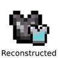
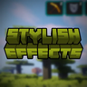

---
navigation:
  title: "Armor & status"
  position: 0
  parent: reference.equipment.md
  icon: minecraft:iron_chestplate
---

# Armor & status

## Armor & effect displays

<ItemGrid>
  <ItemIcon id="minecraft:iron_chestplate" />
  <ItemIcon id="minecraft:diamond_chestplate" />
  <ItemIcon id="minecraft:potion" />
</ItemGrid>

Detail Armor Bar Reconstructed makes armor protection easier to read. Status Effect Bars Reforged shows remaining effect durations. Stylish Effects changes effect presentation. These displays do not grant another equipment slot or another combat bonus.

***

## Reading your build

Read equipment tooltips for permanent attributes while the item is equipped. Read effect durations for temporary bonuses. Then compare the spell school and trigger conditions your build actually uses.

- [Weapons & armor](equipment.weapons-armor.md) Choose a weapon family and compare every supported variant.
- [Accessories](equipment.accessories.md) Equip jewelry and relics in their supported slots.
- [Skill development](combat.skills.md) Spend class and weapon points on connected branches.

***

## Related mods

| Mod or content | Status | Publisher description |
| --- | --- | --- |
|  [Detail Armor Bar Reconstructed](equipment.display.md) | Baseline, installed | More details about armor in the armor bar! |
|  [Status Effect Bars Reforged](equipment.display.md) | Baseline, installed | A client-side mod that adds small customizable bars to the status effects overlay and in the inventory to show the remaining duration of effects. |
|  [Stylish Effects](equipment.display.md) | Baseline, installed | Status effect display overhaul: Display them in any menu! And way more compact. |
