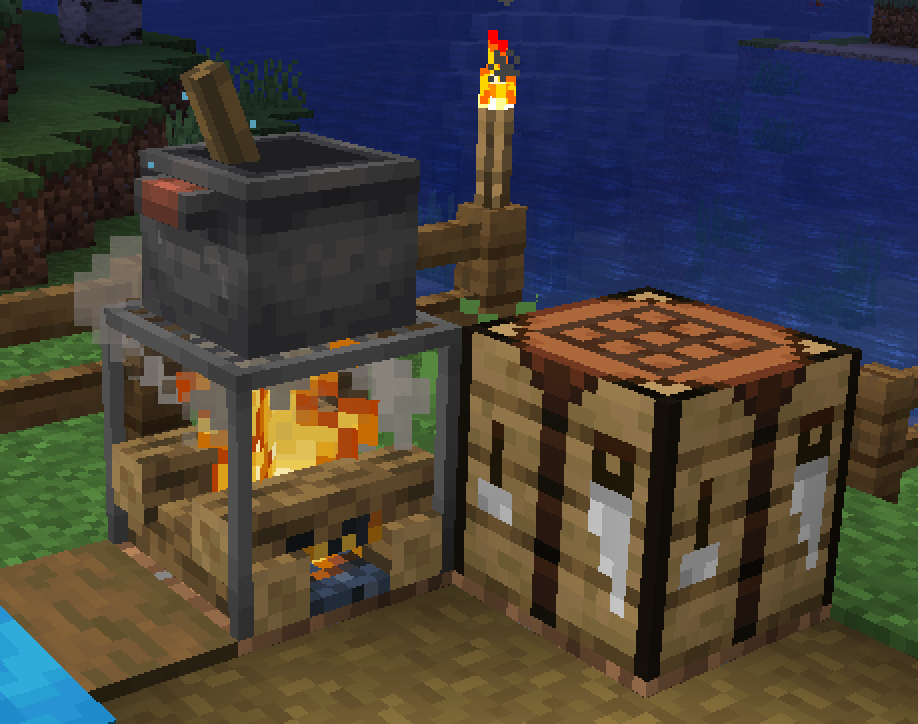
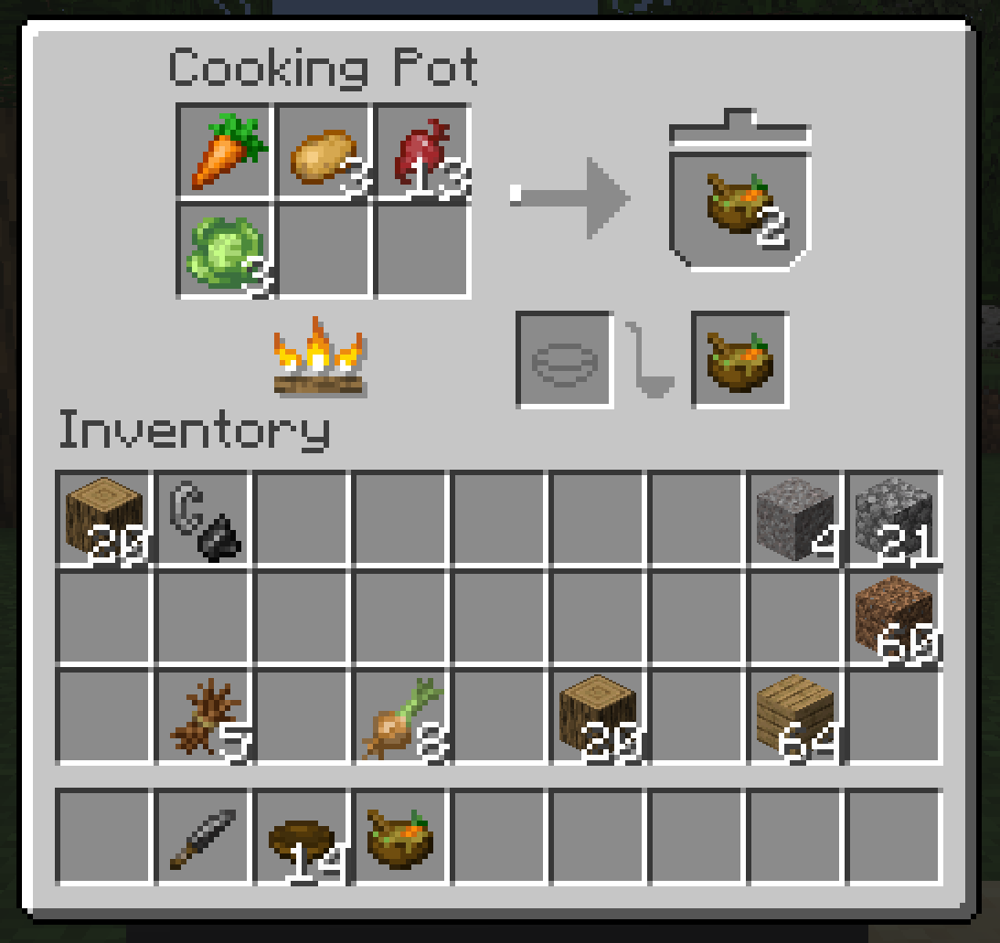

---
navigation:
  title: "Cooking tools"
  position: 0
  parent: reference.food.md
  icon: farmersdelight:cooking_pot
item_ids:
  - farmersdelight:cooking_pot
  - farmersdelight:cutting_board
  - farmersdelight:skillet
  - farmersdelight:stove
---

# Cooking tools

## Kitchen tools

<EmiSearch query="@farmersdelight" />

<ItemGrid>
  <ItemIcon id="farmersdelight:cooking_pot" />
  <ItemIcon id="farmersdelight:cutting_board" />
  <ItemIcon id="farmersdelight:skillet" />
  <ItemIcon id="farmersdelight:stove" />
  <ItemIcon id="farmersdelight:flint_knife" />
</ItemGrid>

Materials & containers

<ItemGrid>
  <ItemIcon id="minecraft:brick" />
  <ItemIcon id="minecraft:wooden_shovel" />
  <ItemIcon id="minecraft:iron_ingot" />
  <ItemIcon id="minecraft:water_bucket" />
  <ItemIcon id="minecraft:stick" />
  <ItemIcon id="minecraft:oak_planks" />
  <ItemIcon id="minecraft:bricks" />
  <ItemIcon id="minecraft:campfire" />
  <ItemIcon id="minecraft:flint" />
</ItemGrid>

Use a <ItemLink id="farmersdelight:flint_knife" /> on a <ItemLink id="farmersdelight:cutting_board" /> to prepare portions. Put food on a lit <ItemLink id="farmersdelight:stove" /> for direct cooking, or heat a <ItemLink id="farmersdelight:cooking_pot" /> for combined meals. A <ItemLink id="farmersdelight:skillet" /> cooks individual ingredients. Native recipes show ingredients, quantities, accepted substitutes and serving containers. Keep containers separate from food inputs. The water bucket in the tool materials grid represents a crafting ingredient, not water required for every meal.
***

## Sandwiches & rolls

<ItemGrid>
  <ItemIcon id="farmersdelight:egg_sandwich" />
  <ItemIcon id="farmersdelight:chicken_sandwich" />
  <ItemIcon id="farmersdelight:hamburger" />
  <ItemIcon id="farmersdelight:bacon_sandwich" />
  <ItemIcon id="farmersdelight:mutton_wrap" />
  <ItemIcon id="farmersdelight:dumplings" />
  <ItemIcon id="farmersdelight:cabbage_rolls" />
  <ItemIcon id="farmersdelight:salmon_roll" />
  <ItemIcon id="farmersdelight:cod_roll" />
  <ItemIcon id="farmersdelight:kelp_roll" />
</ItemGrid>

Materials & containers

<ItemGrid>
  <ItemIcon id="minecraft:bread" />
  <ItemIcon id="farmersdelight:fried_egg" />
  <ItemIcon id="minecraft:cooked_chicken" />
  <ItemIcon id="farmersdelight:cabbage" />
  <ItemIcon id="minecraft:carrot" />
  <ItemIcon id="farmersdelight:beef_patty" />
  <ItemIcon id="farmersdelight:tomato" />
  <ItemIcon id="farmersdelight:onion" />
  <ItemIcon id="farmersdelight:cooked_bacon" />
  <ItemIcon id="minecraft:cooked_mutton" />
  <ItemIcon id="farmersdelight:wheat_dough" />
  <ItemIcon id="minecraft:chicken" />
  <ItemIcon id="farmersdelight:salmon_slice" />
  <ItemIcon id="farmersdelight:cooked_rice" />
  <ItemIcon id="farmersdelight:cod_slice" />
  <ItemIcon id="minecraft:dried_kelp" />
</ItemGrid>

Bread and prepared fillings support sandwiches. Rice and wrapping ingredients open the roll branch. Egg sandwiches require cooked eggs rather than raw eggs.
***

## Soups & rice

<ItemGrid>
  <ItemIcon id="farmersdelight:beef_stew" />
  <ItemIcon id="farmersdelight:chicken_soup" />
  <ItemIcon id="farmersdelight:vegetable_soup" />
  <ItemIcon id="farmersdelight:fish_stew" />
  <ItemIcon id="farmersdelight:pumpkin_soup" />
  <ItemIcon id="farmersdelight:baked_cod_stew" />
  <ItemIcon id="farmersdelight:noodle_soup" />
  <ItemIcon id="farmersdelight:onion_soup" />
  <ItemIcon id="farmersdelight:bone_broth" />
  <ItemIcon id="farmersdelight:cooked_rice" />
  <ItemIcon id="farmersdelight:fried_rice" />
  <ItemIcon id="farmersdelight:mushroom_rice" />
</ItemGrid>

Materials & containers

<ItemGrid>
  <ItemIcon id="minecraft:beef" />
  <ItemIcon id="minecraft:carrot" />
  <ItemIcon id="minecraft:potato" />
  <ItemIcon id="minecraft:chicken" />
  <ItemIcon id="farmersdelight:cabbage" />
  <ItemIcon id="farmersdelight:onion" />
  <ItemIcon id="minecraft:melon_slice" />
  <ItemIcon id="minecraft:beetroot" />
  <ItemIcon id="minecraft:cod" />
  <ItemIcon id="farmersdelight:tomato_sauce" />
  <ItemIcon id="farmersdelight:pumpkin_slice" />
  <ItemIcon id="minecraft:porkchop" />
  <ItemIcon id="farmersdelight:milk_bottle" />
  <ItemIcon id="minecraft:egg" />
  <ItemIcon id="farmersdelight:tomato" />
  <ItemIcon id="farmersdelight:raw_pasta" />
  <ItemIcon id="minecraft:dried_kelp" />
  <ItemIcon id="minecraft:bread" />
  <ItemIcon id="minecraft:bone" />
  <ItemIcon id="minecraft:glow_berries" />
  <ItemIcon id="farmersdelight:rice" />
  <ItemIcon id="minecraft:brown_mushroom" />
  <ItemIcon id="minecraft:red_mushroom" />
</ItemGrid>

Crop harvests, meat and fish support soups and stews. Rice supplies both simple servings and mixed dishes.
***

## Plates & feasts

<ItemGrid>
  <ItemIcon id="farmersdelight:bacon_and_eggs" />
  <ItemIcon id="farmersdelight:pasta_with_meatballs" />
  <ItemIcon id="farmersdelight:pasta_with_mutton_chop" />
  <ItemIcon id="farmersdelight:roasted_mutton_chops" />
  <ItemIcon id="farmersdelight:steak_and_potatoes" />
  <ItemIcon id="farmersdelight:vegetable_noodles" />
  <ItemIcon id="farmersdelight:ratatouille" />
  <ItemIcon id="farmersdelight:squid_ink_pasta" />
  <ItemIcon id="farmersdelight:grilled_salmon" />
  <ItemIcon id="farmersdelight:roast_chicken" />
  <ItemIcon id="farmersdelight:stuffed_pumpkin" />
  <ItemIcon id="farmersdelight:honey_glazed_ham" />
  <ItemIcon id="farmersdelight:shepherds_pie" />
  <ItemIcon id="farmersdelight:gleaming_salad" />
</ItemGrid>

Materials & containers

<ItemGrid>
  <ItemIcon id="farmersdelight:cooked_bacon" />
  <ItemIcon id="minecraft:bowl" />
  <ItemIcon id="farmersdelight:fried_egg" />
  <ItemIcon id="farmersdelight:minced_beef" />
  <ItemIcon id="farmersdelight:raw_pasta" />
  <ItemIcon id="farmersdelight:tomato_sauce" />
  <ItemIcon id="minecraft:mutton" />
  <ItemIcon id="farmersdelight:cooked_mutton_chops" />
  <ItemIcon id="minecraft:beetroot" />
  <ItemIcon id="farmersdelight:cooked_rice" />
  <ItemIcon id="farmersdelight:tomato" />
  <ItemIcon id="minecraft:baked_potato" />
  <ItemIcon id="minecraft:cooked_beef" />
  <ItemIcon id="farmersdelight:onion" />
  <ItemIcon id="minecraft:carrot" />
  <ItemIcon id="minecraft:brown_mushroom" />
  <ItemIcon id="farmersdelight:cabbage" />
  <ItemIcon id="minecraft:melon_slice" />
  <ItemIcon id="minecraft:cod" />
  <ItemIcon id="minecraft:ink_sac" />
  <ItemIcon id="minecraft:cooked_salmon" />
  <ItemIcon id="minecraft:sweet_berries" />
</ItemGrid>

Prepared meat, pasta and vegetables support plated meals. Placeable feasts and individual servings are different items. Choose the serving form before packing for travel.
***

## Desserts & drinks

<ItemGrid>
  <ItemIcon id="farmersdelight:apple_pie_slice" />
  <ItemIcon id="farmersdelight:sweet_berry_cheesecake_slice" />
  <ItemIcon id="farmersdelight:chocolate_pie_slice" />
  <ItemIcon id="farmersdelight:pumpkin_pie_slice" />
  <ItemIcon id="farmersdelight:fruit_salad" />
  <ItemIcon id="farmersdelight:sweet_berry_cookie" />
  <ItemIcon id="farmersdelight:honey_cookie" />
  <ItemIcon id="farmersdelight:melon_popsicle" />
  <ItemIcon id="farmersdelight:glow_berry_custard" />
  <ItemIcon id="farmersdelight:hot_cocoa" />
  <ItemIcon id="farmersdelight:apple_cider" />
  <ItemIcon id="farmersdelight:melon_juice" />
</ItemGrid>

Materials & containers

<ItemGrid>
  <ItemIcon id="farmersdelight:apple_pie" />
  <ItemIcon id="farmersdelight:sweet_berry_cheesecake" />
  <ItemIcon id="farmersdelight:chocolate_pie" />
  <ItemIcon id="minecraft:pumpkin_pie" />
  <ItemIcon id="minecraft:apple" />
  <ItemIcon id="minecraft:melon_slice" />
  <ItemIcon id="minecraft:sweet_berries" />
  <ItemIcon id="farmersdelight:pumpkin_slice" />
  <ItemIcon id="minecraft:bowl" />
  <ItemIcon id="minecraft:wheat" />
  <ItemIcon id="minecraft:honey_bottle" />
  <ItemIcon id="minecraft:ice" />
  <ItemIcon id="minecraft:stick" />
  <ItemIcon id="minecraft:glow_berries" />
  <ItemIcon id="farmersdelight:milk_bottle" />
  <ItemIcon id="minecraft:egg" />
  <ItemIcon id="minecraft:sugar" />
  <ItemIcon id="minecraft:cocoa_beans" />
  <ItemIcon id="minecraft:glass_bottle" />
</ItemGrid>

Fruit, honey and cocoa support desserts and drinks. Whole pies can be cut into slices. Preparation paths and containers vary, so a sweet dish does not necessarily use the pot.
***

## Related topics

- [Food & hunger](food.hunger.md)
- [Crop ingredients](food.growing.md)
- [Machine kitchens](food.machine-cooking.md)

***

## Related mods

| Mod or content | Purpose | Status | Item search |
| --- | --- | --- | --- |
|  [Farmer's Delight](food.utensils.md) | Adds crops, cooking utensils and meal preparation with cutting boards and cooking pots. | Baseline, installed | <EmiSearch query="@farmersdelight" /> |
