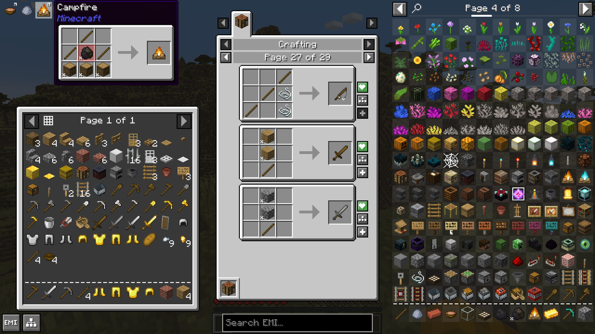
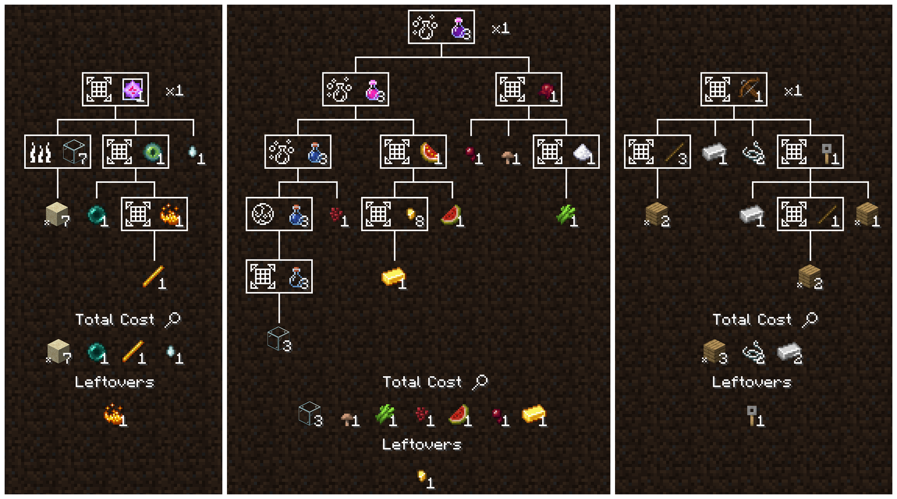
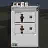
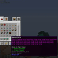

---
navigation:
  title: "Browse recipe"
  position: 1
  parent: quick-reference.md
  icon: minecraft:crafting_table
---

# Browse recipe

## Recipes & uses

- Browse items: <EmiSearch query="@create" /> <EmiSearch query="@emi" />

Ingredients and results appear in the center, searchable items sit on the right.

| Find | Action |
| --- | --- |
| How to make an item | Hover it and press R |
| What an ingredient makes | Hover it and press U |
| One mod's items | Search <EmiSearch query="@create" /> or <EmiSearch query="@farmersdelight" /> |

These are defaults. Change them in the item browser settings.

Click a pink item-search query to open the item browser with that text entered. Closing its inventory screen returns to the handbook. Searches match mod names and namespaces by substring, so @create also includes matching addons. If the browser overlay is hidden, use its own settings to show it.
***

## Recipe tree

Use the recipe tree to see intermediate crafts and base ingredients. It plans a craft, rather than replacing the machines or workstations that perform it.

***

## Getting started

Open your inventory, search for the item, then inspect its recipe. Follow unfamiliar ingredients back through their recipes.

For Create assembly, hold the Ponder key shown in the item's tooltip. Polymorph selects between conflicting crafting results.

***

## Related mods

| Mod or content | Purpose | Status | Item search |
| --- | --- | --- | --- |
|  [EMI](help.search.md) | Provides searchable items, recipes, uses and crafting trees. | Baseline, installed | <EmiSearch query="@emi" /> |
|  [EMI Enchanting](help.search.md) | Shows enchantment applicability and exclusions in EMI. | Baseline, installed | No separate item search |
|  [EMI professions (EMIP)](help.search.md) | Shows villager profession workstations in EMI. | Baseline, installed | No separate item search |
|  [Polymorph](help.search.md) | Lets players choose the output when crafting recipes conflict. | Baseline, installed | No separate item search |
|  [Reliable EMI (REMI)](help.search.md) | Adds configurable usability features to EMI's item and recipe browser. | Baseline, installed | No separate item search |
|  [ToolTipFix](help.search.md) | Keeps long item tooltips from running beyond the screen. | Baseline, installed | No separate item search |
