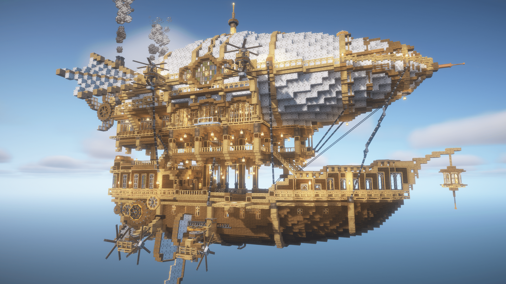

---
navigation:
  title: "Astropunk"
  position: -100
  icon: minecraft:compass
---

# Astropunk

Build an airship, choose your combat class and take on a world that grows more dangerous as you play. Astropunk is a survival sandbox where your workshop, your home and your adventures all have room to grow.

Explore dungeons and fight bosses with weapons, spells and trinkets that suit your build. Develop your skills, then return home to tend crops, cook, decorate or automate the work with Create machinery. Build a quiet farm or a busy factory, sail the seas or take to the sky.

There is no quest chain telling you what to do next. The sidebar gives you quick entry points into each topic. Choose what interests you and make it your own.

- [Image credits](help.credits.md)
