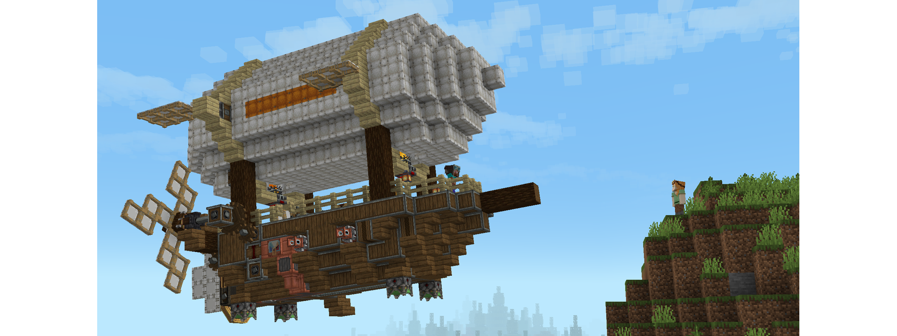

---
navigation:
  title: "Astropunk"
  position: -100
  icon: minecraft:compass
---

# Astropunk

Raise your sails above the clouds. Astropunk turns the workshop you build today into the vessel that carries you beyond tomorrow's horizon.

Ruined strongholds and sprawling dungeons give your ambition something to collide with. Choose a combat class, pair weapons with spells and trinkets, and shape your strengths through skills. Boss encounters put those choices to the test, while hostile mobs grow tougher as the world ages.

There is a life worth building between expeditions. Tend your fields, cook for the journey and turn a shelter into a home. Let machinery carry the work while you furnish a cottage, raise a factory or build a harbor. The sky offers an escape when the ground grows hostile, and the seas are waiting to be sailed.

There is no quest-based progression to dictate your path. The sidebar provides quick entry points into each topic, not a checklist to complete. Your curiosity and imagination set the course.
