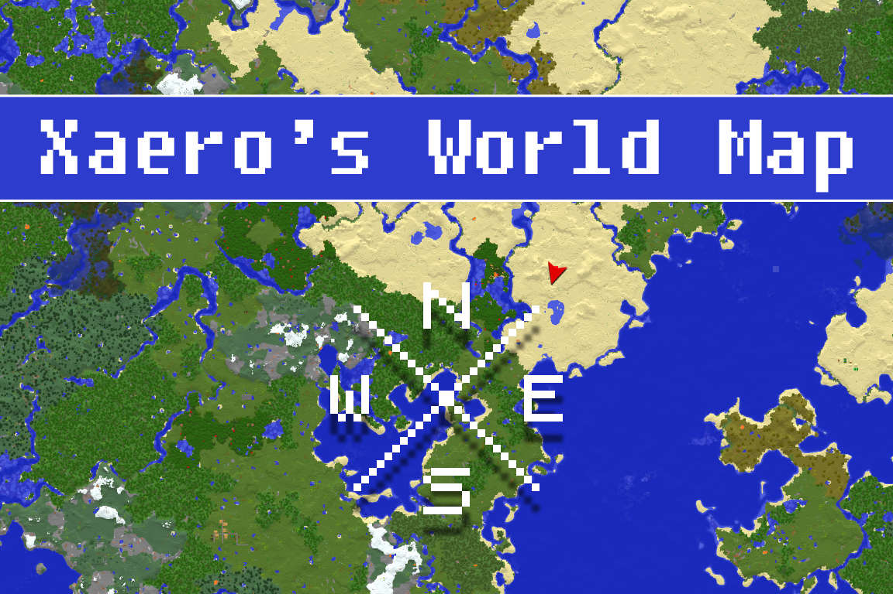
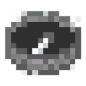
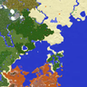

---
navigation:
  title: "Maps"
  position: 11
  icon: minecraft:map
---

# Maps

## World map

Xaero's World Map records explored terrain. Open it with <KeyBind id="gui.xaero_open_map" /> and zoom with the mouse wheel.

***

## Waypoints

Use <KeyBind id="gui.xaero_waypoints_key" /> to manage waypoints. Mark a base, portal or useful location so you can return to it.

Map teleportation depends on server permissions. Placing a waypoint does not grant survival teleportation.

***

## Find & share

- [Location finders](maps.find.md) for a biome or structure.
- [Shared maps](maps.shared.md) for shared explored terrain.
- [Dimensions](world.dimensions.md) for dimension access.

***

## Related mods

| Mod or content | Purpose | Item search |
| --- | --- | --- |
|  [Explorer's Compass](maps.find.md) | Locates structures, including supported modded structures. | <EmiSearch query="@explorerscompass" /> |
|  [Nature's Compass](maps.find.md) | Locates biomes, including supported modded biomes. | <EmiSearch query="@naturescompass" /> |
| <ItemImage id="minecraft:compass" /> [Team Capes](maps.shared.md) (heavy edition only) | Shows capes colored to match players' vanilla teams. | No separate item search |
|  [Xaero's Maps: Multiplayer+](maps.shared.md) | Adds multiplayer map features, including world-map synchronization, to Xaero's maps. | No separate item search |
|  [Xaero's Minimap](maps.personal.md) | Shows nearby terrain and entities on a minimap with saved waypoints. | No separate item search |
|  [Xaero's World Map](maps.personal.md) | Shows explored terrain in a full-screen world map. | No separate item search |
