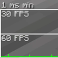

---
navigation:
  title: "Performance"
  position: 0
  parent: reference.technical.md
  icon: minecraft:clock
---

# Performance

## Rendering

<EmiSearch query="@create" />

These components reduce rendering work in different parts of the client. They are not additional visual effects.

| Component | Function |
| --- | --- |
| Sodium | Replaces the terrain rendering engine. |
| ImmediatelyFast | Optimizes immediate-mode rendering. |
| Entity Culling | Avoids rendering hidden entities and block entities. |
| More Culling | Skips selected hidden rendering faces. |
| Cull Leaves | Skips selected hidden leaf geometry. |
| Flerovium | Optimizes item, particle and entity rendering. |
| AsyncParticles | Particle processing and rendering optimization. |
| Kerria | Accelerates animated texture processing. |
| CreateBetterFps | Create rendering optimization for shader use. |

***

## Simulation & terrain

<EmiSearch query="@createlazytick" />

These components target game logic, creature processing, Create machines or terrain preparation.

| Component | Function |
| --- | --- |
| Lithium | Optimizes game logic in single-player and servers. |
| AI Improvements: Performance Tuning | Vanilla creature behavior optimization. |
| Clumps | Combines experience orbs to reduce separate orb processing. |
| Let Me Despawn | Adjusts creature despawn rules to reduce unintended persistent creatures. |
| Create: LazyTick | Create machine tick optimization. |
| Concurrent Chunk Management Engine (NeoForge) | Chunk management and generation optimization. |
| Structure Layout Optimizer | Optimizes jigsaw structure layout processing. |

***

## Memory & loading

Memory, loading and general fixes address different costs from terrain rendering.

| Component | Function |
| --- | --- |
| FerriteCore | Reduces memory use. |
| ModernFix | Performance, memory and bug-fix changes. |
| quick pack | Accelerates compressed data-pack and resource-pack loading. |
| BadOptimizations | Optimizations outside the main terrain renderer. |

***

## Input & idle use

Input processing and background resource use are separate from active-world simulation. Installation does not establish a measured frame-rate gain on your computer.

| Component | Function |
| --- | --- |
| Ixeris | Buffered raw input and threaded event polling. |
| Dynamic FPS | Reduces resource use in the background or while idle. |

***

## Related topics

- [Diagnostics](server.tools.md)
- [Lighting & distance](visuals.lighting.md)

***

## Related mods

| Mod or content | Purpose | Status | Item search |
| --- | --- | --- | --- |
|  [AI Improvements: Performance Tuning](performance.baseline.md) | Vanilla creature behavior optimization. | Baseline, installed | No separate item search |
|  [AsyncParticles](performance.baseline.md) | Particle processing and rendering optimization. | Baseline, installed | No separate item search |
| <ItemImage id="minecraft:redstone" /> [BadOptimizations](performance.baseline.md) | Optimizations outside the main terrain renderer. | Baseline, installed | No separate item search |
|  [Clumps](performance.baseline.md) | Combines experience orbs to reduce separate orb processing. | Baseline, installed | No separate item search |
|  [Concurrent Chunk Management Engine (NeoForge)](performance.baseline.md) | Chunk management and generation optimization. | Baseline, installed | No separate item search |
|  [Create: LazyTick](performance.baseline.md) | Create machine tick optimization. | Baseline, installed | <EmiSearch query="@createlazytick" /> |
|  [CreateBetterFps](performance.baseline.md) | Create rendering optimization for shader use. | Baseline, installed | No separate item search |
|  [Cull Leaves](performance.baseline.md) | Skips selected hidden leaf geometry. | Baseline, installed | No separate item search |
|  [Dynamic FPS](performance.baseline.md) | Reduces resource use in the background or while idle. | Baseline, installed | No separate item search |
|  [Entity Culling](performance.baseline.md) | Avoids rendering hidden entities and block entities. | Baseline, installed | No separate item search |
|  [FerriteCore](performance.baseline.md) | Reduces memory use. | Baseline, installed | No separate item search |
|  [Flerovium](performance.baseline.md) | Optimizes item, particle and entity rendering. | Baseline, installed | No separate item search |
|  [ImmediatelyFast](performance.baseline.md) | Optimizes immediate-mode rendering. | Baseline, installed | No separate item search |
|  [Ixeris](performance.baseline.md) | Buffered raw input and threaded event polling. | Baseline, installed | No separate item search |
|  [Kerria](performance.baseline.md) | Accelerates animated texture processing. | Baseline, installed | No separate item search |
|  [Let Me Despawn](performance.baseline.md) | Adjusts creature despawn rules to reduce unintended persistent creatures. | Baseline, installed | No separate item search |
|  [Lithium](performance.baseline.md) | Optimizes game logic in single-player and servers. | Baseline, installed | No separate item search |
|  [ModernFix](performance.baseline.md) | Performance, memory and bug-fix changes. | Baseline, installed | No separate item search |
|  [More Culling](performance.baseline.md) | Skips selected hidden rendering faces. | Baseline, installed | No separate item search |
|  [quick pack](performance.baseline.md) | Accelerates compressed data-pack and resource-pack loading. | Baseline, installed | No separate item search |
|  [Sodium](performance.baseline.md) | Replaces the terrain rendering engine. | Baseline, installed | No separate item search |
|  [Structure Layout Optimizer](performance.baseline.md) | Optimizes jigsaw structure layout processing. | Baseline, installed | No separate item search |
