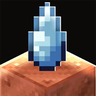

---
navigation:
  title: "Audio"
  position: 14
  parent: quick-reference.md
  icon: minecraft:note_block
---

# Audio

## Contents

| Topic | Status |
| --- | --- |
| [Sound](sounds.ambience.md) | Reference |

***

## Related mods

| Mod or content | Purpose | Status | Item search |
| --- | --- | --- | --- |
|  [Cool Rain Reforged](sounds.ambience.md) | Adds rain sounds for particular block surfaces. | Baseline, installed | No separate item search |
|  [Extreme sound muffler](sounds.ambience.md) | Lets the client selectively quiet unwanted sounds. | Baseline, installed | No separate item search |
|  [More Sounds](sounds.ambience.md) | Adds sound content and mod compatibility to Sounds. | Baseline, installed | No separate item search |
|  [Presence Footsteps (NeoForge)](sounds.ambience.md) | Adds surface-sensitive footstep sounds. | Baseline, installed | No separate item search |
|  [Presence Footsteps x Sable (Aeronautics Compat)](sounds.ambience.md) | Extends Presence Footsteps to Sable moving structures. | Baseline, installed | No separate item search |
|  [Sable: Cool Rain](sounds.ambience.md) | Extends rain sounds to Sable moving structures and supported copycat materials. | Baseline, installed | No separate item search |
|  [Sound Physics Remastered](sounds.ambience.md) | Adds sound attenuation, reverberation and absorption through blocks. | Baseline, installed | No separate item search |
|  [Sounds](sounds.ambience.md) | Adds sounds for interfaces, items, blocks and other interactions. | Baseline, installed | No separate item search |
