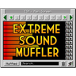
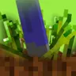
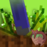

---
navigation:
  title: "Audio"
  position: 14
  icon: minecraft:note_block
---

# Audio

## Rain & footsteps

Cool Rain Reforged changes rain ambience on supported surfaces. Presence Footsteps changes footsteps according to the surface walked on. Their Sable addons belong here because they extend those sounds to moving structures.

| Component | Function |
| --- | --- |
| Cool Rain Reforged | Adds rain sounds for particular block surfaces. |
| Presence Footsteps (NeoForge) | Adds surface-sensitive footstep sounds. |
| Sable: Cool Rain | Extends rain sounds to Sable moving structures and supported copycat materials. |
| Presence Footsteps x Sable (Aeronautics Compat) | Extends Presence Footsteps to Sable moving structures. |

***

## Sound effects

Sounds adds interaction and interface sounds. More Sounds extends its content and mod compatibility. These do not replace the footstep and rain compatibility roles above.

| Component | Function |
| --- | --- |
| Sounds | Adds sounds for interfaces, items, blocks and other interactions. |
| More Sounds | Adds sound content and mod compatibility to Sounds. |

***

## Acoustics & volume

Sound Physics Remastered changes how sound travels through the surroundings. Extreme sound muffler quiets selected sounds on your client. Muting a machine sound does not stop the machine or change its processing.

| Component | Function |
| --- | --- |
| Sound Physics Remastered | Adds sound attenuation, reverberation and absorption through blocks. |
| Extreme sound muffler | Lets the client selectively quiet unwanted sounds. |

***

## Related topics

- [Moving structures](vehicles.assembly.md)

***

## Related mods

| Mod or content | Purpose | Item search |
| --- | --- | --- |
|  [Cool Rain Reforged](reference.audio.md) | Adds rain sounds for particular block surfaces. | No separate item search |
|  [Extreme sound muffler](reference.audio.md) | Lets the client selectively quiet unwanted sounds. | No separate item search |
|  [More Sounds](reference.audio.md) | Adds sound content and mod compatibility to Sounds. | No separate item search |
|  [Presence Footsteps (NeoForge)](reference.audio.md) | Adds surface-sensitive footstep sounds. | No separate item search |
|  [Presence Footsteps x Sable (Aeronautics Compat)](reference.audio.md) | Extends Presence Footsteps to Sable moving structures. | No separate item search |
|  [Sable: Cool Rain](reference.audio.md) | Extends rain sounds to Sable moving structures and supported copycat materials. | No separate item search |
|  [Sound Physics Remastered](reference.audio.md) | Adds sound attenuation, reverberation and absorption through blocks. | No separate item search |
|  [Sounds](reference.audio.md) | Adds sounds for interfaces, items, blocks and other interactions. | No separate item search |
