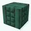
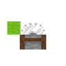
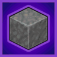

---
navigation:
  title: "Building"
  position: 8
  parent: quick-reference.md
  icon: minecraft:bricks
---

# Building

## Materials & shapes

- Browse items: <EmiSearch query="@chipped" /> <EmiSearch query="@copycats" /> <EmiSearch query="@mcwroofs" />

<ItemGrid>
  <ItemIcon id="chipped:mason_table" />
  <ItemIcon id="copycats:copycat_slope" />
  <ItemIcon id="mcwroofs:oak_roof" />
</ItemGrid>

- [Materials](building.palette.md) Choose decorative materials and the workstation that makes them.
- [Factory finishes](building.factory.md) Finish industrial builds with matching surfaces and structural details.
- [Copycat shapes](building.copycats.md) Give shaped blocks the appearance of another material.
- [Architecture](building.architecture.md) Choose building components that fit a room or exterior.

***

## Rooms & tools

- Browse items: <EmiSearch query="@handcrafted" /> <EmiSearch query="@immersive_paintings" /> <EmiSearch query="@mechtrowel" /> <EmiSearch query="@torchmaster" />

<ItemGrid>
  <ItemIcon id="handcrafted:oak_chair" />
  <ItemIcon id="immersive_paintings:painting" />
  <ItemIcon id="mechtrowel:mech_trowel" />
  <ItemIcon id="torchmaster:megatorch" />
</ItemGrid>

- [Furniture](building.furniture.md) Furnish rooms with functional and decorative objects.
- [Displays](building.displays.md) Arrange artwork and display objects in a build.
The <ItemLink id="mechtrowel:mech_trowel" /> makes randomized palettes and gradients practical. Its upgrades add wand placement, longer reach and supported block-variant conversion. Use palette tools for repeated surfaces instead of placing every decorative variant individually.

- [Placement](building.placement.md) Mechanical Trowel crafting, palettes, upgrades and schematic tools.
- [Lighting & spawning](building.safety.md) Check lighting and control hostile creature spawning.

***

## Related mods

| Mod or content | Purpose | Status | Item search |
| --- | --- | --- | --- |
|  [Amendments](building.furniture.md) | Expands existing blocks with features such as potion-mixing cauldrons and wall-mounted lanterns. | Baseline, installed | <EmiSearch query="@amendments" /> |
|  [Armor Poser](building.displays.md) | Provides an interface for adjusting armor stand poses and properties. | Baseline, installed | No separate item search |
|  [Beautify: ReFoxed](building.furniture.md) | Adds vanilla-styled decorative furnishings for homes and gardens. | Baseline, installed | <EmiSearch query="@beautify" /> |
|  [Big Sign Writer](building.displays.md) | Writes large characters and symbols across multiple lines of signs. | Baseline, installed | No separate item search |
|  [Chipped](building.palette.md) | Adds decorative block variants crafted at material-specific workbenches. | Baseline, installed | <EmiSearch query="@chipped" /> |
|  [Chipped Express](building.palette.md) | Makes Chipped decorative block recipes available through the stonecutter. | Baseline, installed | No separate item search |
|  [Create Deco](building.factory.md) | Adds Create-styled industrial decoration for factories and infrastructure. | Baseline, installed | <EmiSearch query="@createdeco" /> |
|  [Create Encased](building.factory.md) | Expands casing choices for Create shafts, cogwheels and pipes. | Baseline, installed | <EmiSearch query="@createcasing" /> |
|  [Create: Bells & Whistles](building.factory.md) | Adds decorative details for Create trains and railway builds. | Baseline, installed | <EmiSearch query="@bellsandwhistles" /> |
|  [Create: Bits 'n' Bobs](building.factory.md) | Adds cogwheel chain drives and customizable industrial decoration to Create. | Baseline, installed | <EmiSearch query="@bits_n_bobs" /> |
|  [Create: Copycats+](building.copycats.md) | Adds Create copycat building shapes that imitate other blocks' materials. | Baseline, installed | <EmiSearch query="@copycats" /> |
|  [Create: Design n' Decor](building.factory.md) | Adds factory decoration blocks styled to match Create machinery. | Baseline, installed | <EmiSearch query="@dndecor" /> |
|  [Create: Framed](building.factory.md) | Adds more framed glass variants for Create-style construction. | Baseline, installed | <EmiSearch query="@createframed" /> |
|  [Create: Interiors](building.furniture.md) | Adds Create-styled furniture for train interiors and other builds. | Baseline, installed | <EmiSearch query="@interiors" /> |
|  [Create: More Girder](building.factory.md) | Adds structural girder variants for Create builds. | Baseline, installed | <EmiSearch query="@createmoregirder" /> |
|  [Create: Oxidized](building.factory.md) | Adds Create processing recipes for oxidizing copper blocks. | Baseline, installed | No separate item search |
|  [Create: Pattern Schematics](building.placement.md) | Repeats schematic patterns when building with Create schematics. | Baseline, installed | <EmiSearch query="@create_pattern_schematics" /> |
|  [Create: Prismatic Shine](building.factory.md) | Adds glass and illuminated casings for Create machinery. | Baseline, installed | <EmiSearch query="@createprism" /> |
|  [Create: Shuffle Filter](building.placement.md) | Lets Create deployers place randomized blocks from a selected palette. | Baseline, installed | <EmiSearch query="@createshufflefilter" /> |
|  [Diagonal Fences](building.architecture.md) | Lets fences connect diagonally for more flexible boundaries. | Baseline, installed | No separate item search |
|  [Every Compat (Stone Zone)](building.palette.md) | Creates supported decorative block variants from other mods' stone types. | Baseline, installed | <EmiSearch query="@stonezone" /> |
|  [Every Compat (Wood Good)](building.palette.md) | Creates supported building and furniture variants using other mods' wood types. | Baseline, installed | <EmiSearch query="@everycomp" /> |
|  [Forgematica](building.placement.md) | Displays building schematics to guide block placement and construction. | Baseline, installed | No separate item search |
|  [Handcrafted](building.furniture.md) | Adds detailed furniture and household decorations. | Baseline, installed | <EmiSearch query="@handcrafted" /> |
|  [Immersive Paintings](building.displays.md) | Imports images as placeable paintings, including on multiplayer servers. | Baseline, installed | <EmiSearch query="@immersive_paintings" /> |
| ![Items Displayed [NeoForge]](images/catalog-PuR4vDBo.png) [Items Displayed [NeoForge]](building.displays.md) | Lets players place inventory items in the world for display. | Baseline, installed | <EmiSearch query="@items_displayed" /> |
|  [Lighty](building.safety.md) | Overlays light levels to help find dark areas and spawnable surfaces. | Baseline, installed | No separate item search |
|  [Macaw's Bridges](building.architecture.md) | Adds bridge building pieces for paths across gaps and water. | Baseline, installed | <EmiSearch query="@mcwbridges" /> |
|  [Macaw's Doors](building.architecture.md) | Adds door designs and expands available wood variants. | Baseline, installed | <EmiSearch query="@mcwdoors" /> |
|  [Macaw's Fences and Walls](building.architecture.md) | Adds decorative fences, walls and gates for building boundaries. | Baseline, installed | <EmiSearch query="@mcwfences" /> |
|  [Macaw's Roofs](building.architecture.md) | Adds dedicated roof blocks instead of relying on stair-shaped roofs. | Baseline, installed | <EmiSearch query="@mcwroofs" /> |
|  [Macaw's Stairs](building.architecture.md) | Adds building stairs and matching handrails and balcony pieces. | Baseline, installed | <EmiSearch query="@mcwstairs" /> |
|  [Macaw's Windows](building.architecture.md) | Adds window designs and matching shutters, blinds and curtains. | Baseline, installed | <EmiSearch query="@mcwwindows" /> |
|  [Mech Trowel](building.placement.md) | Places randomized blocks from custom palettes and supports building-wand placement. | Baseline, installed | <EmiSearch query="@mechtrowel" /> |
|  [Reconnectible Chains](building.architecture.md) | Connects fences and walls with decorative hanging chains. | Baseline, installed | No separate item search |
|  [Straw Statues](building.displays.md) | Adds poseable player-look statues for decorating builds. | Baseline, installed | <EmiSearch query="@strawstatues" /> |
|  [Supplementaries](building.furniture.md) | Adds practical decorations and utility blocks for building, storage and automation. | Baseline, installed | <EmiSearch query="@supplementaries" /> |
|  [TorchMaster](building.safety.md) | Adds blocks that control hostile or other creature spawning in an area. | Baseline, installed | <EmiSearch query="@torchmaster" /> |
|  [TW‘s  Decorative Food](building.furniture.md) | Lets food items be placed in the world as decorations. | Baseline, installed | No separate item search |
