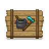

---
navigation:
  title: "Food & farming"
  position: 8
  parent: quick-reference.md
  icon: minecraft:apple
---

# Food & farming

## Kitchen meals

Farmer’s Delight covers everyday cooking from prepared portions to shared feasts. Choose the kitchen tool and serving form before gathering ingredients.

- <ItemImage id="farmersdelight:cooking_pot" /> [Cooking tools & meals](food.utensils.md) explains cutting, heated pot meals, sandwiches, rice, pasta, feasts, desserts and drinks.

***

## Regional ingredients

- <ItemImage id="mynethersdelight:bullet_pepper" /> [Nether foods](food.nether.md) connects Nether hunting and pepper ingredients to sausages, stews and ghast dough.
- <ItemImage id="ends_delight:chorus_fruit_grain" /> [End foods](food.end.md) distinguishes gathered chorus ingredients from knife-hunted shulker meat and dragon encounters.
- <ItemImage id="minersdelight:cave_carrot" /> [Underground foods](food.underground.md) covers cave crops, hunted ingredients, squid dishes, plant meals and copper serving containers.
- <ItemImage id="lendersdelight:amethyst_crab_sandwich" /> [Encounter foods](food.encounters.md) covers Cataclysm creature ingredients and specialized boss dishes.

***

## Growing & seafood

- <ItemImage id="farmersdelight:cabbage" /> [Crop ingredients](food.growing.md) explains wild crop sources, seeds, rice processing and harvesting helpers.
- <ItemImage id="spawn:tuna_roll" /> [Fish & shellfish](food.fishing.md) separates ordinary rod catches from aquatic creatures, prepared portions and shellfish meals.

***

## Diet & production

- <ItemImage id="solonion:food_book" /> [Hunger & variety](food.hunger.md) explains hunger, saturation, the rolling diet and expedition food storage.
- <ItemImage id="sliceanddice:slicer" /> [Machine kitchens](food.machine-cooking.md) separates slicing, drink fluids and crop production from finished meal recipes.

***

## Related mods

| Mod or content | Status | Publisher description |
| --- | --- | --- |
|  [AppleSkin](food.hunger.md) | Baseline, installed | Food/hunger-related HUD improvements |
|  [Create Slice & Dice](food.machine-cooking.md) | Baseline, installed | Making automation for Farmers Delight more sensible |
|  [Create: Central Kitchen](food.machine-cooking.md) | Baseline, installed | Offering more tools and methods to automate food processing of other mod in Create. |
|  [Create: Integrated Farming](food.growing.md) | Baseline, installed | Integrated farming automation for Create |
|  [End's Delight](food.end.md) | Baseline, installed | End's Delight is an addon mod for Farmer's Delight based around adding culinary content to the end! |
|  [Farmer's Delight](food.utensils.md) | Baseline, installed | A cozy expansion to farming and cooking! |
|  [L_Ender 's Cataclysm Delight](food.encounters.md) | Baseline, installed | Adds 50+ dishes, linking L_Ender's Cataclysm and Farmer's Delight in a Vanilla style. |
|  [Leaves Be Gone](food.growing.md) | Baseline, installed | Quick leaf decay from cutting down trees. Built for fast performance and mod compat! |
|  [Miner's Delight](food.underground.md) | Baseline, installed | Farmer's Delight add-on for miners |
|  [My Nether's Delight](food.nether.md) | Baseline, installed | New Nether addon for Farmer's Delight |
|  [RightClickHarvest](food.growing.md) | Baseline, installed | Allows you to harvest crops with right click |
| <ItemImage id="minecraft:wheat" /> [Short Stacks](food.hunger.md) | Baseline, installed | Food stack limits vary with filling power. |
|  [Smarter Farmers (farmers replant)](food.growing.md) | Baseline, installed | Allows villagers to replant the correct seed & allows them to use modded ones |
|  [Spice of Life Onion](food.hunger.md) | Baseline, installed | A mod designed to encourage dietary variety! |
|  [Universal Bone Meal](food.growing.md) | Baseline, installed | Stop the bonemeal discrimination! Grow all plants, no limitations. |
