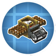
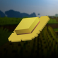

---
navigation:
  title: "Food & farming"
  position: 7
  icon: minecraft:bread
---

# Food & farming

## Kitchen meals

<EmiSearch query="@farmersdelight" />

Farmer’s Delight covers everyday cooking from prepared portions to shared feasts. Choose the kitchen tool and serving form before gathering ingredients.

- <ItemImage id="farmersdelight:cooking_pot" /> [Cooking tools & meals](food.utensils.md) explains cutting, heated pot meals, sandwiches, rice, pasta, feasts, desserts and drinks.

***

## Regional ingredients

- <ItemImage id="minecraft:crimson_fungus" /> [Nether foods](food.nether.md) connects Nether hunting and pepper ingredients to sausages, stews and ghast dough.
- <ItemImage id="minecraft:chorus_fruit" /> [End foods](food.end.md) distinguishes gathered chorus ingredients from knife-hunted shulker meat and dragon encounters.
- <ItemImage id="minecraft:brown_mushroom" /> [Underground foods](food.underground.md) covers cave crops, hunted ingredients, squid dishes, plant meals and copper serving containers.
- <ItemImage id="minecraft:rotten_flesh" /> [Encounter foods](food.encounters.md) covers Cataclysm creature ingredients and specialized boss dishes.

***

## Growing & seafood

- <ItemImage id="minecraft:wheat" /> [Crop ingredients](food.growing.md) explains wild crop sources, seeds, rice processing and harvesting helpers.
- <ItemImage id="minecraft:cod" /> [Fish & shellfish](food.fishing.md) separates ordinary rod catches from aquatic creatures, prepared portions and shellfish meals.

***

## Diet & production

- <ItemImage id="minecraft:apple" /> [Hunger & variety](food.hunger.md) explains hunger, saturation, the rolling diet and expedition food storage.
- <ItemImage id="minecraft:smoker" /> [Machine kitchens](food.machine-cooking.md) separates slicing, drink fluids and crop production from finished meal recipes.

***

## Related mods

| Mod or content | Purpose | Item search |
| --- | --- | --- |
|  [AppleSkin](food.hunger.md) | Shows food hunger restoration and saturation in tooltips and the hunger display. | No separate item search |
|  [Create Slice & Dice](food.machine-cooking.md) | Adds Create machinery for automated Farmer's Delight food preparation. | <EmiSearch query="@sliceanddice" /> |
|  [Create: Central Kitchen](food.machine-cooking.md) | Connects other cooking mods to Create machines for automated food processing. | No separate item search |
|  [Create: Integrated Farming](food.growing.md) | Adds automatic crop harvesting, fishing nets and poultry production to Create. | <EmiSearch query="@create_integrated_farming" /> |
|  [End's Delight](food.end.md) | Adds End-themed ingredients and dishes to Farmer's Delight. | <EmiSearch query="@ends_delight" /> |
|  [Farmer's Delight](food.utensils.md) | Adds crops, cooking utensils and meal preparation with cutting boards and cooking pots. | <EmiSearch query="@farmersdelight" /> |
|  [L_Ender 's Cataclysm Delight](food.encounters.md) | Turns Cataclysm ingredients into Farmer's Delight-style dishes. | <EmiSearch query="@lendersdelight" /> |
|  [Leaves Be Gone](food.growing.md) | Makes unsupported leaves decay quickly after trees are cut. | No separate item search |
|  [Miner's Delight](food.underground.md) | Adds mining-themed food and cooking tools to Farmer's Delight. | <EmiSearch query="@minersdelight" /> |
|  [My Nether's Delight](food.nether.md) | Adds Nether crops, ingredients and cooking recipes to Farmer's Delight. | <EmiSearch query="@mynethersdelight" /> |
|  [RightClickHarvest](food.growing.md) | Harvests mature crops with a right click instead of breaking and replanting manually. | No separate item search |
| <ItemImage id="minecraft:wheat" /> [Short Stacks](food.hunger.md) | Changes food stack limits to alter how much food fits in each inventory slot. | No separate item search |
|  [Smarter Farmers (farmers replant)](food.growing.md) | Helps farmer villagers replant the correct crops, including supported modded seeds. | No separate item search |
|  [Spice of Life Onion](food.hunger.md) | Rewards dietary variety using a rolling history of recently eaten foods. | <EmiSearch query="@solonion" /> |
|  [Universal Bone Meal](food.growing.md) | Extends bone meal use to plants that normally do not accept it. | No separate item search |
