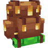
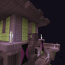

---
navigation:
  title: "Machines & storage"
  position: 11
  parent: quick-reference.md
  icon: create:crushing_wheel
---

# Machines & storage

## Containers & handling

| Reference | Contents |
| --- | --- |
| <ItemImage id="minecraft:shulker_box" /> [Portable storage](storage.portable.md) | Backpacks, reinforced shulker tiers and inventory access. |
| <ItemImage id="create:item_vault" /> [Bulk storage](storage.bulk.md) | Vault, shipping container, silo and fluid vessel families. |
| <ItemImage id="interactic:item_filter" /> [Inventory handling](storage.handling.md) | Search, sorting, transfer, pickup filtering and deletion. |

***

## Machines & materials

| Reference | Contents |
| --- | --- |
| <ItemImage id="create:crushing_wheel" /> [Ore processing](machines.ore-processing.md) | Millstone, crushing wheels and fan washing, with exact outputs. |
| <ItemImage id="create:water_wheel" /> [Rotation & transmission](machines.rotation.md) | Water, wind and steam sources, gearboxes and clutches. |
| <ItemImage id="create:packager" /> [Material routing](machines.logistics.md) | Belts, pipes, packages and stock networks. |
| <ItemImage id="molten_vents:active_molten_asurine" /> [Renewable stone](machines.renewables.md) | Six molten-vent stone families and activation entry. |
| <ItemImage id="create_enchantment_industry:mechanical_grindstone" /> [Enchanting machinery](machines.enchanting.md) | Liquid experience, enchanters, printers and manual anvils. |
| <ItemImage id="trading_floor:trading_depot" /> [Trading machinery](machines.trading.md) | Trading Depot, workstations and two-input trades. |
| <ItemImage id="create_sa:portable_drill" /> [Portable tools & recipes](machines.miscellaneous.md) | Engine and tank components, portable tools and extra material recipes. |

***

## Power & industry

| Reference | Contents |
| --- | --- |
| <ItemImage id="electroenergetics:accumulator" /> [Electricity](power.electricity.md) | Alternators, wiring, meters, protection and railway supply. |
| <ItemImage id="tfmg:coke_oven" /> [Industrial machinery](power.industry.md) | Coke, metallurgy, oil, engines and industrial electricity. |
| <ItemImage id="create:blaze_burner" /> [Burners & liquid fuel](power.burners.md) | Blaze Burner extension and named accepted fluids. |
| <ItemImage id="createsprings:spring" /> [Stored rotation](power.stored-rotation.md) | Kinetic batteries, springs and spring-powered tools. |

***

## Related mods

| Mod or content | Status | Publisher description |
| --- | --- | --- |
|  [Backpacks!](storage.portable.md) | Baseline, installed | Dyeable and upgradeable vanilla-friendly backpacks! |
|  [Create](machines.ore-processing.md) | Baseline, installed | Aesthetic Technology that empowers the Player |
|  [Create Stuff 'N Additions](machines.miscellaneous.md) | Baseline, installed | 🧲 Dominate your environment with Create technology |
|  [Create: Additional Logistics](machines.logistics.md) | Baseline, installed | Adds a few new logistics-oriented blocks to Create, and tweaks a few behaviors. |
|  [Create: Connected](machines.rotation.md) | Baseline, installed | QoL blocks that you wish existed in Create - Highly configurable, disable what you don't need |
|  [Create: Electro Energetics](power.electricity.md) | Baseline, installed | A realistic(-ish) electricity Create addon that focuses on the generation, transmission, distribution and utilization of electric energy. Also electric trains. |
|  [Create: Enchantment Industry](machines.enchanting.md) | Baseline, installed | Automatic Enchanting, with Create |
|  [Create: Liquid Fuel](power.burners.md) | Baseline, installed | Pump in liquid fuel to blaze burners |
|  [Create: Molten Vents](machines.renewables.md) | Baseline, installed | Adds a renewable source of the orestones found in the Create mod, and by extension, many resources. |
|  [Create: Springs](power.stored-rotation.md) | Baseline, installed | Store rotational force using springs! |
|  [Create: Stam1o Tweaks](machines.miscellaneous.md) | Baseline, installed | Tweaks to Create and Minecraft for Stam1o, Developed and Published by - LieOn Studios |
|  [Create: TFMG Community Edition](power.industry.md) | Baseline, installed | Create: TFMG Community Edition is a fork of Create: TFMG by DrMangoTea that aims to fix as many bugs as we can. |
|  [Create: Trading floor](machines.trading.md) | Baseline, installed | Automate trading with villagers using create! |
|  [Create: Vibrant Vaults](storage.bulk.md) | Baseline, installed | A Create mod addon that adds more item vaults. |
|  [Easy Anvils](machines.enchanting.md) | Baseline, installed | Overhauled anvils with stored items, fairer costs, and no more frustrating repair penalties. |
|  [Easy Shulker Boxes](storage.portable.md) | Baseline, installed | Supercharge shulker boxes with browsing, inserting and extracting contents directly from your inventory. |
|  [Interactic Renewed](storage.handling.md) | Baseline, installed | A maintained fork of the populair interactic mod. |
|  [Mouse Tweaks](storage.handling.md) | Baseline, installed | Enhances inventory management by adding various functions to the mouse buttons.  |
|  [Reinforced Shulker Boxes](storage.portable.md) | Baseline, installed | Adds reinforced shulker boxes. |
|  [Shulker Drops Two](storage.portable.md) | Baseline, installed | 🟪 Allows Shulkers to drop two or more shells and ignore their default drop chance. |
|  [Sophisticated Inventory Interactions](storage.handling.md) | Baseline, installed | Adds Sophisticated-style search, sort, and transfer controls to vanilla and compatible modded container GUIs, including player-inventory sorting. |
|  [TrashSlot](storage.handling.md) | Baseline, installed | Adds a draggable trash slot to all inventory screens. Press T to toggle. |
