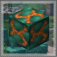
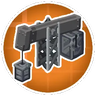
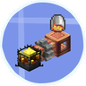
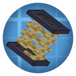
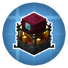
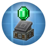
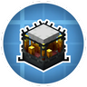
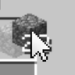

---
navigation:
  title: "Machines & storage"
  position: 10
  icon: create:crushing_wheel
---

# Machines & storage

## Containers & handling

<EmiSearch query="@create" /> <EmiSearch query="@interactic" />

| Reference | Contents |
| --- | --- |
| <ItemImage id="minecraft:shulker_box" /> [Portable storage](storage.portable.md) | Backpacks, reinforced shulker tiers and inventory access. |
| <ItemImage id="create:item_vault" /> [Bulk storage](storage.bulk.md) | Vault, shipping container, silo and fluid vessel families. |
| <ItemImage id="interactic:item_filter" /> [Inventory handling](storage.handling.md) | Search, sorting, transfer, pickup filtering and deletion. |

***

## Machines & materials

<EmiSearch query="@create_enchantment_industry" /> <EmiSearch query="@molten_vents" /> <EmiSearch query="@create_sa" /> <EmiSearch query="@trading_floor" />

| Reference | Contents |
| --- | --- |
| <ItemImage id="create:crushing_wheel" /> [Ore processing](machines.ore-processing.md) | Millstone, crushing wheels and fan washing, with exact outputs. |
| <ItemImage id="create:water_wheel" /> [Rotation & transmission](machines.rotation.md) | Water, wind and steam sources, gearboxes and clutches. |
| <ItemImage id="create:packager" /> [Material routing](machines.logistics.md) | Belts, pipes, packages and stock networks. |
| <ItemImage id="molten_vents:active_molten_asurine" /> [Renewable stone](machines.renewables.md) | Six molten-vent stone families and activation entry. |
| <ItemImage id="create_enchantment_industry:mechanical_grindstone" /> [Enchanting machinery](machines.enchanting.md) | Liquid experience, enchanters, printers and manual anvils. |
| <ItemImage id="trading_floor:trading_depot" /> [Trading machinery](machines.trading.md) | Trading Depot, workstations and two-input trades. |
| <ItemImage id="create_sa:portable_drill" /> [Portable tools & recipes](machines.miscellaneous.md) | Engine and tank components, portable tools and extra material recipes. |

***

## Power & industry

<EmiSearch query="@electroenergetics" /> <EmiSearch query="@createsprings" /> <EmiSearch query="@tfmg" />

| Reference | Contents |
| --- | --- |
| <ItemImage id="electroenergetics:accumulator" /> [Electricity](power.electricity.md) | Alternators, wiring, meters, protection and railway supply. |
| <ItemImage id="tfmg:coke_oven" /> [Industrial machinery](power.industry.md) | Coke, metallurgy, oil, engines and industrial electricity. |
| <ItemImage id="create:blaze_burner" /> [Burners & liquid fuel](power.burners.md) | Blaze Burner extension and named accepted fluids. |
| <ItemImage id="createsprings:spring" /> [Stored rotation](power.stored-rotation.md) | Kinetic batteries, springs and spring-powered tools. |

***

## Machine systems

### Machines and processing

<EmiSearch query="@create_connected" />

| Mod | Purpose |
| --- | --- |
|  [Create](machines.ore-processing.md) | Machines, rotational power and material processing |
|  [Create: Connected](machines.rotation.md) | Additional components for Create machinery |
|  [Create: Molten Vents](machines.renewables.md) | Renewable Create ore stones and resources |

***

### Power & materials

| Mod | Purpose |
| --- | --- |
|  [Create: Electro Energetics](power.electricity.md) | Electric generation, transmission and consumers |
|  [Create: TFMG Community Edition](power.industry.md) | Industrial materials and fuel systems |
|  [Create: Liquid Fuel](power.burners.md) | Liquid fuel for blaze burners |
|  [Create: Springs](power.stored-rotation.md) | Rotational energy storage |

***

### Production automation

<EmiSearch query="@farmersdelight" /> <EmiSearch query="@sliceanddice" />

| Mod | Purpose |
| --- | --- |
|  [Create: Enchantment Industry](machines.enchanting.md) | Automated enchanting |
|  [Create: Trading floor](machines.trading.md) | Automated villager trading |
|  [Create: Central Kitchen](food.machine-cooking.md) | Food-processing integration for Create |
|  [Create Slice & Dice](food.machine-cooking.md) | Automated Farmer's Delight processing |

***

## Related mods

| Mod or content | Purpose | Item search |
| --- | --- | --- |
|  [Backpacks!](storage.portable.md) | Adds dyeable, upgradeable backpacks for portable storage. | <EmiSearch query="backpack" /> |
|  [Create](machines.ore-processing.md) | Adds rotational machines for processing, transport and automated construction. | <EmiSearch query="@create" /> |
|  [Create Stuff 'N Additions](machines.miscellaneous.md) | Adds Create-themed powered equipment and wearable tools. | <EmiSearch query="@create_sa" /> |
|  [Create: Additional Logistics](machines.logistics.md) | Expands Create package handling with shop registers and improved factory stock controls. | <EmiSearch query="@createadditionallogistics" /> |
|  [Create: Connected](machines.rotation.md) | Adds Create transmission components and flexible storage arrangements. | <EmiSearch query="@create_connected" /> |
|  [Create: Electro Energetics](power.electricity.md) | Adds electricity generation, transmission and powered machinery, including electric trains. | <EmiSearch query="@electroenergetics" /> |
|  [Create: Enchantment Industry](machines.enchanting.md) | Automates experience handling and enchanting with Create machinery. | <EmiSearch query="@create_enchantment_industry" /> |
|  [Create: Liquid Fuel](power.burners.md) | Lets Create blaze burners consume pumped liquid fuel. | No separate item search |
|  [Create: Molten Vents](machines.renewables.md) | Provides renewable Create ore-bearing stones through molten vents. | <EmiSearch query="@molten_vents" /> |
|  [Create: Springs](power.stored-rotation.md) | Stores rotational energy in springs for later use. | <EmiSearch query="@createsprings" /> |
|  [Create: Stam1o Tweaks](machines.miscellaneous.md) | Adjusts Create recipes and lets diving boots counter levitation. | No separate item search |
|  [Create: TFMG Community Edition](power.industry.md) | Expands Create with heavy industry and oil processing in a community-maintained fork. | <EmiSearch query="@tfmg" /> |
|  [Create: Trading floor](machines.trading.md) | Automates villager trading through Create machinery. | <EmiSearch query="@trading_floor" /> |
|  [Create: Vibrant Vaults](storage.bulk.md) | Adds more color and material variants of Create item vaults. | <EmiSearch query="@create_vibrant_vaults" /> |
|  [Easy Anvils](machines.enchanting.md) | Improves anvil item storage and costs while removing escalating repair penalties. | No separate item search |
|  [Easy Shulker Boxes](storage.portable.md) | Lets players browse and move shulker box contents directly from the inventory. | No separate item search |
|  [Interactic Renewed](storage.handling.md) | Improves interaction with dropped items in the world. | <EmiSearch query="@interactic" /> |
|  [Mouse Tweaks](storage.handling.md) | Adds mouse-drag and scrolling shortcuts for moving inventory stacks. | No separate item search |
|  [Reinforced Shulker Boxes](storage.portable.md) | Adds upgraded shulker boxes with larger storage capacity. | <EmiSearch query="@reinfshulker" /> |
|  [Shulker Drops Two](storage.portable.md) | Changes shulker shell drop counts and chances, including two-shell drops. | No separate item search |
|  [Sophisticated Inventory Interactions](storage.handling.md) | Adds sorting, searching and transfer controls to supported inventory screens. | No separate item search |
|  [TrashSlot](storage.handling.md) | Adds an inventory trash slot for discarding unwanted items. | No separate item search |
