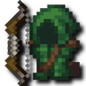
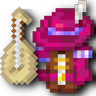
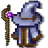
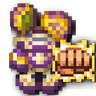
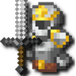
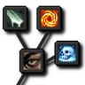
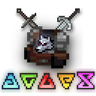

---
navigation:
  title: "Spells & skills"
  position: 7
  parent: quick-reference.md
  icon: minecraft:enchanted_book
---

# Spells & skills

## Playable classes

Choose a build through equipment, a class book and skill-tree choices. There is no permanent class-selection screen. Skill roots can still be incompatible, and changing equipment does not refund spent points.

### Martial classes

| Class | Purpose | First weapon or focus |
| --- | --- | --- |
| Archer | Prepared shots and area arrows. | <ItemGrid><ItemIcon id="archers:composite_longbow" /></ItemGrid> <ItemLink id="archers:composite_longbow" /> |
| Deadeye | Rapid ranged attacks and disabling shots. | <ItemGrid><ItemIcon id="archers:rapid_crossbow" /></ItemGrid> <ItemLink id="archers:rapid_crossbow" /> |
| Tundra Hunter | Frost shots and freezing areas. | <ItemGrid><ItemIcon id="archers:composite_longbow" /></ItemGrid> <ItemLink id="archers:composite_longbow" /> |
| War Archer | Fire arrows and burning ground. | <ItemGrid><ItemIcon id="archers:composite_longbow" /></ItemGrid> <ItemLink id="archers:composite_longbow" /> |
| Rogue | Close attacks with traps and mobility. | <ItemGrid><ItemIcon id="rogues:iron_dagger" /></ItemGrid> <ItemLink id="rogues:iron_dagger" /> |
| Warrior | Charges and defensive melee techniques. | <ItemGrid><ItemIcon id="rogues:iron_double_axe" /></ItemGrid> <ItemLink id="rogues:iron_double_axe" /> |
| Berserker | Rage effects and heavy melee strikes. | <ItemGrid><ItemIcon id="berserker_rpg:iron_berserker_axe" /></ItemGrid> <ItemLink id="berserker_rpg:iron_berserker_axe" /> |
| Forcemaster | Arcane strikes with knuckles. | <ItemGrid><ItemIcon id="forcemaster_rpg:iron_knuckle" /></ItemGrid> <ItemLink id="forcemaster_rpg:iron_knuckle" /> |

### Magic & support

| Class | Purpose | First weapon or focus |
| --- | --- | --- |
| Arcane Wizard | Arcane projectiles and beams. | <ItemGrid><ItemIcon id="wizards:wand_arcane" /></ItemGrid> <ItemLink id="wizards:wand_arcane" /> |
| Fire Wizard | Fire attacks and persistent burning areas. | <ItemGrid><ItemIcon id="wizards:wand_novice" /></ItemGrid> <ItemLink id="wizards:wand_novice" /> |
| Frost Wizard | Frost attacks and protective effects. | <ItemGrid><ItemIcon id="wizards:wand_frost" /></ItemGrid> <ItemLink id="wizards:wand_frost" /> |
| Aqua Wizard | Water damage and healing areas. | <ItemGrid><ItemIcon id="elemental_wizards_rpg:wand_kelp" /></ItemGrid> <ItemLink id="elemental_wizards_rpg:wand_kelp" /> |
| Terra Wizard | Earth attacks and protective ground effects. | <ItemGrid><ItemIcon id="elemental_wizards_rpg:wand_clay" /></ItemGrid> <ItemLink id="elemental_wizards_rpg:wand_clay" /> |
| Wind Wizard | Air attacks and tornado areas. | <ItemGrid><ItemIcon id="elemental_wizards_rpg:wand_feather" /></ItemGrid> <ItemLink id="elemental_wizards_rpg:wand_feather" /> |
| Paladin | Melee strikes with healing and protection. | <ItemGrid><ItemIcon id="paladins:iron_mace" /></ItemGrid> <ItemLink id="paladins:iron_mace" /> |
| Priest | Healing beams and group protection. | <ItemGrid><ItemIcon id="paladins:acolyte_wand" /></ItemGrid> <ItemLink id="paladins:acolyte_wand" /> |
| Bard | Instrument attacks and support songs. | <ItemGrid><ItemIcon id="bards_rpg:wooden_lute" /></ItemGrid> <ItemLink id="bards_rpg:wooden_lute" /> |
| Witcher fencing | Sword attacks and combat techniques. | <ItemGrid><ItemIcon id="witcher_rpg:iron_witcher_sword" /></ItemGrid> <ItemLink id="witcher_rpg:iron_witcher_sword" /> |
| Witcher signs | Signs for control and protection. | <ItemGrid><ItemIcon id="witcher_rpg:iron_witcher_sword" /></ItemGrid> <ItemLink id="witcher_rpg:iron_witcher_sword" /> |

The three archer expansion paths can begin with the bow before adding their specialist armor. Witcher fencing and signs are two book paths for the same class, not two locked character selections.

***

## First abilities

<ItemGrid>
  <ItemIcon id="spell_engine:spell_binding" />
  <ItemIcon id="minecraft:book" />
  <ItemIcon id="minecraft:lapis_lazuli" />
  <ItemIcon id="minecraft:bookshelf" />
  <ItemIcon id="spell_engine:spell_book" />
</ItemGrid>

<ItemLink id="spell_engine:spell_binding" />

<Recipe id="spell_engine:spell_binding_table" />

1. Craft a starter weapon or focus from a class row. Its built-in ability is separate from a class book.
2. Put a normal book in the Spell Binding Table. Select the matching class book and pay the displayed experience levels. Witcher offers separate Fencing and Signs books.
3. Put the class book back in the table with lapis lazuli. Select an ability and meet its displayed level requirement, level cost, lapis cost and bookshelf power. Add valid nearby bookshelves when an offer lacks power.
4. Equip the book in its spell-book slot and hold a compatible weapon or focus. Check the spell hotbar and use <KeyBind id="keybindings.spell_engine.spell_hotbar_1" /> for its first action. Keep required ammunition or runes available.
5. Open <KeyBind id="key.puffish_skills.open" /> to spend earned points on connected nodes. Read incompatible roots before spending. Class and weapon points are separate from the ordinary experience levels used for binding.

The class books are configured versions of <ItemLink id="spell_engine:spell_book" />, not separate craftable item types. A weapon can grant an ability before you learn any book spells.

***

## Starter recipes

The Novice Wand is a low-cost Fire starting point, not an Arcane or Frost substitute. The Acolyte Wand starts healing with sticks and string.

<ItemGrid>
  <ItemIcon id="wizards:wand_novice" />
</ItemGrid>

<ItemLink id="wizards:wand_novice" />

<Recipe id="wizards:wand_novice" />

<ItemGrid>
  <ItemIcon id="paladins:acolyte_wand" />
</ItemGrid>

<ItemLink id="paladins:acolyte_wand" />

<Recipe id="paladins:acolyte_wand" />

***

## Gear & abilities

A spell uses its own school or combat attribute. Match Fire power to Fire spells and healing power to healing. A strong Fire wand does not raise Frost power. Melee and ranged techniques may use different attributes even within one class. Armor protects you, but its school bonuses determine which abilities it strengthens.

Read the ability tooltip before choosing accessories or skill nodes. Rage and Witcher sign intensity are their own build attributes. A relic trigger is not an extra freely castable class spell.

## Related pages

- [Martial abilities](combat.martial.md) Full ranged and melee ability lists.
- [Magic & support](combat.magic.md) Full spell lists and casting requirements.
- [Skill development](combat.skills.md) Class paths, weapon points and resets.
- [Combat controls](combat.handling.md) Attacks, spell actions and rolling.
- [Weapons & armor](equipment.weapons-armor.md) Starter recipes and equipment families.
- [Accessories](equipment.accessories.md) Jewelry, relics and their slots.

***

## Related mods

| Mod or content | Status | Publisher description |
| --- | --- | --- |
|  [Archers (RPG Series)](combat.martial.md) | Baseline, installed | 🏹 Draw, Release, Conquer - Master the art of Archery! |
|  [Archers Expansion (RPG Series Plus)](combat.martial.md) | Baseline, installed | Extends the Archers-Mod (RPG Series)  with new content. Spell Engine Add-On |
|  [Bard (RPG Series Plus)](combat.magic.md) | Baseline, installed | Motivate and strengthen the party with awesome song's and ballads! Spell Engine Add-On |
|  [Berserker (RPG Series Plus)](combat.martial.md) | Baseline, installed | Enter a wild, relentless battle trance as a Berserker! Spell Engine Add-On |
|  [Better Combat](combat.handling.md) | Baseline, installed | ⚔️ Easy, spectacular and fun melee combat system from Minecraft Dungeons. |
|  [Combat Roll](combat.handling.md) | Baseline, installed | 🧶 Adds combat roll ability, with related attributes and enchantments. |
|  [Critical Strike](combat.handling.md) | Baseline, installed | 🍀 Chance based critical hits for melee and ranged attacks! |
|  [Elemental Wizards (RPG Series Plus)](combat.magic.md) | Baseline, installed | Master the elements to overcome your foes! Spell Engine Add-On |
|  [Forcemaster (RPG Series Plus)](combat.martial.md) | Baseline, installed | Grab a Knuckle, master the force and martial art. Spell Engine Add-On |
|  [More RPG Classes - Skill Tree (RPG Series Plus)](combat.skills.md) | Baseline, installed | RPG Series Skill Tree Add-On for the More RPG Classes! |
|  [Paladins & Priests (RPG Series)](combat.magic.md) | Baseline, installed | ✨ Protect and heal your friends as a Paladin or a Priest |
|  [Pufferfish's Skills](combat.skills.md) | Baseline, installed | Adds a fully configurable skill system to the game. |
|  [Rogues & Warriors (RPG Series)](combat.martial.md) | Baseline, installed | 🗡️ Silent Blades, Mighty Blows - Dominate with martial skills! |
|  [Runes](combat.magic.md) | Baseline, installed | 🪨 Craft runes to serve as ammo for spells |
|  [Skill Tree (RPG Series)](combat.skills.md) | Baseline, installed | ⭐️ Choose your path - Skills that shape your class |
|  [Witcher (RPG Series Plus)](combat.magic.md) | Baseline, installed | Slay monsters like a Witcher! Spell Engine Add-On |
|  [Wizards (RPG Series)](combat.magic.md) | Baseline, installed | 🧙🏻‍♂️ Destroy your enemies with Arcane, Fire and Frost magic |
