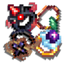
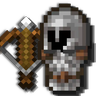
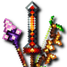
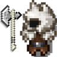
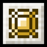
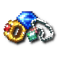
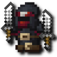
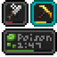
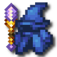

---
navigation:
  title: "Combat"
  position: 6
  icon: minecraft:iron_sword
---

# Combat

## Playable classes

Choose a build through equipment, a class book and skill-tree choices. There is no permanent class-selection screen. Skill roots can still be incompatible, and changing equipment does not refund spent points.

### Martial classes

<EmiSearch query="@archers" /> <EmiSearch query="@berserker_rpg" /> <EmiSearch query="@forcemaster_rpg" /> <EmiSearch query="@rogues" />

| Class | Purpose | First weapon or focus |
| --- | --- | --- |
| Archer | Prepared shots and area arrows. | <ItemGrid><ItemIcon id="archers:composite_longbow" /></ItemGrid> <ItemLink id="archers:composite_longbow" /> |
| Deadeye | Rapid ranged attacks and disabling shots. | <ItemGrid><ItemIcon id="archers:rapid_crossbow" /></ItemGrid> <ItemLink id="archers:rapid_crossbow" /> |
| Tundra Hunter | Frost shots and freezing areas. | <ItemGrid><ItemIcon id="archers:composite_longbow" /></ItemGrid> <ItemLink id="archers:composite_longbow" /> |
| War Archer | Fire arrows and burning ground. | <ItemGrid><ItemIcon id="archers:composite_longbow" /></ItemGrid> <ItemLink id="archers:composite_longbow" /> |
| Rogue | Close attacks with traps and mobility. | <ItemGrid><ItemIcon id="rogues:iron_dagger" /></ItemGrid> <ItemLink id="rogues:iron_dagger" /> |
| Warrior | Charges and defensive melee techniques. | <ItemGrid><ItemIcon id="rogues:iron_double_axe" /></ItemGrid> <ItemLink id="rogues:iron_double_axe" /> |
| Berserker | Rage effects and heavy melee strikes. | <ItemGrid><ItemIcon id="berserker_rpg:iron_berserker_axe" /></ItemGrid> <ItemLink id="berserker_rpg:iron_berserker_axe" /> |
| Forcemaster | Arcane strikes with knuckles. | <ItemGrid><ItemIcon id="forcemaster_rpg:iron_knuckle" /></ItemGrid> <ItemLink id="forcemaster_rpg:iron_knuckle" /> |

### Magic & support

<EmiSearch query="@bards_rpg" /> <EmiSearch query="@elemental_wizards_rpg" /> <EmiSearch query="@paladins" /> <EmiSearch query="@witcher_rpg" /> <EmiSearch query="@wizards" />

| Class | Purpose | First weapon or focus |
| --- | --- | --- |
| Arcane Wizard | Arcane projectiles and beams. | <ItemGrid><ItemIcon id="wizards:wand_arcane" /></ItemGrid> <ItemLink id="wizards:wand_arcane" /> |
| Fire Wizard | Fire attacks and persistent burning areas. | <ItemGrid><ItemIcon id="wizards:wand_novice" /></ItemGrid> <ItemLink id="wizards:wand_novice" /> |
| Frost Wizard | Frost attacks and protective effects. | <ItemGrid><ItemIcon id="wizards:wand_frost" /></ItemGrid> <ItemLink id="wizards:wand_frost" /> |
| Aqua Wizard | Water damage and healing areas. | <ItemGrid><ItemIcon id="elemental_wizards_rpg:wand_kelp" /></ItemGrid> <ItemLink id="elemental_wizards_rpg:wand_kelp" /> |
| Terra Wizard | Earth attacks and protective ground effects. | <ItemGrid><ItemIcon id="elemental_wizards_rpg:wand_clay" /></ItemGrid> <ItemLink id="elemental_wizards_rpg:wand_clay" /> |
| Wind Wizard | Air attacks and tornado areas. | <ItemGrid><ItemIcon id="elemental_wizards_rpg:wand_feather" /></ItemGrid> <ItemLink id="elemental_wizards_rpg:wand_feather" /> |
| Paladin | Melee strikes with healing and protection. | <ItemGrid><ItemIcon id="paladins:iron_mace" /></ItemGrid> <ItemLink id="paladins:iron_mace" /> |
| Priest | Healing beams and group protection. | <ItemGrid><ItemIcon id="paladins:acolyte_wand" /></ItemGrid> <ItemLink id="paladins:acolyte_wand" /> |
| Bard | Instrument attacks and support songs. | <ItemGrid><ItemIcon id="bards_rpg:wooden_lute" /></ItemGrid> <ItemLink id="bards_rpg:wooden_lute" /> |
| Witcher fencing | Sword attacks and combat techniques. | <ItemGrid><ItemIcon id="witcher_rpg:iron_witcher_sword" /></ItemGrid> <ItemLink id="witcher_rpg:iron_witcher_sword" /> |
| Witcher signs | Signs for control and protection. | <ItemGrid><ItemIcon id="witcher_rpg:iron_witcher_sword" /></ItemGrid> <ItemLink id="witcher_rpg:iron_witcher_sword" /> |

The three archer expansion paths can begin with the bow before adding their specialist armor. Witcher fencing and signs are two book paths for the same class, not two locked character selections.

***

## Equipment & abilities

Match your weapon or focus, armor bonuses and accessories to the attributes used by your abilities. A Fire-power bonus does not strengthen a Frost spell. Ordinary experience levels pay for spell binding, class and weapon skill points develop their own trees.

- <ItemImage id="minecraft:iron_chestplate" /> [Equipment](reference.equipment.md) Weapons, armor, accessories and first crafts.
- <ItemImage id="minecraft:enchanted_book" /> [Spells & abilities](combat.abilities.md) Book preparation, binding costs and casting requirements.

***

## First steps

<EmiSearch query="@runes" /> <EmiSearch query="@spell_engine" />

<ItemGrid><ItemIcon id="spell_engine:spell_binding" /></ItemGrid>

<ItemLink id="spell_engine:spell_binding" />

<Recipe id="spell_engine:spell_binding_table" />

1. Choose a role above and craft its starter weapon or focus. A built-in weapon ability is separate from a class book.
2. Make a Spell Binding Table, use a normal book to choose the matching class book, then bind abilities with the displayed experience and lapis requirements.
3. Equip the book in its spell-book slot and hold compatible equipment. Read the spell tooltip for ammunition, runes or other casting requirements.
4. Open <KeyBind id="key.puffish_skills.open" /> to develop connected nodes. Read incompatible roots before spending, changing equipment does not refund points.

***

## Detailed references

- [Weapons & armor](equipment.weapons-armor.md)
- [Accessories](equipment.accessories.md)
- [Armor & status](equipment.display.md)
- [Weapons & dodging](combat.handling.md)
- [Martial classes](combat.martial.md)
- [Magic classes](combat.magic.md)
- [Character skills](combat.skills.md)

***

## Related mods

| Mod or content | Purpose | Item search |
| --- | --- | --- |
|  [Additional Jewelry (RPG Series Plus)](equipment.accessories.md) | Adds jewelry for the additional More RPG Classes professions. | <EmiSearch query="@additional_rpg_jewelry" /> |
|  [Archers (RPG Series)](combat.martial.md) | Adds an archer combat class built around bows and ranged abilities. | <EmiSearch query="@archers" /> |
|  [Archers Expansion (RPG Series Plus)](combat.martial.md) | Adds archer subclasses with cold, status-inflicting and explosive arrow abilities. | <EmiSearch query="@archers_expansion" /> |
|  [Armory (RPG Series)](equipment.weapons-armor.md) | Adds class-oriented armor sets with set bonuses. | <EmiSearch query="@armory_rpgs" /> |
|  [Arsenal (RPG Series)](equipment.weapons-armor.md) | Adds legendary weapons obtained through encounters rather than crafting. | <EmiSearch query="@arsenal" /> |
|  [Bard (RPG Series Plus)](combat.magic.md) | Adds a bard class that supports allies through songs and ballads. | <EmiSearch query="@bards_rpg" /> |
|  [Berserker (RPG Series Plus)](combat.martial.md) | Adds an axe-wielding berserker whose rage increases damage at low health. | <EmiSearch query="@berserker_rpg" /> |
|  [Better Combat](combat.handling.md) | Reworks melee attacks with weapon animations and a more fluid combat system. | No separate item search |
|  [Combat Roll](combat.handling.md) | Adds a dodge roll with related attributes and enchantments. | No separate item search |
|  [Critical Strike](combat.handling.md) | Adds chance-based critical hits to melee and ranged attacks. | No separate item search |
|  [Curios API](equipment.accessories.md) | Provides expandable equipment slots for wearable accessories. | No separate item search |
|  [Detail Armor Bar Reconstructed](equipment.display.md) | Shows additional armor information in the armor status bar. | No separate item search |
|  [Elemental Wizards (RPG Series Plus)](combat.magic.md) | Expands Wizards with earth, water and wind spellcasting subclasses. | <EmiSearch query="@elemental_wizards_rpg" /> |
|  [Forcemaster (RPG Series Plus)](combat.martial.md) | Adds a knuckle-wielding martial class that strengthens attacks with arcane force. | <EmiSearch query="@forcemaster_rpg" /> |
|  [Jewelry (RPG Series)](equipment.accessories.md) | Adds mineable gems and craftable jewelry that improves combat attributes. | <EmiSearch query="@jewelry" /> |
|  [More Relics (RPG Series Plus)](equipment.accessories.md) | Adds Relics accessories for the additional More RPG Classes professions. | <EmiSearch query="@more_relics" /> |
|  [More RPG Classes - Skill Tree (RPG Series Plus)](combat.skills.md) | Adds class skill-tree support for the additional More RPG Classes professions. | No separate item search |
|  [Paladins & Priests (RPG Series)](combat.magic.md) | Adds paladin and priest classes focused on protection and healing. | <EmiSearch query="@paladins" /> |
|  [Pufferfish's Skills](combat.skills.md) | Provides a configurable skill system and skill-tree interface. | No separate item search |
|  [Relics (RPG Series)](equipment.accessories.md) | Adds combat-enhancing trinkets for RPG Series character builds. | <EmiSearch query="@relics_rpgs" /> |
|  [Rogues & Warriors (RPG Series)](combat.martial.md) | Adds rogue and warrior classes with distinct melee combat abilities. | <EmiSearch query="@rogues" /> |
|  [Runes](combat.magic.md) | Adds craftable runes consumed as ammunition for spells. | <EmiSearch query="@runes" /> |
|  [Skill Tree (RPG Series)](combat.skills.md) | Adds class-oriented skill trees for RPG Series characters. | <EmiSearch query="@skill_tree_rpgs" /> |
|  [Status Effect Bars Reforged](equipment.display.md) | Shows remaining status-effect duration with customizable bars. | No separate item search |
|  [Stylish Effects](equipment.display.md) | Reorganizes status-effect displays into compact, configurable interface layouts. | No separate item search |
|  [Witcher (RPG Series Plus)](combat.magic.md) | Adds a monster-hunting witcher class and associated combat abilities. | <EmiSearch query="@witcher_rpg" /> |
|  [Wizards (RPG Series)](combat.magic.md) | Adds wizard combat using arcane, fire and frost spells. | <EmiSearch query="@wizards" /> |
