---
navigation:
  title: "Technical"
  position: 15
  icon: minecraft:redstone
---

# Technical

## Contents

| Topic | Status |
| --- | --- |
| [Handbook](help.handbook.md) | Reference |
| [Advancements](help.reference.md) | Reference |
| [Performance](performance.baseline.md) | Reference |
| [Deferred optimizers](performance.deferred.md) | Reference |
| [Server tools](server.tools.md) | Reference |
| [Deferred loading](server.deferred-pack-loading.md) | Reference |
| [Compatibility](technical.bridges.md) | Reference |
| [Space compatibility](technical.space-bridge.md) | Reference |
| [Libraries](technical.libraries.md) | Reference |

***

## Related mods

| Mod or content | Purpose | Item search |
| --- | --- | --- |
|  [AI Improvements: Performance Tuning](performance.baseline.md) | Vanilla creature behavior optimization. | No separate item search |
|  [Almanac](technical.libraries.md) | Shares loader-independent code and fixes item stacking issues caused by empty tags. | No separate item search |
|  [Apollib](technical.libraries.md) | Shared configuration and registry utilities. | No separate item search |
|  [Architectury API](technical.libraries.md) | Shared cross-loader development interfaces. | No separate item search |
| 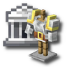 [Armor Model API](technical.libraries.md) | Renders custom armor geometry through the vanilla armor pipeline. | No separate item search |
| <ItemImage id="minecraft:redstone" /> [Async Logger](performance.deferred.md) | Asynchronous log processing. | No separate item search |
|  [AsyncParticles](performance.baseline.md) | Particle processing and rendering optimization. | No separate item search |
|  [Athena](technical.libraries.md) | Provides cross-loader connected block texture support. | No separate item search |
| 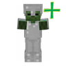 [AttributeFix](technical.bridges.md) | Removes built-in attribute limits that can restrict modded values. | No separate item search |
| <ItemImage id="minecraft:redstone" /> [BadOptimizations](performance.baseline.md) | Optimizations outside the main terrain renderer. | No separate item search |
|  [BaguetteLib](technical.libraries.md) | Death-handling and inventory-tracking support. | No separate item search |
|  [Balm](technical.libraries.md) | Shares loader-independent systems so dependent mods can run on multiple loaders. | No separate item search |
|  [Bookshelf](technical.libraries.md) | Provides shared serialization, data-pack features and debugging tools for dependent mods. | No separate item search |
|  [Bundle API](technical.libraries.md) | Provides larger bundles restricted to items selected by tags. | No separate item search |
|  [Chunky](server.tools.md) | Generates terrain ahead of exploration. | No separate item search |
|  [Cloth Config API](technical.libraries.md) | Configuration screen library. | No separate item search |
|  [Clumps](performance.baseline.md) | Combines experience orbs to reduce separate orb processing. | No separate item search |
| 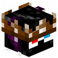 [Collective](technical.libraries.md) | Provides shared functionality for Serilum's utility mods. | No separate item search |
|  [Concurrent Chunk Management Engine (NeoForge)](performance.baseline.md) | Chunk management and generation optimization. | No separate item search |
|  [Configured Defaults](server.tools.md) | Supplies packaged defaults for missing files. | No separate item search |
|  [Create: Dragons Plus](technical.libraries.md) | Adds bulk fan processing and fluid tank access tools, plus shared Create addon utilities. | <EmiSearch query="@create_dragons_plus" /> |
| 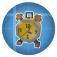 [Create: LazyTick](performance.baseline.md) | Create machine tick optimization. | <EmiSearch query="@createlazytick" /> |
|  [CreateBetterFps](performance.baseline.md) | Create rendering optimization for shader use. | No separate item search |
|  [CreativeCore](technical.libraries.md) | Provides shared interface, configuration and network systems for CreativeMD's mods. | No separate item search |
|  [Cull Leaves](performance.baseline.md) | Skips selected hidden leaf geometry. | No separate item search |
|  [DragonLib](technical.libraries.md) | Provides cross-loader abstractions and shared systems for MisterJulsen's mods. | <EmiSearch query="@dragonlib" /> |
|  [Dynamic FPS](performance.baseline.md) | Reduces resource use in the background or while idle. | No separate item search |
|  [EMF Compat: Core](technical.libraries.md) | Shared framework for EMF compatibility modules. | No separate item search |
|  [Entity Culling](performance.baseline.md) | Avoids rendering hidden entities and block entities. | No separate item search |
|  [FerriteCore](performance.baseline.md) | Reduces memory use. | No separate item search |
|  [Flerovium](performance.baseline.md) | Optimizes item, particle and entity rendering. | No separate item search |
|  [Forgified Fabric API](technical.libraries.md) | Fabric interfaces implemented on NeoForge. | No separate item search |
|  [Fzzy Config](technical.libraries.md) | Configuration, validation and synchronization support. | No separate item search |
|  [Geckolib](technical.libraries.md) | Animation library for entities, blocks, items and armor. | No separate item search |
|  [GroovyModLoader (GML)](technical.libraries.md) | Groovy language provider. | No separate item search |
| <ItemImage id="minecraft:redstone" /> [GuideME](help.handbook.md) | Renders in-game guide pages with formatted text, item displays and interactive scenes. | <EmiSearch query="@guideme" /> |
|  [Iceberg](technical.libraries.md) | Provides extra events and utility functions for dependent mods. | No separate item search |
|  [ImmediatelyFast](performance.baseline.md) | Optimizes immediate-mode rendering. | No separate item search |
|  [Ixeris](performance.baseline.md) | Buffered raw input and threaded event polling. | No separate item search |
|  [JamLib](technical.libraries.md) | Provides platform abstractions and configuration support for JamCore mods. | No separate item search |
| <ItemImage id="minecraft:redstone" /> [Jasione](performance.deferred.md) | Reduces repeated enumeration-array allocations. | No separate item search |
|  [Kerria](performance.baseline.md) | Accelerates animated texture processing. | No separate item search |
| <ItemImage id="minecraft:redstone" /> [Konkrete](technical.libraries.md) | Provides the utility and configuration library required by FancyMenu. | No separate item search |
|  [Kotlin for Forge](technical.libraries.md) | Kotlin language provider and utilities. | No separate item search |
| 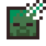 [Let Me Despawn](performance.baseline.md) | Adjusts creature despawn rules to reduce unintended persistent creatures. | No separate item search |
|  [Lionfish-API](technical.libraries.md) | Provides lightweight animation support for dependent mods. | No separate item search |
|  [Lithium](performance.baseline.md) | Optimizes game logic in single-player and servers. | No separate item search |
| 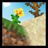 [Lithostitched](technical.libraries.md) | World-generation configuration and compatibility support. | No separate item search |
|  [Lodestone](technical.libraries.md) | Shared rendering and feature code for dependent mods. | No separate item search |
|  [MaFgLib](technical.libraries.md) | Shared code for Forge ports of masa's mods. | No separate item search |
| <ItemImage id="minecraft:redstone" /> [Melody](technical.libraries.md) | Provides the audio library required by FancyMenu. This menu adds no custom music. | No separate item search |
|  [MidnightLib](technical.libraries.md) | Lightweight configuration system. | No separate item search |
|  [ModernFix](performance.baseline.md) | Performance, memory and bug-fix changes. | No separate item search |
|  [Moonlight Lib](technical.libraries.md) | Shared registration and dynamic content utilities. | <EmiSearch query="@moonlight" /> |
|  [More Culling](performance.baseline.md) | Skips selected hidden rendering faces. | No separate item search |
|  [More RPG Library](technical.libraries.md) | Provides shared attributes and status effects for More RPG class addons. | <EmiSearch query="@more_rpg_classes" /> |
|  [MRU](technical.libraries.md) | Shares cross-version utilities used by Cassian and IMB11's mods. | No separate item search |
|  [Neo Bee Fix](technical.bridges.md) | Repairs vanilla bee behavior. | No separate item search |
| <ItemImage id="minecraft:redstone" /> [Northstar Sable Iris Horizons Bridge](technical.space-bridge.md) (deferred addition) | Bridges Northstar sky rendering with shaders, distant terrain and Sable structures. | No separate item search |
|  [Observable](server.tools.md) | Identifies expensive server processing. | No separate item search |
|  [oωo (owo-lib)](technical.libraries.md) | General utilities, interfaces and configuration support. | No separate item search |
| <ItemImage id="minecraft:redstone" /> [Paxi](server.deferred-pack-loading.md) (deferred addition) | Automatic data-pack and resource-pack loading. | No separate item search |
|  [Placebo](technical.libraries.md) | Provides shared code required by Shadows' mods without adding standalone gameplay. | No separate item search |
| <ItemImage id="minecraft:redstone" /> [playerAnimator](technical.libraries.md) | Player animation library. | No separate item search |
|  [Prickle](technical.libraries.md) | Provides structured configuration file handling for dependent mods. | No separate item search |
|  [Puzzles Lib](technical.libraries.md) | Provides shared support systems required by Fuzss' mods. | No separate item search |
|  [quick pack](performance.baseline.md) | Accelerates compressed data-pack and resource-pack loading. | No separate item search |
| 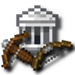 [Ranged Weapon API](technical.libraries.md) | Bow and crossbow development support. | No separate item search |
|  [Reliable Advancements](help.reference.md) | Improves advancement browsing and supports editing advancements in game. | No separate item search |
| 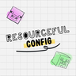 [Resourceful Config](technical.libraries.md) | Provides cross-platform configuration files and settings interfaces. | No separate item search |
|  [Resourceful Lib](technical.libraries.md) | Provides shared networking, data encoding and interface utilities for dependent mods. | No separate item search |
| 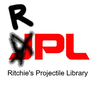 [Ritchie's Projectile Library](technical.libraries.md) | Supports long-range projectile synchronization and projectile chunk loading. | No separate item search |
|  [Sable](technical.libraries.md) | Framework for interactive moving block structures. | No separate item search |
|  [Sable Beyond](technical.bridges.md) | Extends Sable with Create machine interactions and configurable mass and fluid physics. | No separate item search |
| 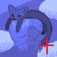 [Sable: Physics Compat](technical.bridges.md) | Adds physics property tags to supported modded blocks. | No separate item search |
|  [Searchables](technical.libraries.md) | Search, filtering and completion support for interfaces. | No separate item search |
| <ItemImage id="minecraft:redstone" /> [ServerCore](performance.deferred.md) | Optimizes server chunk ticking and creature spawning, with configurable workload controls. | No separate item search |
| 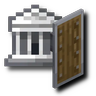 [Shield API](technical.libraries.md) | Custom shield model support. | No separate item search |
|  [Sinytra Connector](technical.libraries.md) | Compatibility layer for selected Fabric mods on NeoForge. | No separate item search |
|  [Sodium](performance.baseline.md) | Replaces the terrain rendering engine. | No separate item search |
| 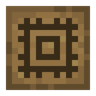 [Sophisticated Core](technical.libraries.md) | Provides shared systems used by Sophisticated inventory and storage mods. | <EmiSearch query="@sophisticatedcore" /> |
|  [spark](server.tools.md) | Profiles client and server performance. | No separate item search |
|  [Spell Engine](technical.libraries.md) | Data-driven spell framework. | <EmiSearch query="@spell_engine" /> |
| 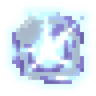 [Spell Power Attributes](technical.libraries.md) | Spell-related attributes, effects and enchantment support. | No separate item search |
|  [Structure Layout Optimizer](performance.baseline.md) | Optimizes jigsaw structure layout processing. | No separate item search |
|  [Structure Pool API](technical.libraries.md) | Structure pool injection support. | No separate item search |
|  [Teal Lib](technical.libraries.md) | Provides shared animation and data-driven creature variant systems. | <EmiSearch query="@teallib" /> |
|  [YetAnotherConfigLib (YACL)](technical.libraries.md) | Configuration screen construction library. | No separate item search |
|  [YUNG's API](technical.libraries.md) | Shared code for YUNG's mods. | No separate item search |
