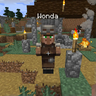

---
navigation:
  title: "Utilities"
  position: 12
  icon: minecraft:chest
---

# Utilities

## Contents

| Topic | Status |
| --- | --- |
| [Block & mob info](help.inspect.md) | Reference |
| [Carry On](interactions.carry.md) | Reference |
| [Death & recovery](adventure.recovery.md) | Reference |
| [Sleep](adventure.sleep.md) | Reference |

***

## Related mods

| Mod or content | Purpose | Item search |
| --- | --- | --- |
|  [Better Days](adventure.sleep.md) | Customizes day and night duration and advances time while players sleep. | No separate item search |
|  [Carry On](interactions.carry.md) | Lets players pick up and carry supported containers and creatures. | No separate item search |
|  [Comforts](adventure.sleep.md) | Adds sleeping bags and hammocks for resting without changing the respawn point. | <EmiSearch query="@comforts" /> |
|  [Corpse](adventure.recovery.md) | Stores a dead player's inventory in a recoverable corpse. | No separate item search |
|  [Corpse x Curios API Compat](adventure.recovery.md) | Lets recovered corpse accessories return directly to their Curios equipment slots. | No separate item search |
|  [Jade Addons (Neo/Forge)](help.inspect.md) | Adds mod-specific information support to Jade's inspection overlay. | No separate item search |
|  [Jade 🔍](help.inspect.md) | Shows information about the block or creature being looked at. | No separate item search |
|  [Villager Names](help.inspect.md) | Gives villagers default or custom names. | No separate item search |
