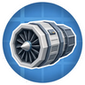
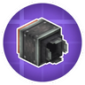
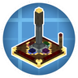
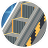
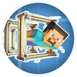
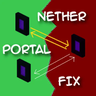
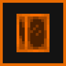
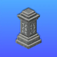

---
navigation:
  title: "Transport"
  position: 9
  icon: minecraft:minecart
---

# Transport

## Physical vehicles

<EmiSearch query="@create_submarine" />

<ItemGrid>
  <ItemIcon id="simulated:physics_assembler" />
  <ItemIcon id="offroad:tire" />
  <ItemIcon id="aeronautics:white_envelope" />
  <ItemIcon id="create_submarine:ballast_tank" />
</ItemGrid>

- [Assembly](vehicles.assembly.md) Turn a block-built hull into a physical vehicle.
- [Airships](vehicles.airships.md) Choose lift and propulsion for an airship.
- [Engines](vehicles.engines.md) Compare power and propulsion components.
- [Water vehicles](vehicles.water.md) Prepare flotation, diving equipment and underwater travel.

***

## Controls & equipment

<EmiSearch query="@aeroworks" /> <EmiSearch query="@createbigcannons" /> <EmiSearch query="@create_radar" />

<ItemGrid>
  <ItemIcon id="aeroworks:control_desk" />
  <ItemIcon id="create_radar:radar_dish_block" />
  <ItemIcon id="createbigcannons:cannon_mount" />
</ItemGrid>

- [Controls](vehicles.controls.md) Connect pilot controls to the machinery they operate.
- [Radar](vehicles.radar.md) Detect targets and understand identification limits.
- [Weapons](vehicles.weapons.md) Mount and supply vehicle weapons.

***

## Routes & destinations

<EmiSearch query="@createrailwaysnavigator" /> <EmiSearch query="@create" /> <EmiSearch query="@create_hypertube" /> <EmiSearch query="@tempad" /> <EmiSearch query="@waystones" />

<ItemGrid>
  <ItemIcon id="createrailwaysnavigator:navigator" />
  <ItemIcon id="create:track" />
  <ItemIcon id="create_hypertube:hypertube" />
  <ItemIcon id="waystones:waystone" />
  <ItemIcon id="tempad:tempad" />
</ItemGrid>

- [Passenger travel](transport.passenger.md) Find a train service and plan a journey.
- [Railway building](transport.railway-builder.md) Build railway infrastructure and schedule services.
- [Local transport](transport.local.md) Move through a base without building a complete vehicle.
- [Teleportation](travel.destinations.md) Use discovered or placed teleportation destinations.

***

## Related mods

| Mod or content | Purpose | Item search |
| --- | --- | --- |
|  [AeroEngine](vehicles.engines.md) | Adds modular aircraft engines and flight control instruments to Create. | <EmiSearch query="@aeroengineering" /> |
|  [Create Aeronautics](vehicles.assembly.md) | Turns block-built vehicles into controllable physical moving structures. | No separate item search |
|  [Create Aeronautics: Encased Fluid Pipes](vehicles.airships.md) | Lets Aeronautics hot air envelopes encase Create fluid pipes. | <EmiSearch query="@aeroencasedpipe" /> |
|  [Create Big Cannons](vehicles.weapons.md) | Adds buildable large cannons and their ammunition to Create. | <EmiSearch query="@createbigcannons" /> |
|  [Create Deep Seas](vehicles.water.md) | Adds marine vehicle components for Aeronautics boats and submarines. | <EmiSearch query="@create_submarine" /> |
|  [Create Propulsion: Simulated](vehicles.engines.md) | Adds fuel and electric thrusters that propel Sable and Aeronautics vehicles. | <EmiSearch query="@createpropulsion" /> |
|  [Create Railways Navigator](transport.passenger.md) | Adds train route search, passenger information displays and schedule features. | <EmiSearch query="@createrailwaysnavigator" /> |
|  [Create Waystones Recipes](travel.destinations.md) | Reworks Waystones recipes to use Create materials and crafting. | No separate item search |
| <ItemImage id="minecraft:minecart" /> [Create: AeroWarptics](space.vehicle-transfer.md) (deferred addition) | Adds relocation tools for physical Aeronautics vehicles. | No separate item search |
|  [Create: Aeroworks](vehicles.controls.md) | Adds flight controls such as gyroscopes and joysticks for Aeronautics vehicles. | <EmiSearch query="@aeroworks" /> |
|  [Create: Ballast](vehicles.airships.md) | Adds layered ballast blocks for adjusting vehicle mass and balance. | <EmiSearch query="@ballastmod" /> |
|  [Create: Blocks & Bogies](transport.railway-builder.md) | Adds larger Create train bogies, including visible valve gear variants. | No separate item search |
|  [Create: Escalated](transport.local.md) | Adds rotation-powered escalators for Create buildings. | <EmiSearch query="@escalated" /> |
|  [Create: Hypertubes](transport.local.md) | Adds tube transport for moving players around Create builds. | <EmiSearch query="@create_hypertube" /> |
| <ItemImage id="minecraft:minecart" /> [Create: Northstar - Redux](space.destinations.md) (deferred addition) | Adds space destinations and Create-based equipment for exploring them. | No separate item search |
| <ItemImage id="minecraft:minecart" /> [Create: Northstar-Aeronautics Compatibility](space.vehicle-transfer.md) (deferred addition) | Connects Northstar space travel to Aeronautics physical vehicle transfers. | No separate item search |
|  [Create: Radars](vehicles.radar.md) | Adds radar equipment to detect and track targets in Create builds. | <EmiSearch query="@create_radar" /> |
|  [Create: Tweaked Controllers](vehicles.controls.md) | Adds advanced handheld controls for Create contraptions. | <EmiSearch query="@create_tweaked_controllers" /> |
|  [NetherPortalFix](travel.destinations.md) | Corrects return destinations when players travel through Nether portals. | No separate item search |
|  [Steam 'n' Rails Neoforge](transport.railway-builder.md) | Expands Create railways with additional track and train components. | <EmiSearch query="@railways" /> |
|  [Tempad](travel.destinations.md) | Creates travel portals to saved locations using portable and stationary devices. | <EmiSearch query="@tempad" /> |
|  [Waystones](travel.destinations.md) | Adds activated destination stones and portable items for travel between locations. | <EmiSearch query="@waystones" /> |
|  [Waystones: Sable (Create Aeronautics Addon)](travel.destinations.md) | Fixes Waystones teleportation and destination handling on Sable moving structures. | No separate item search |
