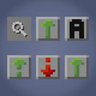

---
navigation:
  title: "Inventory tools"
  position: 0
  parent: reference.machines-storage.md
  icon: create:crushing_wheel
---

# Inventory tools

## Inventory controls

<ItemGrid>
  <ItemIcon id="minecraft:chest" />
  <ItemIcon id="minecraft:hopper" />
  <ItemIcon id="interactic:item_filter" />
  <ItemIcon id="minecraft:lava_bucket" />
</ItemGrid>

| Items & families | Use |
| --- | --- |
| <ItemLink id="minecraft:chest" /> | Sophisticated Inventory Interactions adds search, player and container sorting, and transfer controls to supported screens. |
| <ItemLink id="minecraft:hopper" /> | Mouse Tweaks supplies drag and wheel transfer conveniences. |
| <ItemLink id="interactic:item_filter" /> | Interactic Renewed supplies an Item Filter for pickup rules, with separate pickup and rendering settings. |
| <ItemLink id="minecraft:lava_bucket" /> | TrashSlot is a deletion interface, not a storage container. |

***

## Getting started

Open a chest to find the search, sort and transfer controls on supported screens. Configure the Item Filter before collecting drops. Keep valuable items away from TrashSlot and check its instant deletion setting. Current bindings are in Controls.

- [Controls](help.controls.md)

***

## Related mods

| Mod or content | Status | Publisher description |
| --- | --- | --- |
|  [Interactic Renewed](storage.handling.md) | Baseline, installed | A maintained fork of the populair interactic mod. |
|  [Mouse Tweaks](storage.handling.md) | Baseline, installed | Enhances inventory management by adding various functions to the mouse buttons.  |
|  [Sophisticated Inventory Interactions](storage.handling.md) | Baseline, installed | Adds Sophisticated-style search, sort, and transfer controls to vanilla and compatible modded container GUIs, including player-inventory sorting. |
|  [TrashSlot](storage.handling.md) | Baseline, installed | Adds a draggable trash slot to all inventory screens. Press T to toggle. |
