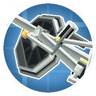
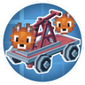

---
navigation:
  title: "Railways"
  position: 0
  parent: reference.vehicles.md
  icon: minecraft:minecart
---

# Railways

## Tracks & stations

<EmiSearch query="@create" />

<ItemGrid>
  <ItemIcon id="create:track" />
  <ItemIcon id="create:railway_casing" />
  <ItemIcon id="create:track_station" />
  <ItemIcon id="create:controls" />
  <ItemIcon id="create:schedule" />
</ItemGrid>

| Shown items |
| --- |
| <ItemLink id="create:track" /> |
| <ItemLink id="create:railway_casing" /> |
| <ItemLink id="create:track_station" /> |
| <ItemLink id="create:controls" /> |
| <ItemLink id="create:schedule" /> |

Create supplies track, Railway Casing, Train Stations, Train Controls and schedules. Steam 'n' Rails extends track families, gauges, switches, signals and conductor equipment. Use Train Station Ponder for train assembly and the chosen track recipe for its gauge and material.

### Train station

<Recipe id="create:crafting/kinetics/track_station" />

One Railway Casing and one compass make two <ItemLink id="create:track_station" />. Use Train Station Ponder for assembly.

### Train controls

<Recipe id="create:crafting/kinetics/controls" />

Craft <ItemLink id="create:controls" /> for the train control position. The Precision Mechanism is a separate intermediate craft.

***

## Bogie styles

Blocks & Bogies adds a Bogie Customisation interface, not a separate set of bogie items. Choose the driver or truck role, then the axle count, size and length offered by the menu. Valve-gear styles are additional interface choices. The menu can switch to Steam 'n' Rails. Not every axle, size and style combination is interchangeable. Train fittings covers decorative bodywork.

- [Train fittings](building.factory.md)

***

## Related mods

| Mod or content | Purpose | Status | Item search |
| --- | --- | --- | --- |
|  [Create: Blocks & Bogies](transport.railway-builder.md) | Adds larger Create train bogies, including visible valve gear variants. | Baseline, installed | No separate item search |
|  [Steam 'n' Rails Neoforge](transport.railway-builder.md) | Expands Create railways with additional track and train components. | Baseline, installed | <EmiSearch query="@railways" /> |
