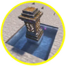

---
navigation:
  title: "Teleportation"
  position: 0
  parent: reference.vehicles.md
  icon: minecraft:ender_pearl
---

# Teleportation

## Waystone network

<EmiSearch query="@create" /> <EmiSearch query="@waystones" />

<ItemGrid>
  <ItemIcon id="waystones:blackstone_waystone" />
  <ItemIcon id="waystones:deepslate_waystone" />
  <ItemIcon id="waystones:end_stone_waystone" />
  <ItemIcon id="waystones:mossy_waystone" />
  <ItemIcon id="waystones:mud_bricks_waystone" />
  <ItemIcon id="waystones:prismarine_waystone" />
  <ItemIcon id="waystones:purpur_waystone" />
  <ItemIcon id="waystones:red_nether_bricks_waystone" />
  <ItemIcon id="waystones:sandy_waystone" />
  <ItemIcon id="waystones:waystone" />
</ItemGrid>

| Shown items |
| --- |
| <ItemLink id="waystones:blackstone_waystone" /> |
| <ItemLink id="waystones:deepslate_waystone" /> |
| <ItemLink id="waystones:end_stone_waystone" /> |
| <ItemLink id="waystones:mossy_waystone" /> |
| <ItemLink id="waystones:mud_bricks_waystone" /> |
| <ItemLink id="waystones:prismarine_waystone" /> |
| <ItemLink id="waystones:purpur_waystone" /> |
| <ItemLink id="waystones:red_nether_bricks_waystone" /> |
| <ItemLink id="waystones:sandy_waystone" /> |
| <ItemLink id="waystones:waystone" /> |

Waystones supplies destination blocks in different materials. Activate a waystone before choosing it in your destination list. The interface shows required experience and cooldowns. Create Waystones Recipes adds Create crafting paths.

***

## Shared & portable travel

<ItemGrid>
  <ItemIcon id="waystones:orange_sharestone" />
  <ItemIcon id="waystones:white_portstone" />
  <ItemIcon id="waystones:warp_plate" />
  <ItemIcon id="waystones:dormant_shard" />
  <ItemIcon id="waystones:attuned_shard" />
  <ItemIcon id="waystones:blank_scroll" />
  <ItemIcon id="waystones:warp_stone" />
</ItemGrid>

| Shown items |
| --- |
| <ItemLink id="waystones:orange_sharestone" /> |
| <ItemLink id="waystones:white_portstone" /> |
| <ItemLink id="waystones:warp_plate" /> |
| <ItemLink id="waystones:dormant_shard" /> |
| <ItemLink id="waystones:attuned_shard" /> |
| <ItemLink id="waystones:blank_scroll" /> |
| <ItemLink id="waystones:warp_stone" /> |

Sharestones connect to others of the same color. Portstones provide departure access but cannot be destinations. Warp Plates use attuned shards: attune a Dormant Shard in one plate, then bring it to another. Bind a Blank Scroll by using it on a waystone. Warp Stones and scrolls provide portable access.

***

## Tempad & portals

<EmiSearch query="@tempad" />

<ItemGrid>
  <ItemIcon id="tempad:tempad" />
  <ItemIcon id="tempad:location_card" />
  <ItemIcon id="tempad:timedoor_projector" />
  <ItemIcon id="tempad:workstation" />
  <ItemIcon id="tempad:chronon_generator" />
  <ItemIcon id="minecraft:obsidian" />
</ItemGrid>

| Shown items |
| --- |
| <ItemLink id="tempad:tempad" /> |
| <ItemLink id="tempad:location_card" /> |
| <ItemLink id="tempad:timedoor_projector" /> |
| <ItemLink id="tempad:workstation" /> |
| <ItemLink id="tempad:chronon_generator" /> |
| <ItemLink id="minecraft:obsidian" /> |

Tempad supplies a portable destination interface, Location Cards, Timedoor Projectors, Workstations and chronon power equipment. Open the Tempad location application to manage saved places and inspect its requirements. NetherPortalFix improves Nether portal return matching. It adds no separate destination item. Fixed saved coordinates are not a moving-vehicle tracking system.

***

## Tempad equipment

<ItemGrid>
  <ItemIcon id="tempad:chronometer" />
  <ItemIcon id="tempad:chronon_cell" />
  <ItemIcon id="tempad:chronon_battery" />
  <ItemIcon id="tempad:location_broadcaster" />
  <ItemIcon id="tempad:timedoor_marker" />
  <ItemIcon id="tempad:card_wallet" />
</ItemGrid>

| Shown items |
| --- |
| <ItemLink id="tempad:chronometer" /> |
| <ItemLink id="tempad:chronon_cell" /> |
| <ItemLink id="tempad:chronon_battery" /> |
| <ItemLink id="tempad:location_broadcaster" /> |
| <ItemLink id="tempad:timedoor_marker" /> |
| <ItemLink id="tempad:card_wallet" /> |

Tempad separates time-power equipment from equipment for managing saved locations. Check each device in the location application and recipe browser. Workstation upgrades and creative equipment are separate families, not prerequisites shared by every device.

***

## Crafting

<Recipe id="waystones:orange_sharestone_recolor" />

***

## Moving waystones

<ItemGrid>
  <ItemIcon id="waystones:waystone" />
  <ItemIcon id="waystones:warp_plate" />
  <ItemIcon id="simulated:physics_assembler" />
</ItemGrid>

| Shown items |
| --- |
| <ItemLink id="waystones:waystone" /> |
| <ItemLink id="waystones:warp_plate" /> |
| <ItemLink id="simulated:physics_assembler" /> |

Waystones Sable bridges Waystones destinations on Sable moving structures. It adds the Sable SubLevels group and tracks waystone positions and assembly state. It does not add a new waystone item. Place and activate the waystone on the supported moving build, then select its destination through Waystones.

***

## Destination scope

A moving waystone destination is different from a Tempad coordinate or a map waypoint. Keep the destination structure loaded and inspect the Waystones list before relying on it for return travel. This bridge does not transfer the entire vehicle between dimensions.

- [Vehicle assembly](vehicles.assembly.md)
- [Dimensions](world.dimensions.md)

## Related items

<ItemGrid>
  <ItemIcon id="waystones:waystone" />
</ItemGrid>

| Shown items |
| --- |
| <ItemLink id="waystones:waystone" /> |

***

## Ship teleportation

Create: AeroWarptics (separate ship patch) relocates an assembled Aeronautics ship within a dimension. Waystones Sable teleports players to moving destinations, not the entire ship. AeroWarptics does not supply Northstar planets or other space destinations.

***

## Related mods

| Mod or content | Purpose | Item search |
| --- | --- | --- |
|  [Create Waystones Recipes](travel.destinations.md) | Reworks Waystones recipes to use Create materials and crafting. | No separate item search |
|  [NetherPortalFix](travel.destinations.md) | Corrects return destinations when players travel through Nether portals. | No separate item search |
|  [Tempad](travel.destinations.md) | Creates travel portals to saved locations using portable and stationary devices. | <EmiSearch query="@tempad" /> |
|  [Waystones](travel.destinations.md) | Adds activated destination stones and portable items for travel between locations. | <EmiSearch query="@waystones" /> |
|  [Waystones: Sable (Create Aeronautics Addon)](travel.destinations.md) | Fixes Waystones teleportation and destination handling on Sable moving structures. | No separate item search |
