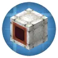
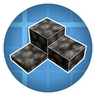

---
navigation:
  title: "Airships"
  position: 0
  parent: reference.vehicles.md
  icon: minecraft:elytra
---

# Airships

## Lift & envelopes

<EmiSearch query="@aeroencasedpipe" /> <EmiSearch query="@ballastmod" />

<ItemGrid>
  <ItemIcon id="aeronautics:white_envelope" />
  <ItemIcon id="aeronautics:adjustable_burner" />
  <ItemIcon id="aeronautics:white_envelope_encased_shaft" />
  <ItemIcon id="aeroencasedpipe:white_envelope_encased_pipe" />
  <ItemIcon id="ballastmod:ballast_stones" />
</ItemGrid>

| Shown items |
| --- |
| <ItemLink id="aeronautics:white_envelope" /> |
| <ItemLink id="aeronautics:adjustable_burner" /> |
| <ItemLink id="aeronautics:white_envelope_encased_shaft" /> |
| <ItemLink id="aeroencasedpipe:white_envelope_encased_pipe" /> |
| <ItemLink id="ballastmod:ballast_stones" /> |

Hot Air Envelopes and Hot Air Burners form the buoyancy family. Envelopes, envelope encased shafts and addon envelope encased fluid pipes come in sixteen dye colors. Ballast Stones gain mass with each added layer, up to eight layers.

### First envelope

<Recipe id="aeronautics:white_envelope" />

Two white wool and two sticks make four <ItemLink id="aeronautics:white_envelope" />.

### Hot air burner

<Recipe id="aeronautics:adjustable_burner" />

Craft <ItemLink id="aeronautics:adjustable_burner" /> for the hot-air envelope system. Use the envelope and burner Ponder entries for the working arrangement.

***

## Propellers & sails

<ItemGrid>
  <ItemIcon id="aeronautics:propeller_bearing" />
  <ItemIcon id="aeronautics:gyroscopic_propeller_bearing" />
  <ItemIcon id="aeronautics:wooden_propeller" />
  <ItemIcon id="aeronautics:andesite_propeller" />
  <ItemIcon id="aeronautics:smart_propeller" />
  <ItemIcon id="simulated:white_symmetric_sail" />
</ItemGrid>

| Shown items |
| --- |
| <ItemLink id="aeronautics:propeller_bearing" /> |
| <ItemLink id="aeronautics:gyroscopic_propeller_bearing" /> |
| <ItemLink id="aeronautics:wooden_propeller" /> |
| <ItemLink id="aeronautics:andesite_propeller" /> |
| <ItemLink id="aeronautics:smart_propeller" /> |
| <ItemLink id="simulated:white_symmetric_sail" /> |

Wooden, Andesite and Smart Propellers have dedicated bearings. Symmetric sails provide another aerodynamic family. Getting started: assemble a supported hull, then use the envelope, burner and propeller Ponder entries to plan lift and thrust. Decorative volume alone does not provide lift.

## Related topics

- [Browse recipe](help.search.md)

***

## Related mods

| Mod or content | Purpose | Item search |
| --- | --- | --- |
|  [Create Aeronautics: Encased Fluid Pipes](vehicles.airships.md) | Lets Aeronautics hot air envelopes encase Create fluid pipes. | <EmiSearch query="@aeroencasedpipe" /> |
|  [Create: Ballast](vehicles.airships.md) | Adds layered ballast blocks for adjusting vehicle mass and balance. | <EmiSearch query="@ballastmod" /> |
