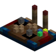

---
navigation:
  title: "Vehicle controls"
  position: 0
  parent: reference.vehicles.md
  icon: create:controls
---

# Vehicle controls

## Cockpit controls

<EmiSearch query="@aeroworks" />

<ItemGrid>
  <ItemIcon id="aeroworks:control_desk" />
  <ItemIcon id="aeroworks:joystick_module" />
  <ItemIcon id="aeroworks:throttle_quadrant_module" />
  <ItemIcon id="aeroworks:wheel_module" />
  <ItemIcon id="aeroworks:mechanical_servo" />
  <ItemIcon id="aeroworks:stepper_servo" />
</ItemGrid>

| Shown items |
| --- |
| <ItemLink id="aeroworks:control_desk" /> |
| <ItemLink id="aeroworks:joystick_module" /> |
| <ItemLink id="aeroworks:throttle_quadrant_module" /> |
| <ItemLink id="aeroworks:wheel_module" /> |
| <ItemLink id="aeroworks:mechanical_servo" /> |
| <ItemLink id="aeroworks:stepper_servo" /> |

Aeroworks consoles accept wheel, joystick, throttle, pedal, lever, keypad and button panel modules. Right-click a socket with a module. Remove it with a wrench. Sneak and right-click to configure each control and its Redstone Link frequencies. Empty-hand right-click takes control. Escape releases it. Touching consoles form one deck, controlled by one player at a time.

***

## Signals & sensors

<EmiSearch query="@create_tweaked_controllers" /> <EmiSearch query="@create" />

<ItemGrid>
  <ItemIcon id="simulated:steering_wheel" />
  <ItemIcon id="simulated:throttle_lever" />
  <ItemIcon id="simulated:altitude_sensor" />
  <ItemIcon id="simulated:velocity_sensor" />
  <ItemIcon id="simulated:gimbal_sensor" />
  <ItemIcon id="aeroworks:gyroscope" />
  <ItemIcon id="create_tweaked_controllers:tweaked_linked_controller" />
</ItemGrid>

| Shown items |
| --- |
| <ItemLink id="simulated:steering_wheel" /> |
| <ItemLink id="simulated:throttle_lever" /> |
| <ItemLink id="simulated:altitude_sensor" /> |
| <ItemLink id="simulated:velocity_sensor" /> |
| <ItemLink id="simulated:gimbal_sensor" /> |
| <ItemLink id="aeroworks:gyroscope" /> |
| <ItemLink id="create_tweaked_controllers:tweaked_linked_controller" /> |

Steering and throttle controls provide manual input. Sensors report altitude, velocity and gimbal state. Aeroworks adds gyroscopes and servos, while Tweaked Linked Controllers provide a handheld interface. Use console and servo Ponder for signal behavior. These parts do not create an automatic flight program on their own.

***

## Receivers & cockpit

<EmiSearch query="@aeroengineering" />

<ItemGrid>
  <ItemIcon id="simulated:directional_linked_receiver" />
  <ItemIcon id="simulated:modulating_linked_receiver" />
  <ItemIcon id="simulated:optical_sensor" />
  <ItemIcon id="simulated:laser_sensor" />
  <ItemIcon id="aeroengineering:engine_monitor_helmet" />
  <ItemIcon id="aeroengineering:hud_display" />
  <ItemIcon id="aeroengineering:folding_landing_gear_bearing" />
</ItemGrid>

| Shown items |
| --- |
| <ItemLink id="simulated:directional_linked_receiver" /> |
| <ItemLink id="simulated:modulating_linked_receiver" /> |
| <ItemLink id="simulated:optical_sensor" /> |
| <ItemLink id="simulated:laser_sensor" /> |
| <ItemLink id="aeroengineering:engine_monitor_helmet" /> |
| <ItemLink id="aeroengineering:hud_display" /> |
| <ItemLink id="aeroengineering:folding_landing_gear_bearing" /> |

Linked receivers and optical or laser sensors extend control wiring. Aero Engineering cockpit equipment provides monitoring and landing-gear controls. Configure bindings through the item help. Cockpit displays require linked monitoring targets.

***

## Crafting

<Recipe id="aeroworks:throttle_quadrant_module" />

## Related items

<ItemGrid>
  <ItemIcon id="create:wrench" />
  <ItemIcon id="create:redstone_link" />
</ItemGrid>

| Shown items |
| --- |
| <ItemLink id="create:wrench" /> |
| <ItemLink id="create:redstone_link" /> |

## Related topics

- [Browse recipe](help.search.md)

***

## Related mods

| Mod or content | Purpose | Item search |
| --- | --- | --- |
|  [Create: Aeroworks](vehicles.controls.md) | Adds flight controls such as gyroscopes and joysticks for Aeronautics vehicles. | <EmiSearch query="@aeroworks" /> |
|  [Create: Tweaked Controllers](vehicles.controls.md) | Adds advanced handheld controls for Create contraptions. | <EmiSearch query="@create_tweaked_controllers" /> |
