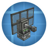

---
navigation:
  title: "Radar"
  position: 0
  parent: reference.vehicles.md
  icon: minecraft:minecart
---

# Radar

## Detection & display

<ItemGrid>
  <ItemIcon id="create_radar:radar_bearing" />
  <ItemIcon id="create_radar:radar_dish_block" />
  <ItemIcon id="create_radar:radar_plate_block" />
  <ItemIcon id="create_radar:radar_receiver_block" />
  <ItemIcon id="create_radar:monitor" />
  <ItemIcon id="create_radar:plane_radar" />
</ItemGrid>

| Shown items |
| --- |
| <ItemLink id="create_radar:radar_bearing" /> |
| <ItemLink id="create_radar:radar_dish_block" /> |
| <ItemLink id="create_radar:radar_plate_block" /> |
| <ItemLink id="create_radar:radar_receiver_block" /> |
| <ItemLink id="create_radar:monitor" /> |
| <ItemLink id="create_radar:plane_radar" /> |

Create Radars separates detection components from receivers and displays. Choose a radar family, then use its tooltip and recipe help for the connections. Filters are listed below.

***

## Targets & fire control

<ItemGrid>
  <ItemIcon id="create_radar:identification_transponder" />
  <ItemIcon id="create_radar:data_link" />
  <ItemIcon id="create_radar:network_filterer" />
  <ItemIcon id="create_radar:radar_warning_receiver" />
  <ItemIcon id="create_radar:fire_controller" />
  <ItemIcon id="create_radar:guided_fuze" />
  <ItemIcon id="aeroengineering:airborne_radar" />
</ItemGrid>

| Shown items |
| --- |
| <ItemLink id="create_radar:identification_transponder" /> |
| <ItemLink id="create_radar:data_link" /> |
| <ItemLink id="create_radar:network_filterer" /> |
| <ItemLink id="create_radar:radar_warning_receiver" /> |
| <ItemLink id="create_radar:fire_controller" /> |
| <ItemLink id="create_radar:guided_fuze" /> |
| <ItemLink id="aeroengineering:airborne_radar" /> |

Identification and network components connect radar information to warning and fire-control equipment. Aero Engineering has a separate Airborne Radar with target switching, confirmation and missile launch frequencies. Choose the radar family, then follow its tooltip and recipe help for connections.

***

## Filters & observation

<ItemGrid>
  <ItemIcon id="create_radar:radar_filter_item" />
  <ItemIcon id="create_radar:target_filter_item" />
  <ItemIcon id="create_radar:ident_filter_item" />
  <ItemIcon id="create_radar:radar_safe_zone_designator" />
  <ItemIcon id="create_radar:binoculars" />
  <ItemIcon id="create_radar:auto_pitch_controller" />
  <ItemIcon id="create_radar:auto_yaw_controller" />
</ItemGrid>

| Shown items |
| --- |
| <ItemLink id="create_radar:radar_filter_item" /> |
| <ItemLink id="create_radar:target_filter_item" /> |
| <ItemLink id="create_radar:ident_filter_item" /> |
| <ItemLink id="create_radar:radar_safe_zone_designator" /> |
| <ItemLink id="create_radar:binoculars" /> |
| <ItemLink id="create_radar:auto_pitch_controller" /> |
| <ItemLink id="create_radar:auto_yaw_controller" /> |

Detection, targeting and identification use separate filters. Observation tools and distinct pitch and yaw controllers extend those roles. Creative Radar Plates are creative equipment.

***

## Crafting

<Recipe id="create_radar:crafting/auto_pitch_controller" />

## Related topics

- [Browse recipe](help.search.md)

***

## Related mods

| Mod or content | Status | Publisher description |
| --- | --- | --- |
|  [Create: Radars](vehicles.radar.md) | Baseline, installed | Adding Radars (& more) to Create! |
