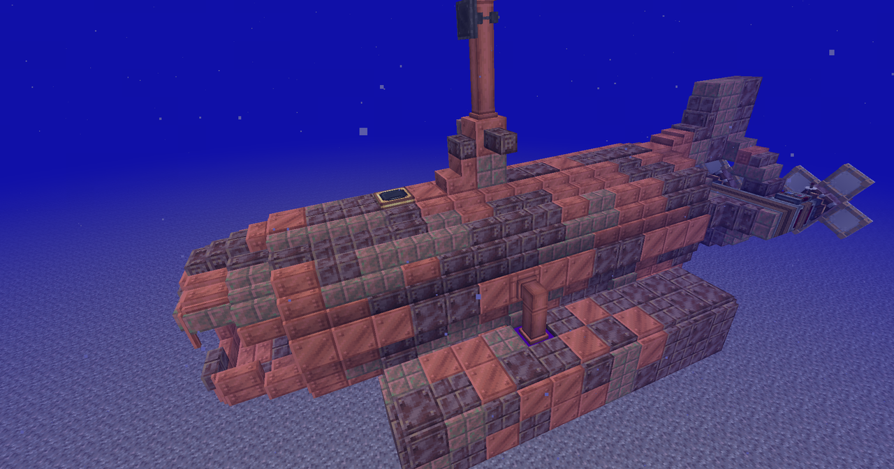
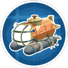

---
navigation:
  title: "Boats & submarines"
  position: 0
  parent: reference.vehicles.md
  icon: minecraft:oak_boat
---

# Boats & submarines

## Hulls

Deep Seas copper submarine.

***

## Buoyancy & thrust

<EmiSearch query="@create_submarine" />

<ItemGrid>
  <ItemIcon id="create_submarine:floater" />
  <ItemIcon id="create_submarine:ballast_tank" />
  <ItemIcon id="create_submarine:ballast_vent" />
  <ItemIcon id="create_submarine:water_thruster" />
  <ItemIcon id="create_submarine:submarine_propeller" />
</ItemGrid>

| Shown items |
| --- |
| <ItemLink id="create_submarine:floater" /> |
| <ItemLink id="create_submarine:ballast_tank" /> |
| <ItemLink id="create_submarine:ballast_vent" /> |
| <ItemLink id="create_submarine:water_thruster" /> |
| <ItemLink id="create_submarine:submarine_propeller" /> |

Floaters support surface boats. Ballast Tanks and Ballast Vents control submerged buoyancy. The vent needs rotational power, pipes to the tanks and at least one face touching the sea. Reverse rotation to drain. Water Thrusters need water and rotational power. Submarine Propellers work underwater, not in air.

***

## Air & pressure

<ItemGrid>
  <ItemIcon id="create_submarine:electrolyzer" />
  <ItemIcon id="create_submarine:oxygene_diffuser" />
  <ItemIcon id="create_submarine:barometer" />
  <ItemIcon id="create_submarine:copper_pressurizer" />
  <ItemIcon id="create_submarine:iron_pressurizer" />
  <ItemIcon id="create_submarine:phycological_membrane" />
</ItemGrid>

| Shown items |
| --- |
| <ItemLink id="create_submarine:electrolyzer" /> |
| <ItemLink id="create_submarine:oxygene_diffuser" /> |
| <ItemLink id="create_submarine:barometer" /> |
| <ItemLink id="create_submarine:copper_pressurizer" /> |
| <ItemLink id="create_submarine:iron_pressurizer" /> |
| <ItemLink id="create_submarine:phycological_membrane" /> |

Electrolyzers consume water and Forge Energy to make oxygen. Oxygen Diffusers need that oxygen and a redstone signal. Demand scales with interior size. Pressure Barometers compare pressure against the weakest hull block. Copper and iron pressurized glass provide pressure-resistant windows. Phycological Membranes can be filled with air.

***

## Cables & equipment

<ItemGrid>
  <ItemIcon id="create_submarine:steel_cable" />
  <ItemIcon id="create_submarine:pulley" />
  <ItemIcon id="create_submarine:industrial_alarm" />
  <ItemIcon id="create_submarine:underwater_mine" />
</ItemGrid>

| Shown items |
| --- |
| <ItemLink id="create_submarine:steel_cable" /> |
| <ItemLink id="create_submarine:pulley" /> |
| <ItemLink id="create_submarine:industrial_alarm" /> |
| <ItemLink id="create_submarine:underwater_mine" /> |

Steel Cables and paired facing Pulleys support cable-guided moving structures. Industrial Alarms and Underwater Mines are additional equipment. Creative Oxygenators are creative equipment. Arresting Hook and Decompression Chamber are marked unfinished by their own item tooltips and should not be used as working survival systems. Getting started: use the ballast, electrolyzer, diffuser and barometer Ponder entries before diving. Dimensions covers destination access separately.

- [Dimensions](world.dimensions.md)

***

## Crafting

<Recipe id="create_submarine:ballast_tank" />

## Unfinished equipment

<ItemGrid>
  <ItemIcon id="create_submarine:arresting_hook" />
  <ItemIcon id="create_submarine:decompression_chamber" />
</ItemGrid>

| Shown items |
| --- |
| <ItemLink id="create_submarine:arresting_hook" /> |
| <ItemLink id="create_submarine:decompression_chamber" /> |

These devices are marked unfinished by their tooltips, not working survival systems.

***

## Related mods

| Mod or content | Purpose | Item search |
| --- | --- | --- |
|  [Create Deep Seas](vehicles.water.md) | Adds marine vehicle components for Aeronautics boats and submarines. | <EmiSearch query="@create_submarine" /> |
