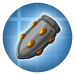

---
navigation:
  title: "Mounted weapons"
  position: 0
  parent: reference.vehicles.md
  icon: minecraft:dispenser
---

# Mounted weapons

## Cannons

<EmiSearch query="@createbigcannons" /> <EmiSearch query="@create" />

<ItemGrid>
  <ItemIcon id="createbigcannons:cannon_mount" />
  <ItemIcon id="createbigcannons:steel_cannon_barrel" />
  <ItemIcon id="createbigcannons:steel_sliding_breech" />
  <ItemIcon id="createbigcannons:bronze_autocannon_barrel" />
  <ItemIcon id="createbigcannons:autocannon_ammo_container" />
</ItemGrid>

| Shown items |
| --- |
| <ItemLink id="createbigcannons:cannon_mount" /> |
| <ItemLink id="createbigcannons:steel_cannon_barrel" /> |
| <ItemLink id="createbigcannons:steel_sliding_breech" /> |
| <ItemLink id="createbigcannons:bronze_autocannon_barrel" /> |
| <ItemLink id="createbigcannons:autocannon_ammo_container" /> |

Create Big Cannons supplies large cannon barrels, chambers, ends and breeches, plus autocannon barrels, breeches and recoil springs. Cast iron, bronze, steel and nethersteel families have distinct parts. Cannon Mounts, carriage equipment and ammunition containers support operation. Use cannon Ponder for assembly, loading and firing, not a decorative barrel layout.

***

## Ammunition & launchers

<EmiSearch query="@aeroengineering" />

<ItemGrid>
  <ItemIcon id="createbigcannons:ap_shell" />
  <ItemIcon id="createbigcannons:ap_shot" />
  <ItemIcon id="createbigcannons:bag_of_grapeshot" />
  <ItemIcon id="createbigcannons:big_cartridge" />
  <ItemIcon id="aeroengineering:missile_assembly_station" />
  <ItemIcon id="aeroengineering:air_to_air_missile" />
  <ItemIcon id="aeronautics:mounted_potato_cannon" />
</ItemGrid>

| Shown items |
| --- |
| <ItemLink id="createbigcannons:ap_shell" /> |
| <ItemLink id="createbigcannons:ap_shot" /> |
| <ItemLink id="createbigcannons:bag_of_grapeshot" /> |
| <ItemLink id="createbigcannons:big_cartridge" /> |
| <ItemLink id="aeroengineering:missile_assembly_station" /> |
| <ItemLink id="aeroengineering:air_to_air_missile" /> |
| <ItemLink id="aeronautics:mounted_potato_cannon" /> |

Shells, solid shot, grapeshot, cartridges, autocannon rounds and fuzes are separate families. Aero Engineering supplies a Missile Assembly Station and Air-to-Air Missile. Aeronautics supplies the Mounted Potato Cannon. Select matching ammunition and follow the weapon help before firing near buildings.

***

## Crafting

<Recipe id="createbigcannons:ap_shot" />

## Related topics

- [Browse recipe](help.search.md)

***

## Related mods

| Mod or content | Purpose | Item search |
| --- | --- | --- |
|  [Create Big Cannons](vehicles.weapons.md) | Adds buildable large cannons and their ammunition to Create. | <EmiSearch query="@createbigcannons" /> |
