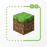

---
navigation:
  title: "Camera"
  position: 0
  parent: reference.appearance.md
  icon: minecraft:ender_eye
---

# Camera

## Camera & window

Zoom, detached viewing and borderless fullscreen solve different viewing needs. A free camera changes the viewpoint, not the player location. Multiplayer rules may restrict camera tools.

| Component | Function |
| --- | --- |
| Cubes Without Borders | Provides borderless fullscreen windows. |
| Freecam | Provides a detached viewing camera. |
| Ok Zoomer - It's Zoom! | Provides adjustable camera zoom. |

***

## Related topics

- [Controls](help.controls.md)

***

## Related mods

| Mod or content | Purpose | Item search |
| --- | --- | --- |
|  [Cubes Without Borders](visuals.camera.md) | Provides borderless fullscreen windows. | No separate item search |
|  [Freecam](visuals.camera.md) | Provides a detached viewing camera. | No separate item search |
|  [Ok Zoomer - It's Zoom!](visuals.camera.md) | Provides adjustable camera zoom. | No separate item search |
