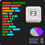
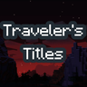

---
navigation:
  title: "Interface"
  position: 0
  parent: reference.appearance.md
  icon: minecraft:painting
---

# Interface

## Video options

Reese's Sodium Options reorganizes the video menu. Sodium Extra adds controls for appearance, particles, animation and information displays. Neither is the terrain renderer itself.

| Component | Function |
| --- | --- |
| Reese's Sodium Options | Reorganizes Sodium video options. |
| Sodium Extra | Adds appearance, particle, animation and display controls. |

***

## Information & notices

These components change information displays and notifications rather than gameplay progression. Hiding an experimental warning does not make world content nonexperimental.

| Component | Function |
| --- | --- |
| Advancement Plaques | Replaces advancement notifications with plaques. |
| Better ModList | Changes the mod list display and filtering. |
| BetterF3 | Reorganizes the debug information display. |
| Hide Experimental Warning | Hides the experimental-world warning. |
| Progress Peek | Shows loading progress on the desktop taskbar. |
| Toast Control | Controls toast notifications. |
| Traveler's Titles | Shows biome and dimension entry titles. |

***

## Related topics

- [Controls](help.controls.md)
- [Lighting & distance](visuals.lighting.md)

***

## Related mods

| Mod or content | Status | Publisher description |
| --- | --- | --- |
|  [Advancement Plaques](visuals.interface.md) | Baseline, installed | Replace those boring advancement popups with something flashier. |
|  [Better ModList](visuals.interface.md) | Baseline, installed | enhances neoforge modlist by adding options to hide mods, libraries, adding badges to mods to define what it does and more. as well as making it look better. |
|  [BetterF3](visuals.interface.md) | Baseline, installed | BetterF3 is a mod that replaces Minecraft's original debug HUD with a highly customizable, more human-readable HUD. |
|  [Hide Experimental Warning](visuals.interface.md) | Baseline, installed | ❌ Hides the Experimental Settings Warning when trying to create or load a modded world. |
|  [Progress Peek](visuals.interface.md) | Baseline, installed | Display game loading progress on the taskbar |
|  [Reese's Sodium Options](visuals.interface.md) | Baseline, installed | Alternative Options Menu for Sodium |
|  [Sodium Extra](visuals.interface.md) | Baseline, installed | A Sodium addon that adds features that shouldn't be in Sodium. |
|  [Toast Control](visuals.interface.md) | Baseline, installed | Manage (or remove) those pesky toast notifications |
|  [Traveler's Titles](visuals.interface.md) | Baseline, installed | Epic, RPG-like titles when entering biomes & dimensions! |
