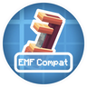
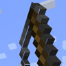

---
navigation:
  title: "Models & animations"
  position: 0
  parent: reference.appearance.md
  icon: minecraft:painting
---

# Models & animations

## Model support

Entity Model Features and Entity Texture Features provide custom model and texture support. Model Gap Fix repairs visible model gaps. Custom animation appearance also depends on enabled resource packs.

| Component | Function |
| --- | --- |
| [EMF] Entity Model Features | Loads custom entity models from compatible resource packs. |
| [ETF] Entity Texture Features | Supports random, custom and emissive entity textures. |
| Model Gap Fix | Repairs gaps in block and item models. |

***

## Animation bridges

- Browse items: <EmiSearch query="@create" />

EMF Compat: Create adapts Create animations for animated player models. Its shared framework is listed under Libraries.

| Component | Function |
| --- | --- |
| EMF Compat: Create | Connects Create player animations to custom animated models. |

***

## Other edition content

- Browse items: <EmiSearch query="@spawn" />

The following animation additions are not installed in this edition. Their absence is not an unfinished installed feature.

| Component | Function |
| --- | --- |
| Eating Animations (not installed) | Animates eating. |
| Fancy World Animations [FWA] (not installed) | Animates interactive blocks such as doors and levers. |
| EMF Compat: Not Enough Animations (not installed) | Connects Not Enough Animations to custom animated player models. |
| Not Enough Animations (not installed) | Shows more player actions in third-person. |
| Spawn Animations Compats (not installed) | Adds compatibility data for Spawn Animations. |
| Spawn Animations (not installed) | Animates hostile creature spawning. |

***

## Related topics

- [Resource packs](visuals.resource-packs.md)
- [Libraries](technical.libraries.md)

***

## Related mods

| Mod or content | Purpose | Status | Item search |
| --- | --- | --- | --- |
| ![[EMF] Entity Model Features](images/catalog-4I1XuqiY.png) [[EMF] Entity Model Features](visuals.models.md) | Loads custom entity models from compatible resource packs. | Baseline, installed | No separate item search |
| ![[ETF] Entity Texture Features](images/catalog-BVzZfTc1.png) [[ETF] Entity Texture Features](visuals.models.md) | Supports random, custom and emissive entity textures. | Baseline, installed | No separate item search |
| <ItemImage id="minecraft:painting" /> [Eating Animations](visuals.models.md) | Animates eating. | Heavy edition, not installed here | Not installed here |
|  [EMF Compat: Create](visuals.models.md) | Connects Create player animations to custom animated models. | Baseline, installed | No separate item search |
| <ItemImage id="minecraft:painting" /> [EMF Compat: Not Enough Animations](visuals.models.md) | Adapts Not Enough Animations player actions to custom Entity Model Features models. | Heavy edition, not installed here | Not installed here |
| <ItemImage id="minecraft:painting" /> [Fancy World Animations [FWA]](visuals.models.md) | Animates interactive blocks such as doors and levers. | Heavy edition, not installed here | Not installed here |
|  [Model Gap Fix](visuals.models.md) | Repairs gaps in block and item models. | Baseline, installed | No separate item search |
| <ItemImage id="minecraft:painting" /> [Not Enough Animations](visuals.models.md) | Shows more player actions in third-person. | Heavy edition, not installed here | Not installed here |
| <ItemImage id="minecraft:painting" /> [Spawn Animations](visuals.models.md) | Animates hostile creature spawning. | Heavy edition, not installed here | Not installed here |
| <ItemImage id="minecraft:painting" /> [Spawn Animations Compats](visuals.models.md) | Extends Spawn Animations compatibility to supported modded creatures. | Heavy edition, not installed here | Not installed here |
