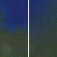
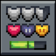
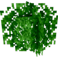

---
navigation:
  title: "Resource packs"
  position: 0
  parent: reference.appearance.md
  icon: minecraft:painting
---

# Resource packs

## Texture support

These mods implement connected textures, resource-pack colors or biome color blending. Their visual result depends on the enabled content and settings.

| Component | Function |
| --- | --- |
| Better Biome Reblend | Improves blending between biome colors. |
| Continuity | Supports connected block textures from resource packs. |
| Polytone | Supports resource-pack colors, colormaps and block sound customization. |

***

## Installed packs

These selected resource packs change leaf appearance, attribute labels or interface presentation. Resource packs change appearance, not the underlying crafting catalogue.

| Component | Function |
| --- | --- |
| Attribute Icons (RPG Series) | Adds icons to attribute translations. |
| Motschen's Better Leaves | Changes the appearance of leaf blocks. |
| Mandala's GUI - Dark mode | Changes interface appearance without replacing item or block textures. |

***

## Other edition packs

These packs are absent from this edition. Animated entity packs need their compatible model support, not just a shader loader.

| Component | Function |
| --- | --- |
| Fresh Animations: Player Extension (not installed) | Adds Fresh Animations style player animation. |
| (Bee's) Fancy Crops (not installed) | Changes crop appearance. |
| Fresh Animations: Objects (not installed) | Animates non-creature entities. |
| Fresh Animations: Quivers (not installed) | Adds skeleton quiver visuals. |
| Fresh Animations (not installed) | Adds animated entity models. |
| Simple Grass Flowers (not installed) | Adds small surface decorations to grass and related ground textures. |
| Visual Effects+ (not installed) | Adds biome-based fog, particles and weather appearance. |

***

## Related topics

- [Models & animation](visuals.models.md)

***

## Related mods

| Mod or content | Status | Publisher description |
| --- | --- | --- |
| <ItemImage id="minecraft:painting" /> [(Bee's) Fancy Crops](visuals.resource-packs.md) | Heavy edition, not installed here | Not installed here. |
|  [Attribute Icons (RPG Series)](visuals.resource-packs.md) | Baseline, installed | Icons embedded in attribute translations |
|  [Better Biome Reblend](visuals.resource-packs.md) | Baseline, installed | Updated version of Better Biome Blend, a mod that improves Biome Blending |
|  [Continuity](visuals.resource-packs.md) | Baseline, installed | A Minecraft mod that allows for efficient connected textures |
| <ItemImage id="minecraft:painting" /> [Fresh Animations](visuals.resource-packs.md) | Heavy edition, not installed here | Not installed here. |
| <ItemImage id="minecraft:painting" /> [Fresh Animations: Objects](visuals.resource-packs.md) | Heavy edition, not installed here | Not installed here. |
| <ItemImage id="minecraft:painting" /> [Fresh Animations: Player Extension](visuals.resource-packs.md) | Heavy edition, not installed here | Not installed here. |
| <ItemImage id="minecraft:painting" /> [Fresh Animations: Quivers](visuals.resource-packs.md) | Heavy edition, not installed here | Not installed here. |
|  [Mandala's GUI - Dark mode](visuals.resource-packs.md) | Baseline, installed | Mandala GUI is an elegant theme, in the style of Mandala Creations. It is specifically made for people who like Dark mode. It only changes the UI of Minecraft, without changing items or blocks. |
|  [Motschen's Better Leaves](visuals.resource-packs.md) | Baseline, installed | Improves the appearance of leaves with high mod compatibility and performance! |
|  [Polytone](visuals.resource-packs.md) | Baseline, installed | Customize Map Color, Block Colors, Colormaps and Block Sounds, Biome Colors, Dye Colors. Supports Optifine format. For Resource Packs |
| <ItemImage id="minecraft:painting" /> [Simple Grass Flowers](visuals.resource-packs.md) | Heavy edition, not installed here | Not installed here. |
| <ItemImage id="minecraft:painting" /> [Visual Effects+](visuals.resource-packs.md) | Heavy edition, not installed here | Not installed here. |
