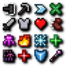
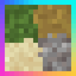

---
navigation:
  title: "Resource packs"
  position: 0
  parent: reference.appearance.md
  icon: minecraft:loom
---

# Resource packs

## Texture support

These mods implement connected textures, resource-pack colors or biome color blending. Their visual result depends on the enabled content and settings.

| Component | Function |
| --- | --- |
| Better Biome Reblend | Improves blending between biome colors. |
| Continuity | Supports connected block textures from resource packs. |
| Polytone | Supports resource-pack colors, colormaps and block sound customization. |

***

## Shared resource packs

These selected resource packs change leaf appearance, attribute labels or interface presentation. Resource packs change appearance, not the underlying crafting catalogue.

| Component | Function |
| --- | --- |
| Attribute Icons (RPG Series) | Adds icons to attribute translations. |
| Motschen's Better Leaves | Changes the appearance of leaf blocks. |
| Mandala's GUI - Dark mode | Changes interface appearance without replacing item or block textures. |

***

## Animation & ambience

The heavy edition adds animated entities, crops, ground decorations and environmental effects. Animated entity packs need compatible model support, not just a shader loader.

| Component | Function |
| --- | --- |
| Fresh Animations: Player Extension (heavy edition only) | Adds Fresh Animations style player animation. |
| (Bee's) Fancy Crops (heavy edition only) | Changes crop appearance. |
| Fresh Animations: Objects (heavy edition only) | Animates non-creature entities. |
| Fresh Animations: Quivers (heavy edition only) | Adds skeleton quiver visuals. |
| Fresh Animations (heavy edition only) | Adds animated entity models. |
| Simple Grass Flowers (heavy edition only) | Adds small surface decorations to grass and related ground textures. |
| Visual Effects+ (heavy edition only) | Adds biome-based fog, particles and weather appearance. |

***

## Related topics

- [Models & animation](visuals.models.md)

***

## Related mods

| Mod or content | Purpose | Item search |
| --- | --- | --- |
| <ItemImage id="minecraft:painting" /> [(Bee's) Fancy Crops](visuals.resource-packs.md) (heavy edition only) | Changes crop appearance. | No separate item search |
|  [Attribute Icons (RPG Series)](visuals.resource-packs.md) | Adds icons to attribute translations. | No separate item search |
|  [Better Biome Reblend](visuals.resource-packs.md) | Improves blending between biome colors. | No separate item search |
|  [Continuity](visuals.resource-packs.md) | Supports connected block textures from resource packs. | No separate item search |
| <ItemImage id="minecraft:painting" /> [Fresh Animations](visuals.resource-packs.md) (heavy edition only) | Adds animated entity models. | No separate item search |
| <ItemImage id="minecraft:painting" /> [Fresh Animations: Objects](visuals.resource-packs.md) (heavy edition only) | Animates non-creature entities. | No separate item search |
| <ItemImage id="minecraft:painting" /> [Fresh Animations: Player Extension](visuals.resource-packs.md) (heavy edition only) | Adds Fresh Animations style player animation. | No separate item search |
| <ItemImage id="minecraft:painting" /> [Fresh Animations: Quivers](visuals.resource-packs.md) (heavy edition only) | Adds skeleton quiver visuals. | No separate item search |
|  [Mandala's GUI - Dark mode](visuals.resource-packs.md) | Changes interface appearance without replacing item or block textures. | No separate item search |
|  [Motschen's Better Leaves](visuals.resource-packs.md) | Changes the appearance of leaf blocks. | No separate item search |
|  [Polytone](visuals.resource-packs.md) | Supports resource-pack colors, colormaps and block sound customization. | No separate item search |
| <ItemImage id="minecraft:painting" /> [Simple Grass Flowers](visuals.resource-packs.md) (heavy edition only) | Adds small surface decorations to grass and related ground textures. | No separate item search |
| <ItemImage id="minecraft:painting" /> [Visual Effects+](visuals.resource-packs.md) (heavy edition only) | Adds biome-based fog, particles and weather appearance. | No separate item search |
