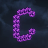

---
navigation:
  title: "Shaders"
  position: 0
  parent: category-visuals.md
  icon: minecraft:painting
---

# Shaders

## Overview

Work in progress (WIP).

## Related mods

| Mod or content | Publisher description |
| --- | --- |
|  Complementary Shaders - Reimagined | Preserving the elements of Minecraft with exceptional quality, detail, and performance. |
|  Complementary Shaders - Unbound | Transforming the visuals of Minecraft with exceptional quality, detail, and performance. |
|  Photon Shaders | A gameplay-focused shader pack with a semi-realistic style |
