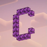
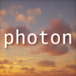

---
navigation:
  title: "Shaders"
  position: 0
  parent: reference.appearance.md
  icon: minecraft:prismarine_crystals
---

# Shaders

## Shader styles

Choose one shader style through Iris rather than treating three shader packs as three simultaneous rendering effects. Shader performance depends on the selected preset, scene and computer.

| Component | Function |
| --- | --- |
| Complementary Shaders - Reimagined | A shader style that preserves Minecraft's visual character. |
| Complementary Shaders - Unbound | A shader style with a more transformed appearance. |
| Photon Shaders | A gameplay-focused, semi-realistic shader style. |

***

## Related topics

- [Lighting & distance](visuals.lighting.md)

***

## Related mods

| Mod or content | Purpose | Item search |
| --- | --- | --- |
|  [Complementary Shaders - Reimagined](visuals.shader-packs.md) | A shader style that preserves Minecraft's visual character. | No separate item search |
|  [Complementary Shaders - Unbound](visuals.shader-packs.md) | A shader style with a more transformed appearance. | No separate item search |
|  [Photon Shaders](visuals.shader-packs.md) | A gameplay-focused, semi-realistic shader style. | No separate item search |
