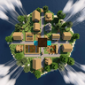

---
navigation:
  title: "Weather & particles"
  position: 0
  parent: reference.appearance.md
  icon: minecraft:snowball
---

# Weather & particles

## Teleport transition

<EmiSearch query="@create" />

GrandTeleport changes the camera transition during teleportation. It does not create a survival travel destination or grant teleport permission.

| Component | Function |
| --- | --- |
| GrandTeleport NeoForge | Adds a cinematic camera transition during teleportation. |

***

## Other edition effects

These explosion, status-particle and ambient visual additions are not installed here. Particle optimizers are listed separately from visual effect generators.

| Component | Function |
| --- | --- |
| Explosive Enhancement: Reforged (not installed) | Changes explosion animation effects. |
| Particle Effects (not installed) | Gives vanilla status effects distinct textured particles. |
| Particular ✨ Reforged (not installed) | Adds ambient visual effects. |
| Ripple (not installed) | Makes particles respond to entities. |

***

## Related topics

- [Optimization](performance.baseline.md)
- [Teleportation](travel.destinations.md)

***

## Related mods

| Mod or content | Purpose | Status | Item search |
| --- | --- | --- | --- |
| <ItemImage id="minecraft:painting" /> [Explosive Enhancement: Reforged](visuals.weather.md) | Changes explosion animation effects. | Heavy edition, not installed here | Not installed here |
|  [GrandTeleport NeoForge](visuals.weather.md) | Adds a cinematic camera transition during teleportation. | Baseline, installed | No separate item search |
| <ItemImage id="minecraft:painting" /> [Particle Effects](visuals.weather.md) | Gives vanilla status effects distinct textured particles. | Heavy edition, not installed here | Not installed here |
| <ItemImage id="minecraft:painting" /> [Particular ✨ Reforged](visuals.weather.md) | Adds ambient visual effects. | Heavy edition, not installed here | Not installed here |
| <ItemImage id="minecraft:painting" /> [Ripple](visuals.weather.md) | Makes particles respond to entities. | Heavy edition, not installed here | Not installed here |
