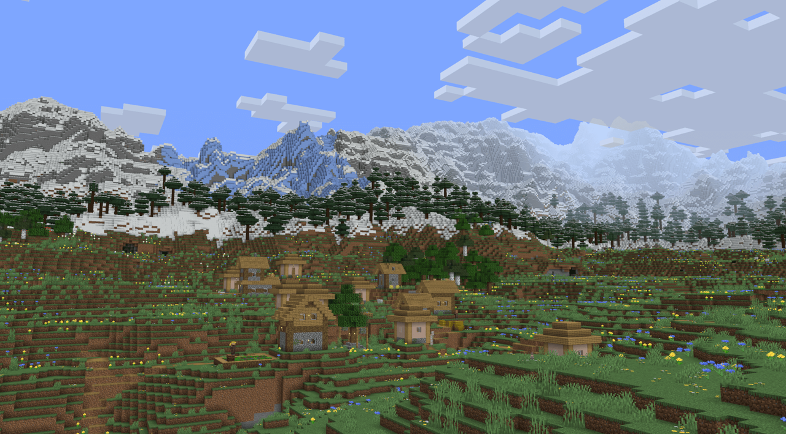
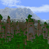
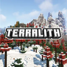
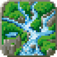
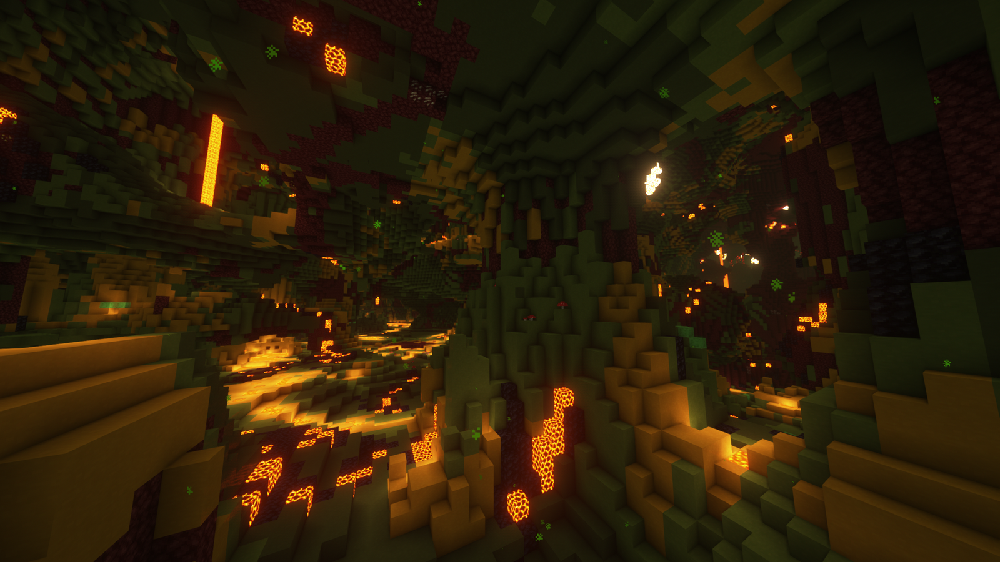
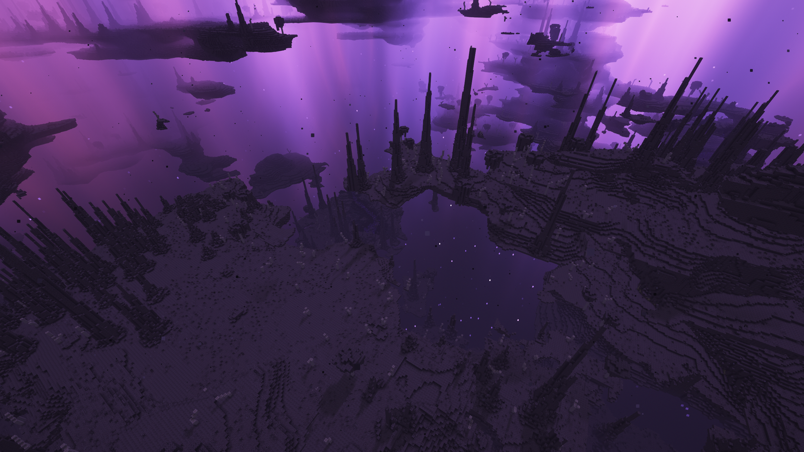
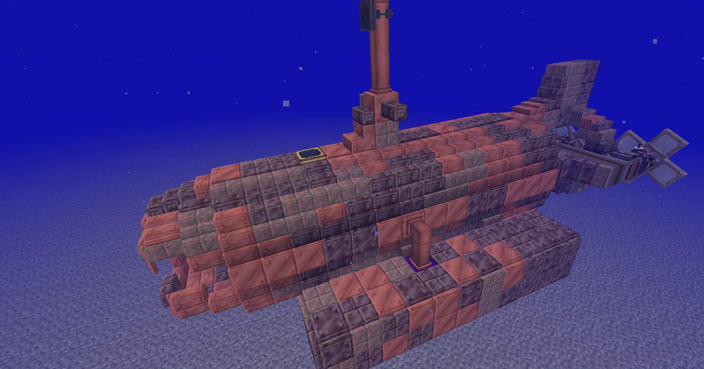

---
navigation:
  title: "Dimensions"
  position: 5
  parent: quick-reference.md
  icon: minecraft:grass_block
---

# Dimensions

## Overworld

Tectonic mountain ranges.

| Terrain | Adds |
| --- | --- |
|  Tectonic | Mountains, larger landforms and terrain shaping |
|  Terralith | Surface and cave biomes built from vanilla blocks |
|  Streams Reflowing | Flowing streams |

### Terralith biomes

| Biome | Biome | Biome |
| --- | --- | --- |
| Alpha Islands | Alpha Islands Winter | Alpine Grove |
| Alpine Highlands | Amethyst Canyon | Amethyst Rainforest |
| Ancient Sands | Arid Highlands | Ashen Savanna |
| Basalt Cliffs | Birch Taiga | Blooming Plateau |
| Blooming Valley | Brushland | Bryce Canyon |
| Caldera | Caves: Andesite Caves | Caves: Deep Caves |
| Caves: Diorite Caves | Caves: Frostfire Caves | Caves: Fungal Caves |
| Caves: Granite Caves | Caves: Infested Caves | Caves: Mantle Caves |
| Caves: Thermal Caves | Caves: Tuff Caves | Caves: Underground Jungle |
| Cloud Forest | Cold Shrubland | Deep Warm Ocean |
| Desert Canyon | Desert Oasis | Desert Spires |
| Emerald Peaks | Forested Highlands | Fractured Savanna |
| Frozen Cliffs | Glacial Chasm | Granite Cliffs |
| Gravel Beach | Gravel Desert | Haze Mountain |
| Highlands | Hot Shrubland | Ice Marsh |
| Jungle Mountains | Lavender Forest | Lavender Valley |
| Lush Desert | Lush Valley | Mirage Isles |
| Moonlight Grove | Moonlight Valley | Orchid Swamp |
| Painted Mountains | Red Oasis | Rocky Jungle |
| Rocky Mountains | Rocky Shrubland | Sakura Grove |
| Sakura Valley | Sandstone Valley | Savanna Badlands |
| Savanna Slopes | Scarlet Mountains | Shield |
| Shield Clearing | Shrubland | Siberian Grove |
| Siberian Taiga | Skylands Autumn | Skylands Spring |
| Skylands Summer | Skylands Winter | Snowy Badlands |
| Snowy Cherry Grove | Snowy Maple Forest | Snowy Shield |
| Steppe | Stony Spires | Temperate Highlands |
| Tropical Jungle | Valley Clearing | Volcanic Crater |
| Volcanic Peaks | Warm River | Warped Mesa |
| White Cliffs | White Mesa | Windswept Spires |
| Wintry Forest | Wintry Lowlands | Yellowstone |
| Yosemite Cliffs | Yosemite Lowlands |  |

***

## Nether

Incendium cavern terrain.

Incendium Legacy reshapes the Nether. Incendium Biomes Only keeps its terrain and biomes, but removes its added structures, items, mobs and bosses.

### Incendium biomes

| Biome | Biome | Biome |
| --- | --- | --- |
| Ash Barrens | Infernal Dunes | Inverted Forest |
| Quartz Flats | Toxic Heap | Volcanic Deltas |
| Weeping Valley | Withered Forest |  |

***

## End

Nullscape islands and spires.

Nullscape reshapes the End's outer islands. It changes an existing dimension rather than adding another portal destination.

### Nullscape biomes

| Biome | Biome | Biome |
| --- | --- | --- |
| Crystal Peaks | Shadowlands | Void Barrens |

***

## Deep Seas

Copper submarine from Deep Seas.

The selected Deep Seas release contains an Abyss prototype, but disables that dimension outside development environments. It is not an accessible destination in this pack.

- [Vehicles](reference.vehicles.md)

***

## Getting started

| Destination | Access |
| --- | --- |
| Overworld | The starting world |
| Nether | Light an obsidian portal |
| End | Activate a stronghold's End portal with Eyes of Ender |

Terrain changes appear in newly generated areas, existing terrain is not rebuilt by opening this guide.

- [Location finders](maps.find.md)

***

## Other editions

Space content is not installed in this light edition.

- [Space](space.destinations.md)

***

## Related mods

| Mod or content | Status | Publisher description |
| --- | --- | --- |
|  [Incendium Biomes Only](world.dimensions.md) | Baseline, installed | Removes structures, items, mobs and bosses from Incendium, leaving only the biomes and terrain. |
|  [Incendium Legacy](world.dimensions.md) | Baseline, installed | A nether biome overhaul combined with challenging structures to conquer, unique weapons to obtain, and tricky mobs to defeat. |
|  [Nullscape](world.dimensions.md) | Baseline, installed | Transforms the boring Vanilla end into an alien dimension with the most surreal terrain imaginable. Topped with a couple of new biomes to add to the experience, whilst keeping the end desolate. |
|  [Streams Reflowing](world.dimensions.md) | Baseline, installed | Adds beautiful flowing streams to your world. |
|  [Tectonic](world.dimensions.md) | Baseline, installed | Terrain shaping brought to new heights, grander and more varied than ever before! |
|  [Terralith](world.dimensions.md) | Baseline, installed | Explore almost 100 new biomes consisting of both realism and light fantasy, using just Vanilla blocks. Complete with several immersive structures to compliment the overhauled terrain. |
